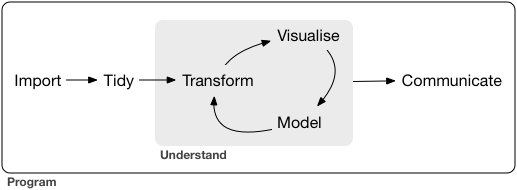

# Introduction

**Learning objectives:**

After today's session, you will be able to...

- Describe a *typical* data science project.
- Explain the reasoning behind the order of content in this book.
- Recognize topics that are not covered by this book.
- Set up an environment in which you can learn the topics in this book.
- Describe how code in the book differs from code in your console.

## A typical data science project {-}



-   **Importing** + **tidying** = **wrangling** data
-   **Understanding** = cycle of **transforming, visualizing, modeling** 
-   **Communicating** your results to other humans
-   **Programming** aids entire process 
    -   Automate common tasks
    -   Solve new problems with greater ease.

## Wrangle the data {-}

-   🤠 Importing + tidying + transforming = ***wrangling*** 
    -   🥊 Making data usable often feels like a fight.

-   **Import:** (file, database, web app) ➡️ R
    -   Can't data science it 'til it's in R!
-   **Tidy:** Consistent structure makes everything easier
    -   ↕↕↕️ Columns = variables
    -   ↔️ Rows = observations
-   **Transform:** Further refinement
    -   Filter (narrow in)
    -   Mutate (create new variables)
    -   Summarize (calculate things for groups)

## Understand & communicate {-}

- **Visualize:** 
    -   Good dataviz can help find unexpected + raise new questions
    -   [ggplot2 book](http://ggplot2-book.org/) has more in-depth details
- **Model:** 
    -   Extract patterns from data
    -   Not covered in-depth here, see [tmwr.org](https://tmwr.org)
- **Communicate:** 
    -   Critical part of DS!
    -   It doesn't matter how good your models are if nobody knows about them.
    - ***Note:*** R4DS 2e focuses on [Quarto](https://quarto.org/), vs [RMarkdown](https://rmarkdown.rstudio.com/) in 1e

## The order of content in this book {-}

-   **Import** & **Tidy** = 😴
    -   So jump to 📈 **Visualization** & 🔁 **Transformation**
    -   *Then* **wrangle,** cuz necessary
-   **Programming** next
    -   Helps simplify other steps
-   Each chapter has **motivating examples**
    -   Bigger picture before details
-   **Exercises** woven in for practice
    -   ***Discuss: Do we want to walk through exercises?***

## Not covered by this book {-}

-   **Modelling:** Super important for DS, but too big for this book
    -   [Tidy Modelling with R](https://www.tmwr.org/) by Max Kuhn & Julia Silge (book club!)
-   **Big data:** Problem-specific
    -   If you work with big data, will want to learn other tools
    -   [{sparklyr}](https://therinspark.com/) builds on principles in this book
-   **Other programming languages:** (Python, Julia, etc.)
    -   Master 1 tool at a time
    -   Maybe go on to other tools later

## Prerequisites {-}

-   Numeric literacy
-   Basic programming skills (but ok if you're brand new)
    -   [Hands on Programming with R](https://rstudio-education.github.io/hopr/) by Garrett Grolemund =  useful corequisite for this book
-   **R:** Download from [CRAN](https://cran.r-project.org), the **c**omprehensive **R** **a**rchive **n**etwork
-   [**Rstudio:**](https://posit.co/download/rstudio-desktop/) integrated development environment (IDE) for R (and others)
    -   A useful [cheat sheet](https://rstudio.github.io/cheatsheets/html/rstudio-ide.html) for RStudio

## Prerequisites: Install these packages {-}

-   📦 = collection of functions, data, & documentation
-   The [**tidyverse**](https://tidyverse.tidyverse.org/) = 📦📦📦📦📦📦📦📦📦
    -   Shared philosophy (concept of this book)
    -   `install.packages("tidyverse")`
        -   [`dplyr`](https://dplyr.tidyverse.org/), [`forcats`](https://forcats.tidyverse.org/), [`ggplot2`](https://ggplot2.tidyverse.org/), [`lubridate`](https://github.com/tidyverse/lubridate), [`purrr`](https://purrr.tidyverse.org/), [`readr`](https://readr.tidyverse.org/), [`stringr`](https://stringr.tidyverse.org/), [`tibble`](https://tibble.tidyverse.org/), [`tidyr`](https://tidyr.tidyverse.org/)
-   Additional packages which provide interesting datasets
    -   When you see `Error in library(ggrepel) : there is no package called ‘ggrepel’`,
    -   Run `install.packages("ggrepel")`

## Conventions within the book: #> {-}

Code in book slightly different from output you'll see

- `#>` in book = `>` in RStudio
    -   `#` = comment
    -   Can copy/paste code from book to console

```{r eval=FALSE}
1 + 2
#> [1] 3
```

## Conventions within the book: Code {-}

-   Functions = `code font` + `()`
    -   `sum()` or `mean()`
-   Other R objects = `code font`
    -   `flights` or `x`
-   `dplyr::filter()` = "dplyr's filter"

## Bonus: Resources for getting help {-}

-   **Pay attention to error messages.**
    -   Tidyverse error messages are often helpful
    -   If not enough, copy/paste into Google
-   **Stackoverflow.com** *can* also be helpful, but beware.
-   The [**R4DS Online Learning Community**](r4ds.io/join) is a friendly Slack community with volunteer R tutors
    - Navigate to [r4ds.io/join](r4ds.io/join) to request access to our Slack
    -   If expired, email [rfordatasci@gmail.com](mailto:rfordatasci@gmail.com)

## Bonus: Reproducible examples {-}

-   Make a [**reprex**](https://reprex.tidyverse.org/) ("reproducible example")
    -   State what *packages* you use
        -   `library(dplyr)`, etc
    -   Provide (a subset of) any data you use with [`dput()`](https://www.rdocumentation.org/packages/base/versions/3.6.2/topics/dput)
    -   Try to make your code *easy to read* (clean spacing, clear variable names, comments)

## Meeting Videos {-}

### Cohort 5

`r knitr::include_url("https://www.youtube.com/embed/BtRTkChZo8c")`

<details>
  <summary> Meeting chat log </summary>
  
```
00:18:00	Morgan Grovenburg:	I have to leave early today. Also, I'd normally have my video on, but my kid is currently using me as a jungle gym
00:21:19	Susie Neilson:	Link to our team’s work :) https://www.sfchronicle.com/data/
00:22:40	Morgan Grovenburg:	I know what talk you're talking about
00:23:10	Wai-Yin:	Data journalism’s wikipedia article  https://en.wikipedia.org/wiki/Data_journalism
00:49:59	Ryan Metcalf:	Great question Susie! I consider “Big Data” anything I can’t open in a conventional service. Using scripting languages helps with managing overhead (Cost [not monetary], time of process, processing capability, etc…).
01:00:14	Njoki Njuki Lucy:	data.table has the similar syntax as the base R package.
01:17:46	Jon Harmon (jonthegeek):	r4ds.io/r4ds
```
</details>

### Cohort 6

`r knitr::include_url("https://www.youtube.com/embed/R1OUW3Ldu4Q")`

<details>
  <summary> Meeting chat log </summary>
  
```
00:09:03	Matthew Efoli:	Good day everyone
00:09:16	Trisha Adamus(she/her):	Hi
00:09:39	Shannon:	Good morning, everyone :)
00:09:45	Adeyemi Olusola:	hello.
00:09:56	Marielena Soilemezidi:	Hi all! :)
00:10:18	Adeyemi Olusola:	who is facilitating this cohort?
00:10:38	Nico Schmidt:	I think it is Daniel, at least according to Slack
00:10:59	Shannon:	I was just going to ask. Assuming we're waiting for the host?
00:11:41	Trisha Adamus(she/her):	Has anyone participate in a cohort before? I am not sure what to expect.
00:12:20	Daniel Adereti:	Hello all, reaching out to Jon. First classes are usually introductions
00:12:35	Adeyemi Olusola:	i joined cohort 5 last week just to have a feel and it was pretty interesting
00:12:37	Matthew Efoli:	@Trisha For me, No. This is my first.
00:12:45	Shannon:	I haven't. Was wondering if today is just an intro, or if we're jumping into Ch.1
00:12:45	Nico Schmidt:	Then maybe let’s start, Daniel?
00:13:23	Nico Schmidt:	If we are jumping into Chapter 1, I have already missed my homework one time
00:14:40	Shannon:	haha, me too...
00:16:41	Nico Schmidt:	Do we do this with Cameras on or off?
00:18:14	Aalekhya Reddam:	Hello everyone, unfortunately my microphone / camera aren't working right now, hope to have it figured out by next week! I'm a postdoctoral researcher in the US. My research is in environmental epidemiology and data science is a huge part of my work
00:20:39	Jon Harmon (jonthegeek):	Shared notes/slides: r4ds.io/r4ds
00:26:47	Aalekhya Reddam:	Do we usually volunteer the week ahead for the next week?
00:28:53	Aalekhya Reddam:	Thank you!
00:37:01	Matthew Efoli:	bye Jon
00:37:19	Adeyemi Olusola:	let me go
00:39:04	Nico Schmidt:	Cool!
00:39:08	Nico Schmidt:	Thanks Daniel
00:39:16	Marielena Soilemezidi:	sounds good!
00:39:47	Aalekhya Reddam:	That sounds great!
00:39:50	Shannon:	Sounds good! Thank you Daniel and Adeyemi, for volunteering for next week!
00:40:12	Trisha Adamus(she/her):	Thank you!
00:40:14	Matthew Efoli:	Thank you
00:40:28	Marielena Soilemezidi:	have a great day you all! :)
```
</details>


### Cohort 7

`r knitr::include_url("https://www.youtube.com/embed/wBH7pqql_uU")`

<details>
<summary> Meeting chat log </summary>

```
00:09:07	Oluwafemi Oyedele:	We will start in 2 minute time
00:14:02	Lucio:	yes
00:20:48	timnewby:	Hi - my microphone isn’t working.  I’m Tim from Wales.  I have a degree in Chemistry (UK) recently started a new job as Business Information Developer.  Keen to learn more about R
00:40:56	Betsy Muriithi:	yes
00:43:31	Lucio:	no question. all good
00:43:51	Dolleen Osundwa:	no question at the moment
00:43:54	Lucio:	please proceed
01:02:15	Lucio:	thank you!!
```
</details>


### Cohort 8

`r knitr::include_url("https://www.youtube.com/embed/KK7dJe9AoXs")`
