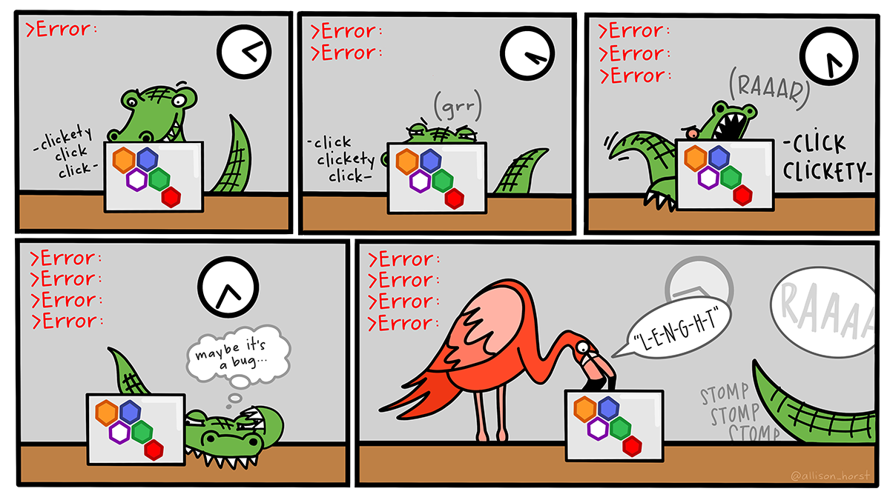

# Data visualisation

**Learning objectives:**

-   Produce a simple plot with `ggplot2`
-   Use different **`aes`thetic mappings** and **`geom_*()` functions** to produce more complex plots
-   Visualize **distributions and relationships** in data
-   Produce **small multiples** with `facet()`
-   [Make this](https://r4ds.hadley.nz/data-visualize_files/figure-html/unnamed-chunk-7-1.png): 

------------------------------------------------------------------------

## Loading Packages in R

-   Use `install.packages("Package_name")` to **install** a package in R.
    -   You need to do this before you can use a package, but you only need to do it once.
    -   Depending where you're learning R, the packages you need may already be installed.
-   Use `library(Package_name)` to **load** a package in R.
    -   In general, you want to do this at the start of any session where you use a package.
    -   Alternatively, you can refer to a package every time you use it, such as `ggplot2::ggplot()`. "ggplot2" is the package, "ggplot()" is the function call, "::" tells R "look up this function in this package."

```{r 02-library}
library(tidyverse)
```

We'll also need...

```{r 02-otherpkgs, message=FALSE, warning=FALSE}
library(palmerpenguins)
library(ggthemes)
```

## First Steps

### Peeking at the `palmerpenguins`

```{r 02-dataset}
palmerpenguins::penguins
```

### Creating a ggplot

The first part of creating a plot in `ggplot2` is calling the `ggplot()` function. It can take arguments that tell it what **data** to use and how to **map** them to certain **aesthetics**.

```{r 02-plot01, message=FALSE, warning=FALSE}
ggplot(
  data = penguins,
  mapping = aes(x = flipper_length_mm, y = body_mass_g)
)
```

But we'll need to add a `geom_*()` argument to make figures show up.

```{r 02-plot02}
ggplot(
  data = penguins,
  mapping = aes(x = flipper_length_mm, y = body_mass_g)
) +
  geom_point()
```

(the warning is telling us there are two penguins in our dataset with missing body mass and/or flipper length values and ggplot2 has no way of representing them on the plot)

## Adding Aesthetics and Layers

**Aesthetics** are visual properties of objects in the plot.

There are several different types of **aesthetic mapping**:

-   coordinates: x and y
-   linewidth
-   shape
-   color
-   fill
-   alpha (transparency)
-   stroke
-   linetype
-   group
-   show.legend
-   others, sometimes specific to a geom

Adding more aesthetics to the plot may help tell the data's story better.

```{r 02-plot03, message=FALSE, warning=FALSE}
ggplot(
  data = penguins,
  mapping = aes(x = flipper_length_mm, y = body_mass_g, color = species)
) +
  geom_point()
```

Additional `geom_*()` layers may help as well

```{r 02-plot04, message=FALSE, warning=FALSE}
ggplot(
  data = penguins,
  mapping = aes(x = flipper_length_mm, y = body_mass_g, color = species)
) +
  geom_point() +
  geom_smooth(method = "lm")
```

There are several different types of `geom_*()` functions available:

-   point (scatterplot)
-   line
-   smooth
-   histogram / bar or (stat_count) / col
-   boxplot
-   map
-   text
-   ...

## Global vs. Local Aesthetics

```{r 02-plot05, message=FALSE, warning=FALSE}
ggplot(
  data = penguins,
  mapping = aes(x = flipper_length_mm, y = body_mass_g, color = species)
) +
  geom_point() +
  geom_smooth(method = "lm")
```

What if we want just one overall trend line?

Turn color into a "local" aesthetic by moving it within the `geom_point()` call.

```{r 02-plot06, message=FALSE, warning=FALSE}
ggplot(
  data = penguins,
  mapping = aes(x = flipper_length_mm, y = body_mass_g)
) +
  geom_point(aes(color = species)) +
  geom_smooth(method = "lm")
```

**Global options** are spelled out in the `ggplot()` function and will apply to all layers unless specifically overwritten in a layer.

**Local options** are spelled out in individual `geom_*()` functions and only apply to that layer.

### Improving Accessibility

Mapping shape as well as color may help colorblind readers better suss out the differences we're highlighting. A colorblind-friendly palette would help, too

```{r 02-plot07, message=FALSE, warning=FALSE}
ggplot(
  data = penguins,
  mapping = aes(x = flipper_length_mm, y = body_mass_g)
) +
  geom_point(aes(color = species, shape = species)) +
  geom_smooth(method = "lm") +
  scale_color_colorblind()

```

And why stop there? Let's use the `labs()` function to add human-readable titles and axes.

```{r 02-plot08, message=FALSE, warning=FALSE}
ggplot(
  data = penguins,
  mapping = aes(x = flipper_length_mm, y = body_mass_g)
) +
  geom_point(aes(color = species, shape = species)) +
  geom_smooth(method = "lm") +
  labs(
    title = "Body mass and flipper length",
    subtitle = "Dimensions for Adelie, Chinstrap, and Gentoo Penguins",
    x = "Flipper length (mm)", y = "Body mass (g)",
    color = "Species", shape = "Species"
  ) +
  scale_color_colorblind()
```

## Exercises

**1. How many rows are in `penguins`? How many columns?**

```{r 02-ex01-01}
penguins
```

The very first line gives us dimensions for `penguins`, telling us it's 344 rows long by 8 columns wide.

**2. What does the `bill_depth_mm` variable in the `penguins` data frame describe? Read the help for `?penguins` to find out.**

Calling `?penguins` pulls up the package documentation, describing `bill_depth_mm` as: "a number denoting bill length (millimeters)"

**3. Make a scatterplot of `bill_depth_mm` vs. `bill_length_mm`. That is, make a scatterplot with `bill_depth_mm` on the y-axis and `bill_length_mm` on the x-axis. Describe the relationship between these two variables.**

```{r 02-ex03-01, message=FALSE, warning=FALSE}
ggplot(penguins) +
  geom_point(aes(x = bill_depth_mm, y = bill_length_mm))
```

Looks to be a positive, linear relationship.

**4. What happens if you make a scatterplot of species vs. bill_depth_mm? What might be a better choice of geom?**

```{r 02-ex04-01}
ggplot(penguins) +
  geom_point(aes(x = species, y = bill_depth_mm))
```

We've essentially got a dotplot for every species. A boxplot would be able to tell us more.

```{r 02-ex04-02}
ggplot(penguins) +
  geom_boxplot(aes(x = species, y = bill_depth_mm))
```

This is better for comparing typical bill depths across species.

**5. Why does the following give an error and how would you fix it?**

```{r 02-ex05-01, eval=FALSE}
ggplot(data = penguins) + 
  geom_point()
```

The error reads `! geom_point() requires the following missing aesthetics: x and y`, which makes sense. The call needs an x variable and a y variable to know where to plot points.

**6. What does the `na.rm` argument do in `geom_point()`? What is the default value of the argument? Create a scatterplot where you successfully use this argument set to `TRUE`.**

Looking up `?ggplot2::geom_point` tells us this about `na.rm`: "If `FALSE`, the default, missing values are removed with a warning. If `TRUE`, missing values are silently removed."

```{r 02-ex06-01}
ggplot(penguins) +
  geom_point(aes(x = species, y = bill_depth_mm), na.rm = TRUE)

```

**7. Add the following caption to the plot you made in the previous exercise: "Data come from the `palmerpenguins` package." Hint: Take a look at the documentation for `labs()`.**

Looking up `?ggplot2::labs` tells us that we can use the `caption` argument to add a caption. While we're at it, let's use the `alt` argument to add alt text since we want our plots to be as accessible as possible. Since the "previous exercise" didn't include a plot, we'll use the boxplot from Exercise 4.

```{r 02-ex07-01, message=FALSE, warning=FALSE}
ggplot(penguins) +
  geom_boxplot(aes(x = species, y = bill_depth_mm)) +
  labs(
    title = "Distribution of Penguin Bill Lengths by Species",
    subtitle = "For penguins at Palmer Station Antarctica",
    x = "Species",
    y = "Bill depth (in millimeters)",
    caption = "Data come from the `palmerpenguins` package.",
    alt = "A comparison of the bill depths of Adelie, Chinstrap and Gentoo penguin species. Adelie and Chinstrap have similar medians near 18.5 mm while the Gentoo median is about 15 mm. The Adelie and Chinstrap interquartile ranges are nearly similar, with the Chinstrap upper range being slightly higher. Adelie, however is the only species with a visible outline on the graph, this one on the higher end."
  )
```

**8.Recreate the following visualization. What aesthetic should `bill_depth_mm` be mapped to? And should it be mapped at the global level or at the geom level?**


The axes and legends tell us what to map to x, y, and color. And as it's only the points that color vary for, that's our hint that color needs to be mapped locally in the `geom_point()` call. I had to look up `?ggplot2::geom_smooth` to remember what arguments it takes. It needs an x and y as well as a method for smoothing. What the picture shows looks more like a loess curve than a linear model, so we'll substitute "loess" in for "lm" in that variable.

```{r 02-ex08-01, message=FALSE, warning=FALSE}
ggplot(data = penguins, aes(x = flipper_length_mm, y = body_mass_g)) +
  geom_point(aes(color = bill_depth_mm)) +
  geom_smooth(method = "loess")
```

**9. Run this code in your head and predict what the output will look like. Then, run the code in R and check your predictions.**

```{r 02-ex09-01, eval=FALSE}
ggplot(
  data = penguins,
  mapping = aes(x = flipper_length_mm, y = body_mass_g, color = island)
) +
  geom_point() +
  geom_smooth(se = FALSE)
```

Looks like we can expect a scatterplot comparing flipper length along the x-axis with body mass along the y-axis as well as the island the penguin belongs to color-coded. There also appears to be a smooth line that will trace the relationship between flipper length and body mass. However, the `se = FALSE` bit suggests there won't be a gray standard error band around the line.

What do we actually get?

```{r 02-ex09-02, message=FALSE, warning=FALSE}
ggplot(
  data = penguins,
  mapping = aes(x = flipper_length_mm, y = body_mass_g, color = island)
) +
  geom_point() +
  geom_smooth(se = FALSE)
```

So close! Because the color aesthetic is mapped within the `ggplot()` call it becomes a "global" variable, and we get one line per species rather than the single overall one I was expecting.

**10. Will these two graphs look different? Why/why not?**

```{r 02-ex10-01, eval=FALSE, message=FALSE, warning=FALSE}
ggplot(
  data = penguins,
  mapping = aes(x = flipper_length_mm, y = body_mass_g)
) +
  geom_point() +
  geom_smooth()

ggplot() +
  geom_point(
    data = penguins,
    mapping = aes(x = flipper_length_mm, y = body_mass_g)
  ) +
  geom_smooth(
    data = penguins,
    mapping = aes(x = flipper_length_mm, y = body_mass_g)
  )
```

It looks like the only difference between the two calls is maping once globally vs. mapping twice locally, so they should look the same.

Let's find out...

```{r 02-ex10-02, message=FALSE, warning=FALSE}
ggplot(
  data = penguins,
  mapping = aes(x = flipper_length_mm, y = body_mass_g)
) +
  geom_point() +
  geom_smooth()

ggplot() +
  geom_point(
    data = penguins,
    mapping = aes(x = flipper_length_mm, y = body_mass_g)
  ) +
  geom_smooth(
    data = penguins,
    mapping = aes(x = flipper_length_mm, y = body_mass_g)
  )
```

Samesies!

## `ggplot2` calls

For the sake of brevity, "data =" and "mapping =" are often dropped from `ggplot2` function calls. But things still work just fine without them.

```{r 02-twin01, eval=FALSE}
ggplot(
  data = penguins,
  mapping = aes(x = flipper_length_mm, y = body_mass_g)
) +
  geom_point()
```

and

```{r 02-twin02, eval=FALSE}
ggplot(penguins, aes(x = flipper_length_mm, y = body_mass_g)) + 
  geom_point()
```

produce the same plot.

Interestingly, with R 4.1's introduction of the `|>` pipe, the following also produces that plot:

```{r 02-twin03, eval=FALSE}
penguins |> 
  ggplot(aes(x = flipper_length_mm, y = body_mass_g)) + 
  geom_point()
```

## Visualizing Distributions

One of `ggplot2`'s lesser-cited superpowers is its ability to help you quickly check out the distribution of a variable.

Barplots can help you visualize categorical variables.

```{r 02-categorical, message=FALSE, warning=FALSE}
ggplot(penguins, aes(x = species)) +
  geom_bar()
```

Histograms can aid with numerical variables

```{r 02-numerical, message=FALSE, warning=FALSE}
ggplot(penguins, aes(x = body_mass_g)) +
  geom_histogram(binwidth = 200)
```

(some work adjusting the proper bin width or number of bins may be required)

Density plots may also help visualize numerical variables.

```{r 02-numerical2, message=FALSE, warning=FALSE}
ggplot(penguins, aes(x = body_mass_g)) +
  geom_density()
```

## (more) Exercises

**1. Make a bar plot of species of penguins, where you assign species to the y aesthetic. How is this plot different?**

```{r 02-ex11, message=FALSE, warning=FALSE}
ggplot(penguins, aes(y = species)) +
  geom_bar()
```

The bars are horizontal instead of vertical.

**2. How are the following two plots different? Which `aesthetic`, `color` or `fill`, is more useful for changing the color of bars?**

```{r 02-ex12, message=FALSE, warning=FALSE}
ggplot(penguins, aes(x = species)) +
  geom_bar(color = "red")

ggplot(penguins, aes(x = species)) +
  geom_bar(fill = "red")
```

When it comes to `geom_bar()`, "color" refers to the color of the bars' borders. "Fill" refers to the color of the bar itself.

**3. What does the `bins` argument in geom_histogram() do?**

The `bins` argument is helpful when you don't have a particular bin width in mind, but you do want to narrow things down to a particular number of bins.

**4. Make a histogram of the `carat` variable in the `diamonds` dataset that is available when you load the tidyverse package. Experiment with different binwidths. What binwidth reveals the most interesting patterns?**

Let's try 1, 0.1, and 0.01.

```{r 02-ex14-01, message=FALSE, warning=FALSE}
ggplot(diamonds) +
  geom_histogram(aes(x = carat), binwidth = 1)
```

```{r 02-ex14-02, message=FALSE, warning=FALSE}
ggplot(diamonds) +
  geom_histogram(aes(x = carat), binwidth = 0.1)
```

```{r 02-ex14-03, message=FALSE, warning=FALSE}
ggplot(diamonds) +
  geom_histogram(aes(x = carat), binwidth = 0.01)
```

Here, a `binwidth` of 0.1 seems to be a good compromise between showing granularity in the data and not overwhelming ourselves with too many bars.

## Visualizing relationships

Just as with distributions in individual variables, `ggplot2` is also incredible at displaying relationships between variables.

### Numerical Variable and Categorical Variable

Boxplots are a great tool here.

```{r 02-relationship-boxplot, message=FALSE, warning=FALSE}
ggplot(penguins, aes(x = species, y = body_mass_g)) +
  geom_boxplot()
```

Alternatively, a color-coded density plot can help

```{r 02-relationship-density, message=FALSE, warning=FALSE}
ggplot(penguins, aes(x = body_mass_g, color = species, fill = species)) +
  geom_density(alpha = 0.5)
```

### Two Categorical Variables

This is where bar plots shine.

```{r 02-relationship-bar, message=FALSE, warning=FALSE}
ggplot(penguins, aes(x = island, fill = species)) +
  geom_bar()
```

If proportion is more usable than frequencies, set the `position` argument in the `geom_bar()` call to "fill"

```{r 02-relationship-barprop, message=FALSE, warning=FALSE}
ggplot(penguins, aes(x = island, fill = species)) +
  geom_bar(position = "fill")
```

### Two Numerical Variables

This is where scatterplots shine.

```{r 02-relationship-scatter, message=FALSE, warning=FALSE}
ggplot(penguins, aes(x = flipper_length_mm, y = body_mass_g)) +
  geom_point()
```

### Three or More Variables

Here's where all those other aesthetics really start to become helpful. Map each to a different variable.

```{r 02-relationship-scatter-multi, message=FALSE, warning=FALSE}
ggplot(penguins, aes(x = flipper_length_mm, y = body_mass_g)) +
  geom_point(aes(color = species, shape = island))
```

Or, if that gets too busy, we can create small multiples with the `facet` argument.

```{r 02-relationship-facet, message=FALSE, warning=FALSE}
ggplot(penguins, aes(x = flipper_length_mm, y = body_mass_g)) +
  geom_point(aes(color = species, shape = species)) +
  facet_wrap(~island)
```

## (Even More) Exercises

**1. The `mpg` data frame that is bundled with the `ggplot2` package contains 234 observations collected by the US Environmental Protection Agency on 38 car models. Which variables in `mpg` are categorical? Which variables are numerical? (Hint: Type `?mpg` to read the documentation for the dataset.) How can you see this information when you run `mpg?`**

Running `glimpse(mpg)` gets us most of the way there. We can assume all of the character-based variables ("\<chr\>") are categorical. Since we know we're dealing with cars, we can also recognize that year and cyl (number of cylinders), while technically numerical, are effectively categorical as there is a limited number of possible results. That leaves displ(engine displacement), cty (mpg in city), and hwy(mpg on a highway) as purely numerical.

**2. Make a scatterplot of `hwy` vs. `displ` using the `mpg` data frame. Next, map a third, numerical variable to color, then size, then both color and size, then shape. How do these aesthetics behave differently for categorical vs. numerical variables?**

```{r 02-ex16-01, message=FALSE, warning=FALSE}
ggplot(mpg) +
  geom_point(aes(x = hwy, y = displ))
```

```{r 02-ex16-02, message=FALSE, warning=FALSE}
ggplot(mpg) +
  geom_point(aes(x = hwy, y = displ, color = cty))
```

```{r 02-ex16-03, message=FALSE, warning=FALSE}
ggplot(mpg) +
  geom_point(aes(x = hwy, y = displ, size = cty))
```

```{r 02-ex16-04, message=FALSE, warning=FALSE}
ggplot(mpg) +
  geom_point(aes(x = hwy, y = displ, color = cty, size = year))
```

```{r 02-ex16-05}
ggplot(mpg) +
  geom_point(aes(x = hwy, y = displ, color = cty, size = year, shape = manufacturer))
```

First off, shape doesn't accept numerical variables. When a categorical variable is mapped to size, a warning suggests this is ill-advised. With color, numerical variables are given a gradient palette while categoricals get varying colors (We've see this behavior before [think penguin species], so it's not plotted here).

**3. In the scatterplot of `hwy` vs. `displ`, what happens if you map a third variable to `linewidth`?**

```{r 02-ex17-01}
ggplot(mpg) +
  geom_point(aes(x = hwy, y = displ, color = cty, size = year, linewidth = manufacturer))
```

It's ignored because there are no lines in a scatterplot. (Also, if you use a categorical variable, it advises you against it).

**4. What happens if you map the same variable to multiple aesthetics?**

```{r 02-ex18-01, message=FALSE, warning=FALSE}
ggplot(mpg) +
  geom_point(aes(x = hwy, y = displ, color = cty, size = cty))
```

Both work, but it can be kind of redundant.

**5. Make a scatterplot of `bill_depth_mm` vs. `bill_length_mm` and color the points by `species`. What does adding coloring by species reveal about the relationship between these two variables? What about faceting by species?**

```{r 02-ex19-01, message=FALSE, warning=FALSE}
ggplot(penguins) +
  geom_point(aes(x = bill_depth_mm, y = bill_length_mm, color = species))
```

```{r 02-ex19-02, message=FALSE, warning=FALSE}
ggplot(penguins) +
  geom_point(aes(x = bill_depth_mm, y = bill_length_mm, color = species))+
  facet_wrap(~species)
```

Color-coding helps spot the difference in bill sizes by species. Faceting helps the eye notice those differences a little better by taking the "noise" of the other species out of the picture.

**6. Why does the following yield two separate legends? How would you fix it to combine the two legends?**

```{r 02-ex20-01}
ggplot(
  data = penguins,
  mapping = aes(
    x = bill_length_mm, y = bill_depth_mm, 
    color = species, shape = species
  )
) +
  geom_point() +
  labs(color = "Species")
```

Adding an argument to `labs` about our shape as well as our color should solve that.

```{r 02-ex20-02, message=FALSE, warning=FALSE}
ggplot(
  data = penguins,
  mapping = aes(
    x = bill_length_mm, y = bill_depth_mm
  )
) +
  geom_point(aes(color = species, shape = species)) +
  labs(color = "Species", shape = "Species")
```

**7. Create the two following stacked bar plots. Which question can you answer with the first one? Which question can you answer with the second one?**

```{r 02-ex21-01, message=FALSE, warning=FALSE}
ggplot(penguins, aes(x = island, fill = species)) +
  geom_bar(position = "fill")
ggplot(penguins, aes(x = species, fill = island)) +
  geom_bar(position = "fill")
```

The first tells us which species make up certain proportions of an island's overall population. The second tells us how a species' overall population is split among the islands.

## Saving Your Plots

Plots are at their most useful when shared. Which likely means getting them out of R.

That's where `ggsave()` comes in handy.

```{r 02-ggsave, eval=FALSE}
ggplot(penguins, aes(x = flipper_length_mm, y = body_mass_g)) +
  geom_point()
ggsave(filename = "penguin-plot.png", width = 800, units = "px")
# Saving 800 x 1983 px image
# Warning message:
# Removed 2 rows containing missing values (`geom_point()`). 
```

Setting a `width` and/or `height` helps with reproducibility. Even better, publish the plot in Quarto!

## (Yet More) Exercises

**1. Run the following lines of code. Which of the two plots is saved as `mpg-plot.png`? Why?**

```{r 02-ex22-01, warning=FALSE, message=FALSE, eval=FALSE}
ggplot(mpg, aes(x = class)) +
  geom_bar()
ggplot(mpg, aes(x = cty, y = hwy)) +
  geom_point()
ggsave("mpg-plot.png")
```

It will run the second. In looking at `?ggplot2::ggsave`, we see that the it defaults to the most recent plot run.

**2. What do you need to change in the code above to save the plot as a PDF instead of a PNG? How could you find out what types of image files would work in `ggsave()`?**

Changing filename in `ggsave()` to end in `.pdf` instead of `.png` will change the type. Looking at the function documentation, we see there are options for: "eps", "ps", "tex" (pictex), "pdf", "jpeg", "tiff", "png", "bmp", "svg" and "wmf" (windows only).

## Common Problems

Mistakes happen. To everyone.

Even this guy! 

Maybe it's a mismatched `()` or `""`.

Or perhaps your `+` you left off or accidentally put on the start of the next line instead of the end of the previous.

But more than likely, you misspelled something.

[](https://allisonhorst.com/everything-else)
[Art by Allison Horst](https://allisonhorst.com/everything-else/)

-   Read the error message for hints of where the issue is
-   Google the error message
-   Look up package or function documentation if needed
-   Ask R friends in person or online
-   **Don't give up ... setbacks are temporary**

## Summary

<h3> TADA! </h3>

<h3> Things you now know how to do: </h3>

-   Produce a simple plot with `ggplot2`
-   Use different **`aes`thetic mappings** and **`geom_*()` functions** to produce more complex plots
-   Visualize **distributions and relationships** in data
-   Produce **small multiples** with `facet()`
-   [Make this](https://r4ds.hadley.nz/data-visualize_files/figure-html/unnamed-chunk-7-1.png): 
