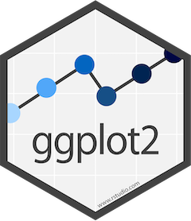

# Data visualisation

**Learning objectives:**


> **"The fundamental principles or rules of an art or science"** 
>
> `r tufte::quote_footer('OED Online 1989')`


- Data visualisation: learning the basic structure of a ggplot2 plot
- Data transformation: select, filter, create, and summarize 
- Exploratory data analysis: combination of visualisation and transformation


In the next chapters we will see how modeling is an important part of the exploratory process and focus on R workflow.


-----------------------------------------


**Learning objectives:**

- **Load** the `tidyverse` family of packages
- Produce a simple plot with **{ggplot2}**
- Use **`aes`thetic mappings** to produce more complex plots
- Deal with **common R programming problems.**
- Produce **small multiples** with `facet()`
- Combine multiple `geom_*()` objects to produce more complex plots
- Recognize the interaction between `stat`s and `geom`s
- Use the `position` argument to control **data layout.**
- Use alternative **coordinate systems** for plots in ggplot2
- Describe the components of the **layered grammar of graphics**


--------------------------------------------


## Loading Packages in R

- Use `install.packages("PACKAGE_NAME")` to **install** a package in R.
  - You need to do this before you can use a package, but you only need to do it once.
  - Depending where you're learning R, the packages you need may already be installed.
- Use `library(PACKAGE_NAME)` to **load** a package in R.
  - In general, you want to do this at the start of any session where you use a package.
  - Alternatively, you can refer to a package every time you use it, such as `ggplot2::ggplot()`. "ggplot2" is the package, "ggplot()" is the function call, "::" tells R "look up this function in this package."
  

```{r library}
library(tidyverse)
```


## First Steps


### How to visualise your data using ggplot2

> "ggplot2 is a plotting system for R, based on the grammar of graphics, which tries to take the good parts of base and lattice graphics and none of the bad parts. It takes care of many of the fiddly details that make plotting a hassle (like drawing legends) as well as providing a powerful model of graphics that makes it easy to produce complex multi-layered graphics." 
>
> `r tufte::quote_footer('© Hadley Wickham 2013')`

The `{ggplot2}` package is one of the `{tidyverse}` packages, it lets us build up plots layer by layer. 


```{r 03-02, echo=FALSE, fig.align='center', fig.cap='ggplot2 package', out.width='25%'} 

```


**The layered grammar of graphics**: to see the structure of a ggplot()

    ggplot(data = <DATA>) + 
    <GEOM_FUNCTION>(mapping = aes(<MAPPINGS>)) 


- `ggplot(data = <DATA>)`: Set up a base plot with data
- `<GEOM_FUNCTION>(mapping = aes(<MAPPINGS>))`: Add a geometry, such as a point (`geom_point()`)
- `mapping`: Map visual properties (`x`, `y`) to variables from `data` (`displ`, `hwy`)
- `aes()`: A function to do the mapping. The name is short for "aesthetics." **Spoiler alert:** "aesthetics" is the word Hadley uses for "visual properties"
  
  
Other little things brought out here:

  - Type `?FUNCTION_NAME` (`?) to load help for that function (or data object)
  - All `{tidyverse}` help is also available at [tidyverse.org](https://www.tidyverse.org/)
  - Exercises solution are available at: [jrnold.github.io/r4ds-exercise-solutions](https://jrnold.github.io/r4ds-exercise-solutions/)


After having loaded the library you can start building your plot. Let's start with making an empty plot:

```{r 03-03}
ggplot() +
  geom_blank() 
```


The `ggplot()` function can be used by adding data inside the function as its first argument, and adding a `mapping` as a second argument:

    ggplot( data = < some data > , 
            mapping = aes( x = x , y = y )) +
    <GEOM_FUNCTION>()
    
    
    
## Geometry


There are several different types of of `<GEOM_FUNCTION>`: `geom_`

- point (scatterplot)
- line
- smooth
- histogram / bar or (stat_count) / col
- boxplot
- map
- text
- ...    


## Aesthetic mappings

**Aesthetics** are visual properties of objects in the plot.

There are several different types of of **aesthetic mapping**:

- coordinates: x and y
- size
- shape
- color
- fill
- alpha (transparency)
- stroke
- linetype
- group
- show.legend 
- others, sometimes specific to a geom


Use the `mapping` argument and the `aes` function to map an aesthetic to a variable in `data`.

Or assign the <DATA> in the `ggplot()` function and the `mapping` in one of the <GEOM_FUNCTION>:

    ggplot(data = <DATA>) + 
    <GEOM_FUNCTION>(mapping = aes(<MAPPINGS>))
    

As an example we load the data provided in {ggplot2}: 

    ggplot2::mpg    
    
Display the data head of the first 3 rows:
```{r 03-04}
head(mpg,3)
```
    

Add a <GEOM_FUNCTION> to `ggplot(<DATA>)` with:

```{r 03-05}
ggplot(data=mpg) +
  geom_point(mapping = aes(x = displ, y = hwy), color = "blue")
```

    
    
Here the color appears outside the **mapping** but what if it will be set inside of it?
    
A super common error: Trying to set the color *inside* the `aes` call results in random effects because `aes()` automatically figures out the necessary **scale** for your data.
  
  
```{r 03-bad-mapping}
ggplot(data = mpg) + 
  geom_point(mapping = aes(x = displ, y = hwy, color = "blue"))
```


---------------------------------------


## Common problems


What is very important when deciding on a visualization of your data?

{width=90%} 


Before you create your visualization, you need to have your data ready. We'll learn more about these steps in upcoming chapters:```

- import your data
- tidy the data to have your variables ready to display
- transform the data as needed
- visualize the data with a plot
- model 
- communicate


One more suggestion would be to sketch down your visualization before hand and then set the data ready and plot it!


More tips:

- The `{tidyverse}` (the packages described in this book) tend to have *really good error messages.* Pay attention to what they say!
- Read the help at `?function_name` to see if maybe it doesn't work how you thought it worked
- Googling error messages can often help
- Take a deep breath. You've got this!
- Get practice doing some [TidyTuesdays](https://github.com/rfordatascience/tidytuesday) 


-------------------------------------


## Other function and features

- Facets
- Statistical transformations
- Position adjustments
- Coordinate systems
- Themes


----------------------------


### Facets

They never use this terminology, but...

you can subgroup your visualization with a `facet_` function:

**Small multiples:** Multiple plots on the same axes comparing something across splits in a dataset

There are 2 versions of this function in `ggplot2`:

    facet_wrap() the variable that you pass to facet_wrap() should be discrete
    facet_grid() the formula should contain two variable names separated by a ~

```{r 03-07}
ggplot(data = mpg) + 
  geom_point(mapping = aes(x = displ, y = hwy)) + 
  facet_wrap(~ class, nrow = 2)
```


You can either use `~` or `vars()`
 

--------------------------------------


### Statistical transformations

- Lots of geoms use transformed data. For example, `geom_bar(aes(x = cut))` calculates a count for each `cut`.

```{r 03-counts}
ggplot(data = diamonds) + 
  geom_bar(mapping = aes(x = cut))
```

- `stat_*()` functions do this calculation.
- `?stat_count` (etc) has a **Computer variables** section that tells you what that stat computes.
- You can use these computed variables to make fancier plots.


------------------------------------


### Position adjustments

- Geoms have a `position` argument to tell it how to deal with things that go on top of one another.
  - Sample values include "stack", "identity", "fill", "dodge", and "jitter".
- `geom_jitter()` is a shortcut for `geom_point(position = "jitter")` because it's super useful.

```{r 03-jitter}
dat <- tibble(
  x = rep(1:3, 3),
  y = rep(1:3, 3)
)
ggplot(dat, aes(x, y)) +
  geom_point()
ggplot(dat, aes(x, y)) +
  geom_jitter()
```

- Use `width` and `height` arguments of `geom_jitter` to more specifically specify range.

```{r 03-jitter2}
ggplot(dat, aes(x, y)) +
  geom_jitter(width = 0.1, height = 0.5)
```


-------------------------------


### Coordinate systems


Add Coordinate systems to your `ggplot` with:

    coord_flip()
    coord_quickmap()
    coord_polar()
    coord_fixed()
    

By default, `{ggplot}` uses `coord_cartesian()` but you can add other functions:

- `coord_flip()` can be useful to quickly flip orientations (although this is less necessary in modern `{ggplot}` than when this book was written; now there's an "orientation" argument that is usually guessed properly if you leave it blank)
- `coord_quickmap()` does proper transformations to work with lat/long data.
- `coord_polar()` for circular plots, which are almost always a bad idea but they tend to look cool
- `coord_fixed()` set the same limits to both axis


-------------------------------


### Theme


Once your data are imported, tidied and transformed adeguately for obtaing desired visualization you can start setting up a plot with extra features:

```{r 03-theme, eval = FALSE}
?theme
```

It is possible to add a `theme()` function to your `ggplot`, this is done to customize the non-data components of your plots:
 

- titles
- labels
- fonts
- background
- gridlines
- legends
- ...


For example if you would like to customize the background of your plot:

```{r 03-12}
ggplot() +
  geom_blank() +
  theme(plot.background = element_rect(color = "red", size = 2, fill = "gold"),
        panel.background = element_rect(color = "grey", size = 5, fill = "darkblue"))
```

Or you can customize a `theme_`, there are many different themes provided by defauld by `ggplo2` such as:


    theme_classic()
    theme_minimal()
    theme_void()

just to name a few, those function then can be further customize by adding the `theme` customization function.


--------------------------


## To summarize: The gg in {ggplot}

`{ggplot}` implements the "layered grammar of graphics."

```{r 03-gg, eval = FALSE}
ggplot(data = <DATA>) + 
  <GEOM_FUNCTION>(
     mapping = aes(<MAPPINGS>),
     stat = <STAT>, 
     position = <POSITION>
  ) +
  <COORDINATE_FUNCTION> +
  <FACET_FUNCTION> +
  <THEME_FUNCTION> +
  theme()
```

- `ggplot(data = <DATA>)`: Set up a base plot with data.
- `<GEOM_FUNCTION>(mapping = aes(<MAPPINGS>))`: Add a geometry, such as a point (`geom_point()`).
  - `mapping`: Map aesthetics (`x`, `y`) to variables from `data` (`displ`, `hwy`).
  - `stat`: How to transform the data.
  - `aes()`: A function to do the mapping. The name is short for "aesthetics."
  - `position`: How to deal with things that overlap.
- `<COORDINATE_FUNCTION>`: Adjust the coordinate layout.
- `<FACET_FUNCTION>`: Break the plot up into small multiples.


In addition it is possible to subset data inside the `ggplot()` function or inside the `<GEOM_FUNCTION>()`:


    ggplot(data = mpg, mapping = aes(x = displ, y = hwy)) + 
      geom_point(mapping = aes(color = class)) + 
      geom_smooth(data = filter(mpg, class == "subcompact"), se = FALSE)


---------------------------------------


[R4DS book](https://r4ds.had.co.nz/data-visualisation.html)


### Exercises:

[R for Data Science: Exercise Solutions](https://jrnold.github.io/r4ds-exercise-solutions/)


### Resources:


- [A Layered Grammar of Graphics](http://vita.had.co.nz/papers/layered-grammar.pdf)
- [{ggplot2}](https://cran.r-project.org/web/packages/ggplot2/index.html)
- [ggplot2 extensions - gallery](https://exts.ggplot2.tidyverse.org/gallery/)
- [R Graphics Cookbook](https://r-graphics.org/)


## Meeting Videos

### Cohort 1

`r knitr::include_url("https://www.youtube.com/embed/0NdiQuuM0vw")`

<details>
  <summary> Meeting chat log </summary>
  
```
00:11:14	Jon Harmon (jonthegeek):	r4ds.io/r4ds
00:12:06	Saeed Shafiei Sabet:	Hi everyone!
00:12:29	Sandra Muroy:	Hi Saeed!
00:13:05	Becki R. (she/her):	Hello!
00:13:30	Sandra Muroy:	Hi Becki!
00:22:41	Saeed Shafiei Sabet:	Can also by using ggplot2 do some 3D surface plots?
00:24:01	shamsuddeen:	https://ggplot2.tidyverse.org/reference/geom_contour.html
00:24:12	shamsuddeen:	2D contours of a 3D surface
00:25:34	Saeed Shafiei Sabet:	Thanks @shamsuddeen ;)
00:25:50	Jon Harmon (jonthegeek):	ggplot2 is 2D. There are other packages for 3D visualization, I'll try to link some in your question on the Slack once we're done!
00:26:29	Saeed Shafiei Sabet:	@Jon Thanks a lot! :)
00:26:34	shamsuddeen:	I guess this package provides 3D plotting https://www.rayshader.com/index.html
00:27:24	Jon Harmon (jonthegeek):	Yup, that's the one I was going to recommend: https://cran.r-project.org/web/packages/rayshader/index.html
00:28:28	Jon Harmon (jonthegeek):	I found it super helpful to figure out how to read some of these things as words:
%>% = "and then"
~ = "by" (usually)
00:28:30	shamsuddeen:	Looks at some practical examples of the package here: https://www.tylermw.com/3d-ggplots-with-rayshader/
00:29:54	Saeed Shafiei Sabet:	Thank you!
00:36:02	docksbox@pm.me:	https://jrnold.github.io/r4ds-exercise-solutions/
00:40:57	Jon Harmon (jonthegeek):	?ggplot2::mpg will show all the details of the dataset
00:41:50	Sandra Muroy:	thanks Jon :)
00:42:40	Jon Harmon (jonthegeek):	hwy = "highway miles per gallon", cty = "city miles per gallon" in that set, so usually that's what you'd want on y.
00:43:38	Becki R. (she/her):	Did I hear correctly that the dependent variable goes on the y-axis?
00:44:04	Jon Harmon (jonthegeek):	Generally, yes. But it's whatever you specify as "y" in the "aes" call.
00:44:16	Becki R. (she/her):	ok thanks
00:49:24	Jon Harmon (jonthegeek):	The "labs" function is for all of the labels for your plot.
00:51:26	Jon Harmon (jonthegeek):	https://twitter.com/search?q=%23tidytuesday&src=typed_query
00:51:48	Hector:	Is there any specific use for the ggtitle() function in contrast with labs() ?
00:52:09	Njoki Njuki Lucy:	what is there a difference between stat="count" and stat="identity"? I understand stat = "count returns count per each level.
00:53:23	Jon Harmon (jonthegeek):	@Hector: ggtitle is equivalent to labs() for just the title and subtitle parts. It's just to make it easier to focus on those specific bits.
00:53:56	Jon Harmon (jonthegeek):	@Njoki: "count" means "how many entries have this value?", vs "identity" means "what value is in this cell?"
00:54:59	Hector:	Thank you!
00:55:04	Njoki Njuki Lucy:	thank you.
00:56:26	Jon Harmon (jonthegeek):	"color" = outside, "fill" = inside
00:58:53	docksbox@pm.me:	labs()
01:04:36	Ryan Metcalf:	Could it be stated that “labs” is a more eloquent way of labeling than explicitly calling each field directly? Less lines of code maybe?
01:05:47	Jon Harmon (jonthegeek):	I'm not sure I'd say "eloquent," but it's just another option. They provide the separate functions in case you're looking for them, basically.
01:07:23	Jon Harmon (jonthegeek):	Sorry about that!
01:08:23	Susie Neilson:	This was a great presentation - thank you so much Federica!
01:12:31	docksbox@pm.me:	example would be the use of a map data
01:12:51	Saeed Shafiei Sabet:	Thanks Federica :)
01:13:43	docksbox@pm.me:	great thanks!
01:13:46	Fodil:	thank you everyone was very interesting.
01:13:51	Becki R. (she/her):	Thanks, Federica!
01:13:56	Njoki Njuki Lucy:	Thank you.
01:13:56	Saeed Shafiei Sabet:	Thank you
01:13:58	Saeed Shafiei Sabet:	bye
```
</details>
