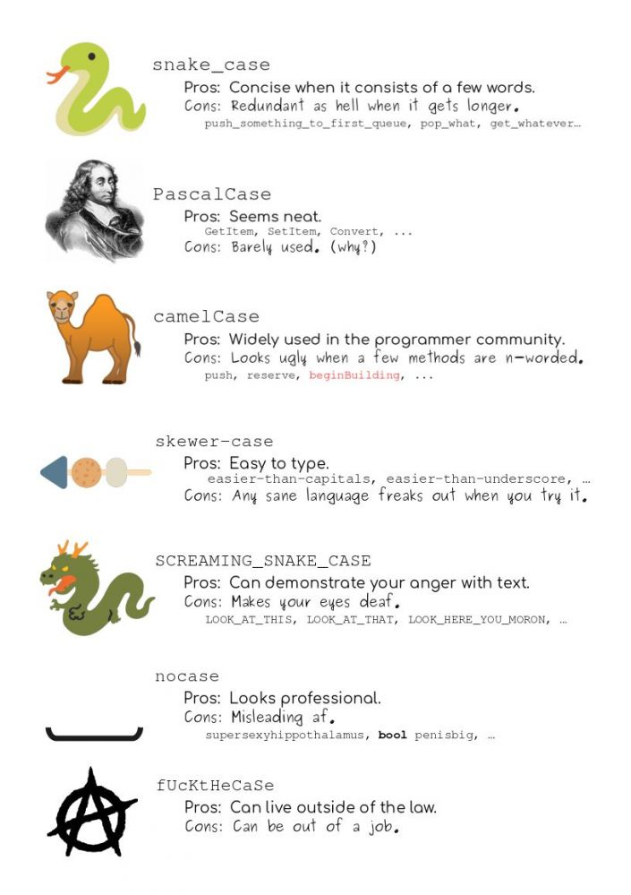

# Workflow: basics

**Learning objectives:**

-   Review some basic R coding.
-   Follow good **style conventions** when writing code.
-   Discuss the importance of commenting your code.
-   Review good practices when naming objects.
-   Confidently call **functions** in R.

## Coding basics {.unlisted .unnumbered}

1. Basic math calculations 

```{r}
1 / 200 * 30
(59 + 73 + 2) / 3
sin(pi / 2)
```
2. Create new objects using the 'assignment operator' `<-`

  - In windows the shortcut is 'ALT -'. 
  - In Mac the shortcut is 'Option -'.
  - I read it as "assign", so the following is "To object x assign  three by four" OR "three by four is assigned to object x" BUT the book recommends: "object name gets value/s".

```{r}
x <- 3*4
```

  - Although some times you can go the other way `->`. I've seen this with graphs mostly.

```{r}
library(ggplot2)
ggplot(mtcars, aes(wt, hp))+
  geom_point() -> plot01

plot01
```

  - *Double assign or scoping assing `<<-`?!*

3. Combine elements into a vector with `c()`

- Basic arithmetic operations applied to every element of a vector. 

```{r}
primes <- c(2, 3, 5, 7, 11, 13)
primes * 2
```


## Comments {.unlisted .unnumbered}

  - Use `#` to insert any comments in R. 
  
```{r}
# Create vector of primes 
primes <- c(2, 3)

# Multiply primes by 2
primes * 2
```

  - Commenting your own code can save you, your future you, and collaborators a lot of time.
  - *Why* of your code, not the how or what. 
    - For example `geom_smooth()` has an argument called `span`. Write a comment if you decide to change the default value of 0.75 to 0.9. 


## Assigning Names {.unlisted .unnumbered}

  - Different ways to assign names. 
  - Object names must start with a letter, contain letters, numbers, `_`, `.`. 
  - Descriptive names. 
  - The book recommends snake case. 
  - R is case-sensitive! And it can't read your mind.
  - Sticking with a good style convention will make your code more readable.
  - Use descriptive names. Long names are ok!
  - Typos matter! 



## Calling Functions {.unlisted .unnumbered}

Functions overall look like this: 

```{r, eval=FALSE}
function_name(argument1 = value 1, 
              argument2 = value 2, 
              ...)
```

  - Use TAB to show a popup of possible completions of a function and its arguments. Use ESC to abort the suggestions. 
  - Usually, we can skip the names of the arguments but it can make code more readable. 
  - The order of the arguments is not important but if you skip names remember the order of the defined function. 
  - Functions and objects are always displayed in the Environment tab in RStudio. 

```{r}
seq (from = 1,  to = 10)
seq(1, 10)
```
  
## Other RStudio Features {.unlisted .unnumbered}

Explore on your own:

  -   Console: up-arrow to see console history
  -   Console: type, then command- (control-) up-arrow to search history
  -   alt-shift-k to see lots of shortcuts
  -   Script: one of my recent favorites: alt-command-down-arrow. 

## Exercises

1. Why does this code not work? 

```{r, eval=FALSE}
my_variable <- 10
my_varıable 
#> Error in eval(expr, envir, enclos): object 'my_varıable' not found
```
> Because the name on the second line doesn't include and `i`. Remember, typos matter. 

2. Tweak each of the following R commands so that they run correctly:

```{r, eval = FALSE}
libary(todyverse)

ggplot(dTA = mpg) + 
  geom_point(maping = aes(x = displ y = hwy)) +
  geom_smooth(method = "lm)
```

Here is the correct code with no typos: 

```{r, eval=FALSE}
library(tidyverse)

ggplot(data = mpg)+
  geom_point(mapping = aes(x = display, y = hwy)) +
  geom_smooth(method = "lm")
```

3. Press Option + Shift + K / Alt + Shift + K. What happens? How can you get to the same place using the menus?

> This takes you to the list of shortcuts. Another way of getting here is: Tools > Keyboard shortcuts help. 

4. Let’s revisit an exercise from the Section 2.6. Run the following lines of code. Which of the two plots is saved as mpg-plot.png? Why?

```{r, eval=FALSE}
my_bar_plot <- ggplot(mpg, aes(x = class)) +
  geom_bar()
my_scatter_plot <- ggplot(mpg, aes(x = cty, y = hwy)) +
  geom_point()
ggsave(filename = "mpg-plot.png", plot = my_bar_plot)
```

> The arguments for ggsave are (`?ggsave` in the console): filename, plot, device, path, ...). Plot refers to the plot to be saved, so in this case the first plot named `my_bar_plot` will be saved as mpg-plot.png. 

## Meeting Videos {.unlisted .unnumbered}

### Cohort 5

`r knitr::include_url("https://www.youtube.com/embed/nQnMm6kyJbE")`

<details>

<summary>Meeting chat log</summary>

```         
00:14:44    Jon Harmon (jonthegeek):    Ignore the URL on these, I should have made my coworker crop those out since it isn't relevant outside of our work environment 🙃
00:47:00    Jon Harmon (jonthegeek):    ?variable.names
00:58:53    Becki R. (she/her): jon_doe is an object?
00:59:05    Wai-Yin:    Yes.
01:10:33    Becki R. (she/her): Is there a list of verbal substitutions like "<- = get"?
01:16:05    Jon Harmon (jonthegeek):    Not yet! Some more will come up as we go through the book... and I plan on putting something together with them before too long!
01:16:56    Becki R. (she/her): Nice!
01:20:44    docksbox@pm.me: Thanks
01:22:41    Becki R. (she/her): Thanks everyone! I will not be here next week.
```

</details>

### Cohort 7

`r knitr::include_url("https://www.youtube.com/embed/JDOQDfpYBmY")`

<details>

<summary>Meeting chat log</summary>

```         
00:29:38    Dolleen Osundwa:    is a tibble similar to the table () function?
```

</details>

### Cohort 8

`r knitr::include_url("https://www.youtube.com/embed/FeSYfRx2esU")`

<details>

<summary>Meeting chat log</summary>

```         
00:06:13    Shamsuddeen Muhammad:   book_club-py4da
00:06:16    Shamsuddeen Muhammad:   #book_club-py4da
00:08:47    Shamsuddeen Muhammad:   https://www.youtube.com/watch?v=8tq1C8spV_g
00:09:03    Abdou Daffeh:   Hey everyone
00:34:25    Abdou Daffeh:   sorry do you mean vscode?
00:34:45    Hamza:  Yes he is using VSCode
00:35:13    Abdou Daffeh:   thanks, I have to check it out
00:41:22    Shamsuddeen Muhammad:   https://www.rscreencasts.com/content_pages/hbcu-enrollment.html
```

</details>
