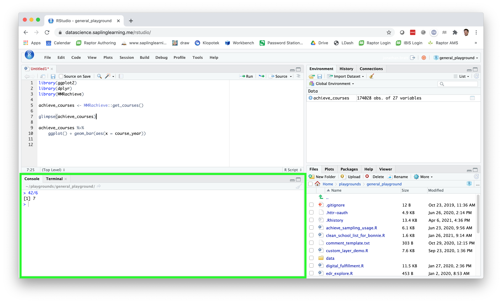
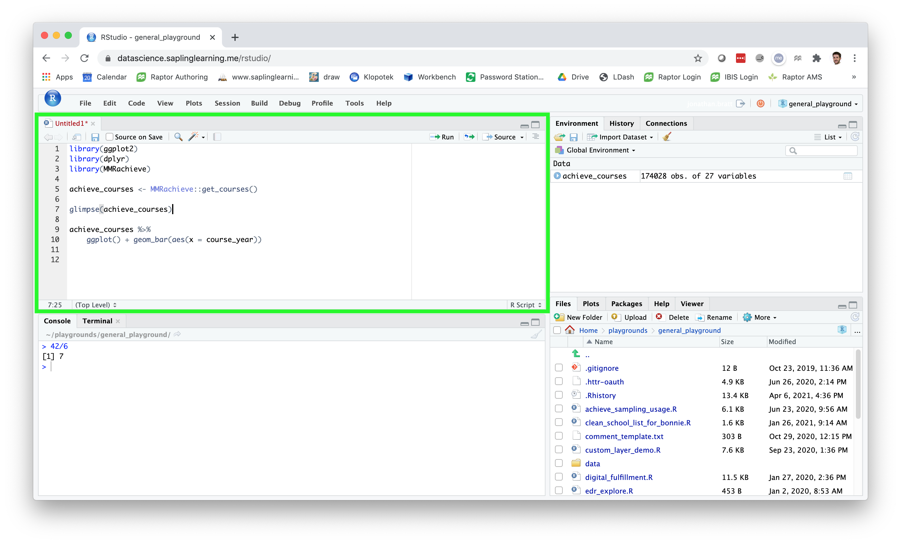
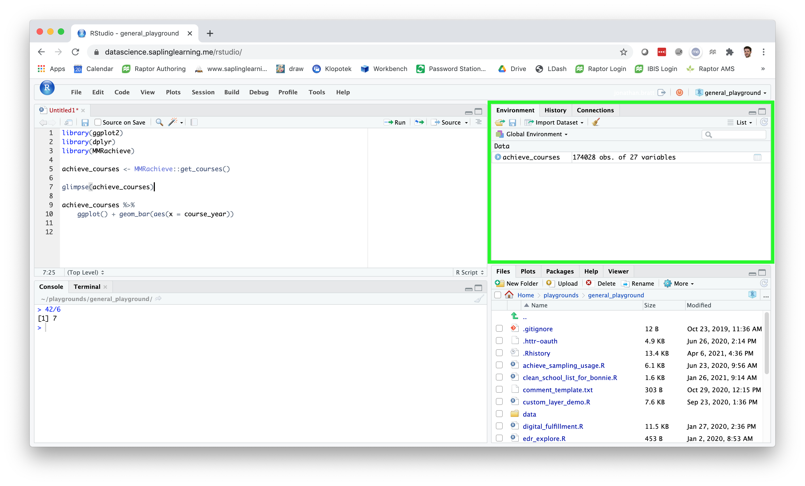
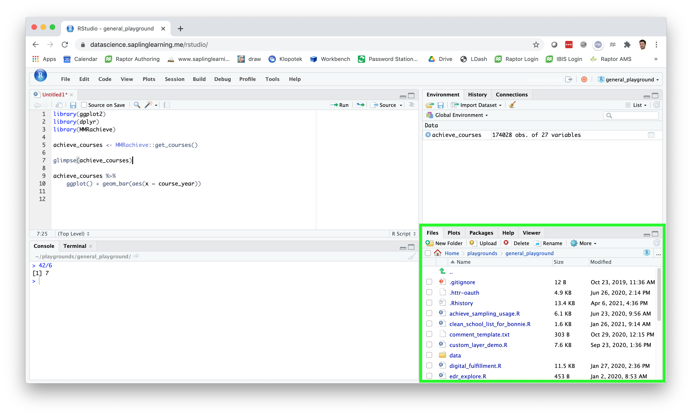

# Workflow: basics

**Learning objectives:**

- Understand the **RStudio** interface
- Use the R **command line** boldly
- Follow good **style conventions** when writing code
- Confidently call **functions** in R

## The Console Pane 




## The Script Pane {.unlisted .unnumbered}




## The Environment Pane {.unlisted .unnumbered}




## The Other Pane {.unlisted .unnumbered}




## Using the Console {.unlisted .unnumbered}

Conceptually, everything we do in R is a series of commands. The console is where we can enter these commands.

By default, entering `<thing>` means "print out `<thing>`."

```{r 04-01}
4
```

## Using the Console {.unlisted .unnumbered}

R has some pre-defined named objects:

```{r 04-02}
pi
```

This one is surprisingly useful:

```{r 04-03}
letters
```

## Using the Console {.unlisted .unnumbered}

What it means to "print out" a thing depends on what kind of thing it is.

```{r 04-05}
ggplot2::diamonds
```

## Using the Console {.unlisted .unnumbered}

Actually, entering `<thing>` really means "**evaluate** and print `<thing>`."

```{r 04-06}
cos(pi)
```

I use R as a desktop calculator a lot.

```{r 04-07}
60*60*24
```


## Assigning Names {.unlisted .unnumbered}

Sometimes you don't just want to print out a thing, especially if it's a complex evaluation. You want to save it to a named object so that you can do more stuff with it. 
Use the assignment arrow (`<-`) for this.

```{r 04-08}
tau <- 2*pi
```

Most programming languages use the equals sign (`=`) for assignment, and this also works in R. But assignment is really a conceptually distinct thing from mathematical equality, so it makes sense to use a different symbol. It's a bit more annoying to type, though, so get used to the keyboard shortcut Alt+minus.

Objects that you have named will show up in the "Environment" panel.

## Assigning and Printing {.unlisted .unnumbered}

By default, when you make an assignment, the result of the evaluation **is not** printed in the console. To assign **and** print in one command, surround the assignment with parentheses:

```{r 04-09}
(tau <- 2*pi)
```


## Pronouncing Code {.unlisted .unnumbered}

It's easier to remember and understand a thing if you can say it (either out loud or in your head). 

A common pronunciation of `<-` is "gets," so `tau <- 2*pi` would be read as
"tau gets two times pi."


## Naming Things

<font size="4"> *There are only two hard things in computer science: cache invalidation and naming things. And off-by-one errors.* </font>

- Picking good names for things is both harder and more important than you might guess.
- Having good guidelines for naming things can save you a lot of mental effort down the road.
- Names in R can only contain letters, numbers, `_`, and `.`.
- R is case-sensitive! And it can't read your mind.
- Sticking with a good style convention will make your code more readable, both for others, and for yourself in the future.
 
 Some suggestions:
 
- Use descriptive names. Long names are ok!
- Use all lowercase by default, with `_` as a separator.
  - `student_item_data`
  - `num_students`
  - `fall2020_math_courses_with_multiple_sections`


## Functions

A function in R is like a function in math: it's a box that takes in input and returns output.^[Functions may also have *side effects*, which is something we can talk about later.]

Functions can take zero, one, or more than one object as input. When you *call* a function, you specify values (*arguments*) for the inputs. Evaluating the function call gives the output of the function.

```{r 04-10}
length(letters)
```

Or:

```{r 04-12}
nrow(ggplot2::diamonds)
```

## Functions {.unlisted .unnumbered}

The inputs (the function *parameters*) have names. When you pass in the function arguments, you can do so by name:

```{r 04-13}
seq(from = 1, to = 10)
```

Specifying names is (usually) optional, but it can make your code more readable, so it's a good habit to get into. If you name the arguments, it doesn't matter what order you put them in:

```{r 04-14}
seq(to = 10, from = 1)
```

If you don't specify names, the function matches the arguments to the parameters in the order they appear in the function definition.

```{r 04-15}
seq(10, 1)
```

## Other RStudio Features {.unlisted .unnumbered}

Explore on your own:

- tab autocomplete
- up-arrow to see console history
- type, then command- (control-) up-arrow to search history
- alt-shift-k to see lots of shortcuts
- one of my recent favorites: alt-command-down-arrow (inside a script)

## Meeting Videos

### Cohort 1

`r knitr::include_url("https://www.youtube.com/embed/nQnMm6kyJbE")`

<details>
  <summary> Meeting chat log </summary>
  
```
00:14:44	Jon Harmon (jonthegeek):	Ignore the URL on these, I should have made my coworker crop those out since it isn't relevant outside of our work environment 🙃
00:47:00	Jon Harmon (jonthegeek):	?variable.names
00:58:53	Becki R. (she/her):	jon_doe is an object?
00:59:05	Wai-Yin:	Yes.
01:10:33	Becki R. (she/her):	Is there a list of verbal substitutions like "<- = get"?
01:16:05	Jon Harmon (jonthegeek):	Not yet! Some more will come up as we go through the book... and I plan on putting something together with them before too long!
01:16:56	Becki R. (she/her):	Nice!
01:20:44	docksbox@pm.me:	Thanks
01:22:41	Becki R. (she/her):	Thanks everyone! I will not be here next week.
```
</details>
