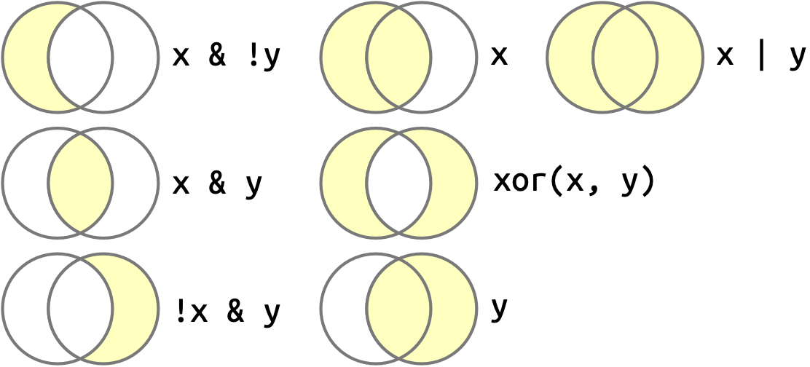

# (PART\*) Transform {-}

```{r, include=F}
library(dplyr)
library(nycflights13)
```

# Logical Vectors

**Learning objectives:**

- Logical vectors: understanding what they are and why we use them
- Knowing how to generate logical vectors (variables)
- Knowing how to make use of logical vectors (variables):
  - to filter data
  - to create new variables
  - to create summaries 
- Understanding the effect of missing values in these operations


## What and why {-}

- This is all about conditions on data values: they return `TRUE` or `FALSE`.
This vector of `TRUE`/`FALSE` values is a logical vector.
- These conditions -- hence the resulting logical vectors -- play an important role in filtering, mutating and summarizing dataframe columns.

## Definition {-}

Logical vector: vector of `TRUE`, `FALSE` and/or `NA` values.

## Challenging: `NA` values {-}

The most tricky part of **operations** with logical vectors is the effect of missing values.

## Operations overview {-}

- Operations that don't change vector lengths
  - comparisons: **generate a logical vector** from a non-logical vector
  - boolean algebra: **generate a logical vector** from other logical vectors
  - conditional transformations: generate a new vector **from (hierarchical) conditions** (~ logical vectors ~ comparisons)
- **Subsetting** vectors with a logical vector
- **Summarizing** logical vectors

## Generating a logical vector (1) {-}

- either by doing (vectorized) **comparisons**

  operators:

  - one-to-one: `==`, `!=`, `<`, `<=`, `>`, `>=`
  - one-to-many: `%in%`
  
  \
  Comparisons are often the way that logical vectors arise, i.e. during exploration, cleaning and analysis
    - ... unless the logical vector is already provided, e.g. the observed variable is boolean.

## Generating a logical vector (2) {-}

```{r}
flights |> 
  mutate(daytime = dep_time > 600, .keep = "used")
```

## Generating a logical vector (3) {-}

```{r}
flights |> 
  mutate(daytime = dep_time > 600, .keep = "used") |> 
  filter(daytime)
```

## Generating a logical vector (4) {-}

```{r}
1:12 %in% c(1, 5, 11)
```

## Generating a logical vector (5) {-}

A comparison _**is**_ a logical vector...

```{r}
class(flights$dep_time > 600)
length(flights$dep_time > 600)
head(flights$dep_time > 600)
```

## Generating a logical vector (6) {-}

... so the logical vector does not have to be stored in order to filter data -- it is created on the fly:

```{r}
flights |> 
  filter(dep_time > 600)
```


## Generating a logical vector (7) {-}

- either by doing (vectorized) comparisons (see before)
- or by **combining** logical vectors or comparisons = **boolean algebra**

  - operators: `&`, `|`, `!`, `xor()`
  - `{magrittr}` (through `{dplyr}`) provides the aliases `and()`, `or()`, `not()`
  
  \
  In numerical operations, `FALSE` is 0 and `TRUE` is 1.
  Therefore:

  - `&` can be mimicked by `pmin()`
  - `|` can be mimicked by `pmax()`

## Generating a logical vector (8) {-}

Boolean operators:



## Generating a logical vector (9) {-}

```{r}
flights |> 
  mutate(
    daytime = dep_time > 600 & dep_time < 2000,
    .keep = "used"
  )
```
  
## Missing values (1) {-}

In most cases an `NA` value (vector element) is regarded '_missing so we can't (always) know the outcome_':

- hence `NA`in **comparisons** will always return `NA`.
  - so `x == NA` will just return `NA` for _all_ elements.
  - check for missing values with **`is.na()`**: `TRUE` for missing values and `FALSE` for everything else
  
## Missing values (2) {-}

```{r}
c(TRUE, NA, FALSE) == NA # NOT useful!!
is.na(c(TRUE, NA, FALSE))
is.na(c(1, NA, 3))
```

## Missing values (3) {-}

In most cases an `NA` value (vector element) is regarded '_missing so we can't (always) know the outcome_':

- `NA`in comparisons will always return `NA` (see before).
- `NA` in **boolean algebra**: sometimes the outcome is known, sometimes not (hence `NA`):
  - `TRUE & NA` is `NA` but `FALSE & NA` is `FALSE`
  - `TRUE | NA` is `TRUE` but `FALSE | NA` is `NA`

## Missing values (4) {-}

```{r}
c(TRUE, FALSE) & NA
c(TRUE, FALSE) | NA
```

## Missing values (5) {-}

But `%in%` works differently:

- `NA %in% NA` returns `TRUE`: here `NA` is just regarded as a special value

```{r}
flights |>
  filter(dep_time %in% c(NA, 0800))
```

## Conditional transformations (1) {-}

Aim: generate a vector where each element is determined by the value of one or multiple conditions (~ comparisons).

- one condition: use `if_else()`
  - `if_else(condition, true, false, missing = NULL)`
  
- multiple (hierarchical) conditions: use `case_when(..., .default = NULL)`.
  - the _first_ condition that is `TRUE` for an element determines the outcome for that element.
  - the different outcomes must be compatible types

## Conditional transformations (2) {-}

```{r}
x <- c(-3:3, NA)
if_else(x > 0, "+ve", "-ve", "???")
```

## Conditional transformations (3) {-}

```{r}
x <- c(-3:3, NA)
case_when(
  x == 0   ~ "0",
  x < 0    ~ "-ve", 
  x > 0    ~ "+ve",
  is.na(x) ~ "???"
)
```

## Conditional transformations (4) {-}

The different outcomes must be **compatible types**!
E.g. numerical and logical; strings and factors.

- `NA` is compatible with everything.


## Subsetting vectors {-}

I.e. keep only a subset of a vector, drop the rest, based on some condition.

- This is base R!
- Put a logical vector in the brackets (obtained by one of the previous techniques; often comparison)

E.g.:

```r
condition <- flights$arr_delay > 0
flights$arr_delay[condition]
flights$dep_time[condition]
# or just:
flights$dep_time[flights$arr_delay > 0]
```


## Summarizing logical vectors (1) {-}

- Summarizing the whole vector:
  - `any()`, `all()`: return a logical
  - `sum()`, `mean()`: return a numeric

- Summarizing a subset:
  - apply a summary function to a subsetted vector

- If `NA` values are present, the summary result will be `NA`, BUT the `NA` values can also be ignored with: **`na.rm = TRUE`**.

## Summarizing logical vectors (2) {-}

```{r}
flights |> 
  group_by(year, month, day) |> 
  summarize(
    all_delayed = all(dep_delay <= 60, na.rm = TRUE),
    any_long_delay = any(arr_delay >= 300, na.rm = TRUE),
    .groups = "drop"
  )
```


## Summarizing logical vectors (3) {-}

```{r}
flights |> 
  group_by(year, month, day) |> 
  summarize(
    proportion_delayed = mean(dep_delay <= 60, na.rm = TRUE),
    count_long_delay = sum(arr_delay >= 300, na.rm = TRUE),
    .groups = "drop"
  )
```

## Summarizing logical vectors (4) {-}

```{r}
flights |>
  group_by(year, month, day) |>
  summarize(
    behind = mean(arr_delay[arr_delay > 0], na.rm = TRUE),
    ahead = mean(arr_delay[arr_delay < 0], na.rm = TRUE),
    n = n(),
    .groups = "drop"
  )
```


## Meeting Videos

### Cohort 5

`r knitr::include_url("https://www.youtube.com/embed/rsRImj294pM")`

<details>
  <summary> Meeting chat log </summary>
  
```
00:39:35	Jon Harmon (jonthegeek):	.Machine$double.eps
00:40:36	Jon Harmon (jonthegeek):	> .Machine$integer.max
[1] 2147483647
00:41:23	Federica Gazzelloni:	?`.Machine`
00:42:11	Ryan Metcalf:	Some really fun reading about CPU “inner” workings: https://www.geeksforgeeks.org/computer-organization-von-neumann-architecture/
00:42:35	Jon Harmon (jonthegeek):	> typeof(.Machine$integer.max + 1)
[1] "double"
00:42:55	Jon Harmon (jonthegeek):	> .Machine$integer.max + 1L
[1] NA
Warning message:
In .Machine$integer.max + 1L : NAs produced by integer overflow
00:43:52	Becki R. (she/her):	thanks for the link, Ryan!
00:44:44	Jon Harmon (jonthegeek):	> sqrt(2)**2 == 2
[1] FALSE
00:45:16	Jon Harmon (jonthegeek):	> dplyr::near(sqrt(2)**2, 2)
[1] TRUE
00:57:52	Ryan Metcalf:	Not directly related to Cache or RAM….But similar. It is where you get FAT, FAT32, NTFS, ExFat, EXT, EXT3, etc…etc… there are hundreds of file allocation.
00:59:29	Sandra Muroy:	thanks Ryan!
01:02:08	Becki R. (she/her):	I'm finding the info on computer architecture (?) fascinating so I appreciate the detour.
01:03:05	Sandra Muroy:	I'm glad :)
01:10:01	Ryan Metcalf:	I think I just had an epiphany!!! Is this were the “Big Endian” and “Little Endian” comes in? The leading bit representing positive and negative?
01:10:27	Jon Harmon (jonthegeek):	> typeof(0L)
[1] "integer"
01:12:42	Jon Harmon (jonthegeek):	> .Machine$double.xmax
[1] 1.797693e+308
01:15:53	Jon Harmon (jonthegeek):	> 1:10 + 1
 [1]  2  3  4  5  6  7  8  9 10 11
01:16:19	Jon Harmon (jonthegeek):	> 1:10 + 2:11
 [1]  3  5  7  9 11 13 15 17 19 21
```
</details>

`r knitr::include_url("https://www.youtube.com/embed/EfOPxmQ9R-c")`

<details>
  <summary> Meeting chat log </summary>
  
```
00:03:09	Becki R. (she/her):	I have a buzz in my audio so I'm staying muted.
00:30:48	Federica Gazzelloni:	http://adv-r.had.co.nz/Subsetting.html
00:33:31	Jon Harmon (jonthegeek):	mtcars["mpg"]
mtcars[["mpg"]]
00:35:19	Jon Harmon (jonthegeek):	months <- purrr::set_names(month.name, month.abb)
00:35:40	Jon Harmon (jonthegeek):	months["Jan"]
00:35:46	Jon Harmon (jonthegeek):	Jan 
"January"
00:36:10	Jon Harmon (jonthegeek):	> months[["Jan"]]
[1] "January"
00:38:28	Federica Gazzelloni:	it acts like unlist()
00:38:48	Jon Harmon (jonthegeek):	> unlist(mtcars["mpg"])
 mpg1  mpg2  mpg3  mpg4  mpg5  mpg6  mpg7  mpg8  mpg9 mpg10 mpg11 mpg12 mpg13 mpg14 
 21.0  21.0  22.8  21.4  18.7  18.1  14.3  24.4  22.8  19.2  17.8  16.4  17.3  15.2 
mpg15 mpg16 mpg17 mpg18 mpg19 mpg20 mpg21 mpg22 mpg23 mpg24 mpg25 mpg26 mpg27 mpg28 
 10.4  10.4  14.7  32.4  30.4  33.9  21.5  15.5  15.2  13.3  19.2  27.3  26.0  30.4 
mpg29 mpg30 mpg31 mpg32 
 15.8  19.7  15.0  21.4
00:39:13	Jon Harmon (jonthegeek):	> unname(unlist(mtcars["mpg"]))
 [1] 21.0 21.0 22.8 21.4 18.7 18.1 14.3 24.4 22.8 19.2 17.8 16.4 17.3 15.2 10.4 10.4
[17] 14.7 32.4 30.4 33.9 21.5 15.5 15.2 13.3 19.2 27.3 26.0 30.4 15.8 19.7 15.0 21.4
00:39:29	Jon Harmon (jonthegeek):	single <- mtcars["mpg"]
00:39:50	Jon Harmon (jonthegeek):	> attributes(single) <- NULL
> single
[[1]]
 [1] 21.0 21.0 22.8 21.4 18.7 18.1 14.3 24.4 22.8 19.2 17.8 16.4 17.3 15.2 10.4 10.4
[17] 14.7 32.4 30.4 33.9 21.5 15.5 15.2 13.3 19.2 27.3 26.0 30.4 15.8 19.7 15.0 21.4
00:42:51	Jon Harmon (jonthegeek):	> str(months[[1]])
 chr "January"
> str(months[1])
 Named chr "January"
 - attr(*, "names")= chr "Jan"
00:43:41	Jon Harmon (jonthegeek):	?`[`
00:44:15	Jon Harmon (jonthegeek):	The most important distinction between [, [[ and $ is that the [ can select more than one element whereas the other two select a single element.
00:47:28	Ryan Metcalf:	BRB
00:56:31	Jon Harmon (jonthegeek):	The tangent I obsessed on just now:
> pillar:::glimpse.default
function (x, width = NULL, max.level = 3, ...) 
{
    str(x, width = get_width_glimpse(width), max.level = max.level, 
        ...)
    invisible(x)
}

(huh, "glimpse" technically comes from the {pillar} package)
01:12:09	Jon Harmon (jonthegeek):	> round(c(1.5, 2.5, 3.5, 4.5))
[1] 2 2 4 4
01:14:08	Jon Harmon (jonthegeek):	Note that for rounding off a 5, the IEC 60559 standard (see also ‘IEEE 754’) is expected to be used, ‘go to the even digit’. Therefore round(0.5) is 0 and round(-1.5) is -2. However, this is dependent on OS services and on representation error (since e.g. 0.15 is not represented exactly, the rounding rule applies to the represented number and not to the printed number, and so round(0.15, 1) could be either 0.1 or 0.2).
```
</details>

### Cohort 6

`r knitr::include_url("https://www.youtube.com/embed/bRwmyUbario")`

<details>
  <summary> Meeting chat log </summary>
  
```
00:36:56	Daniel Adereti:	Lucky I am not a python user. lol
00:37:05	Marielena Soilemezidi:	😂
00:38:03	Marielena Soilemezidi:	python will come and get you too, Daniel!
00:38:18	Daniel Adereti:	lol! can't avoid it!
00:42:11	Daniel Adereti:	Unfortunately, we have a strict 18 mins to end the lessons, let's see where we end up. Thanks
```
</details>


### Cohort 7

`r knitr::include_url("https://www.youtube.com/embed/crc1zcEKBWQ")`


### Cohort 8

`r knitr::include_url("https://www.youtube.com/embed/BNPvXGGcQMI")`
