# Relational data

**Learning objectives:**


- Recognize the **families of verbs** for working with relational data.
- Use **keys (primary, foreign, and surrogate)** to identify relations between tables.
- Use **mutating joins** to combine related tables.
- Use **filtering joins** to remove observations from a table.
- Recognize **common problems with joins.**
- Use **set operations** to combine or filter tables.


-----------

## Introduction

Multiple tables of data are called **relational data**.
The basic idea is that relations are defined between a pair of tables. Multiple tables are put in relation starting from this basic idea.

There are three families of verbs designed to work with relational data:

- **Mutating joins**, which add new variables to one data frame from matching observations in another.

- **Filtering joins**, which filter observations from one data frame based on whether or not they match an observation in the other table.

- **Set operations**, which treat observations as if they were set elements.


## nycflights13

How to make a custom table with different data sets

```{r message=FALSE, warning=FALSE, include=FALSE, paged.print=FALSE}
library(nycflights13)
library(tidyverse)
```


```{r eval=FALSE, include=T}
nycflights13::airlines
nycflights13::airports
nycflights13::flights
nycflights13::planes
nycflights13::weather
```

Relations:

- **flights** connects to **planes** via a single variable, **tailnum**.

- **flights** connects to **airlines** through the **carrier** variable.

- **flights** connects to **airports** in two ways: via the **origin** and **dest** variables.

- **flights** connects to **weather** via **origin** (the location), and **year**, **month**, **day** and **hour** (the time).


```{r echo=FALSE, fig.align='center', fig.cap='nycfilghts13 package', out.width='100%'} 
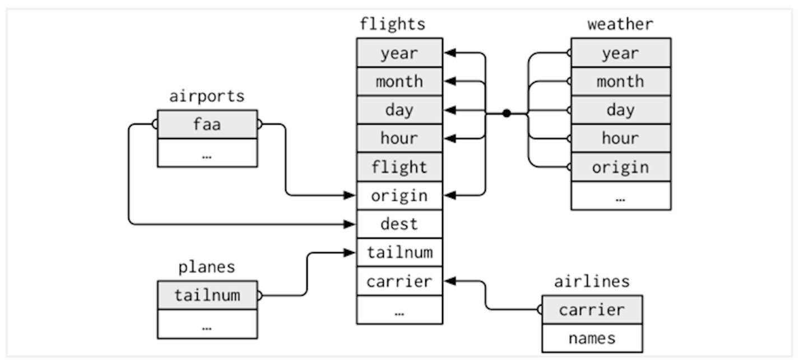
```

[Exercises and solutions](https://jrnold.github.io/r4ds-exercise-solutions/relational-data.html)

## Keys

> What is a **key**?   
>A key is a variable (or set of variables) that uniquely identifies an observation.


> What is a **relation**? 
> It is when a **primary key** and the corresponding **foreign key** in another table form a relation.
  

**What are the types of keys:**  
  
- A **primary key** uniquely identifies an observation in its own table.

> primary key: each row is an observation

For example, `planes$tailnum` is a primary key because it uniquely identifies each plane in the planes table.

- A **foreign key** uniquely identifies an observation in another table.

For example, `flights$tailnum` is a foreign key for the `planes table` because it appears in the `flights table` where it matches each flight to a unique plane.

- A **surrogate key** is a custom made key where it is possible to identify unique information, such as the number of rows in a table, and it is made if a table lacks a primary key.

For example, `flights$filghts_id` is a surrogate key because it is custom made and uniquely identifies each observation in the flights table.


**Type of data relations**
  
-   **1-to-many**: flight has one plane, but each plane has many flights
-   **Many-to-many**: between airlines and airports, each airline flies to many airports; each airport hosts many airlines

Special cases are: **1-to-1** and **Many-to-1** 

-----------

## Mutating joins

To combine variables from two tables

We have seen the **inner_join()** function operating now we see the other three **outer joins**:

- **left_join()** keeps all observations in x
- **right_join()** keeps all observations in y
- **full_join()** keeps all observations in x and y


### Understanding joins


```{r venndiagram, echo=FALSE, fig.align='center', fig.cap='Venn diagram', out.width='100%'} 
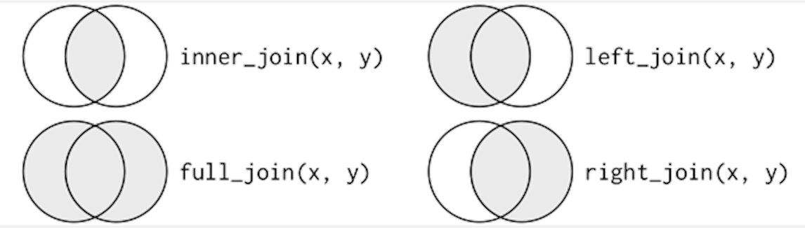
```

Suppose we have two tables with two variables: id and the observations
```{r twotables, echo=FALSE, fig.align='center', fig.cap='Two tables', out.width='30%'} 
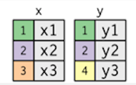
```

### Inner join


```{r}
flights %>% 
  slice(1:100) %>%
  select(origin,year,month) %>%
  inner_join(select(weather,origin,temp,wind_dir),by = "origin")
```

```{r innerjoin, echo=FALSE, fig.align='center', fig.cap='inner join', out.width='100%'} 
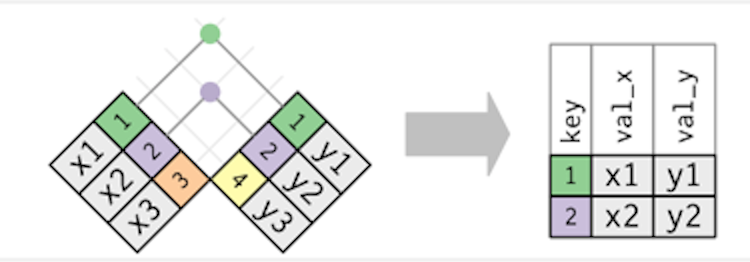
```

### Outer joins

- A left join keeps all observations in x
- A right join keeps all observations in y
- A full join keeps all observations in x and y

```{r outerjoins.png, echo=FALSE, fig.align='center', fig.cap='Outer joins', out.width='60%'} 
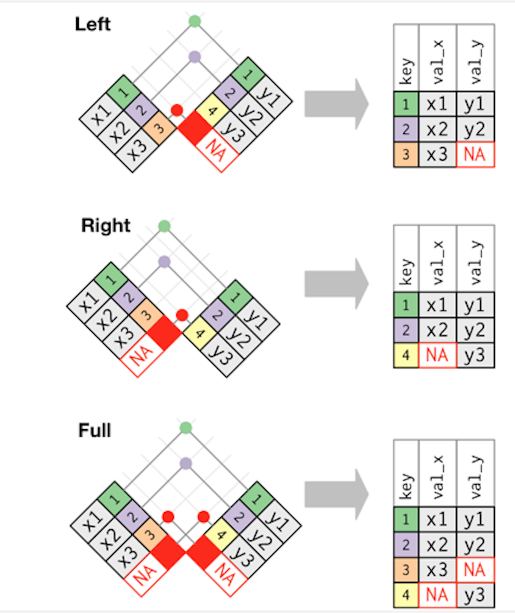
```


- left_join 

```{r}
flights %>% 
  select(year:day, hour, origin, dest, tailnum, carrier) %>%
  select(-origin, -dest) %>% 
  left_join(airlines, by = "carrier")
```

- same thing with `mutate()`

```{r}
flights %>% 
  select(year:day, hour, origin, dest, tailnum, carrier) %>%
  select(-origin, -dest) %>% 
  mutate(name = airlines$name[match(carrier, airlines$carrier)])
```

- right_join 

```{r}
weather %>% 
  select(origin,temp, humid, wind_dir, precip) %>%
  right_join(airports, by = c("origin" = "faa"))
```

- full_join

```{r}
airports %>%
  select(name,lat,lon) %>%
  full_join(airlines,by = "name")
```


### Duplicate keys

What happens when the keys are not unique?

1. Table with duplicates

```{r duplicates, echo=FALSE, fig.align='center', fig.cap='Duplicates', out.width='60%'} 
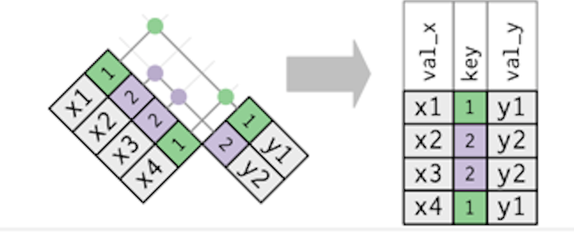
```

2. Both tables have duplicate keys

```{r duplicates2, echo=FALSE, fig.align='center', fig.cap='Duplicates', out.width='60%'} 
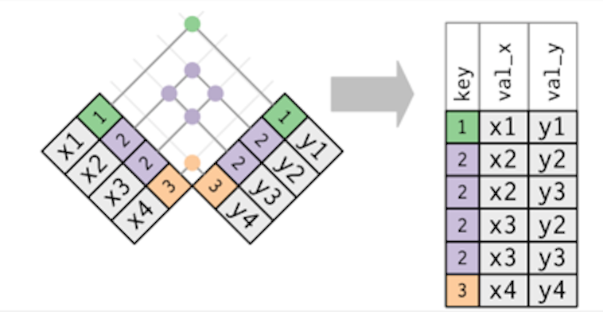
```

#### Defining the key columns

`by = "key"` can be customized:

- `by = NULL`, uses all variables that appear in both tables (**natural join**)
- `by = "x"`, uses only one specific variable
- `by = c("a" = "b")`, uses a named character vector

[Exercises and solutions](https://jrnold.github.io/r4ds-exercise-solutions/relational-data.html)

#### Other implementations

The `base::merge()` function can perform all four types of mutating join. 

The difference between the **joins** and **merge()** is really important. dplyr’s joins are considerably faster and don’t mess with the order of the rows.

```{r merge, echo=FALSE, fig.align='center', fig.cap='Implementations', out.width='60%'} 
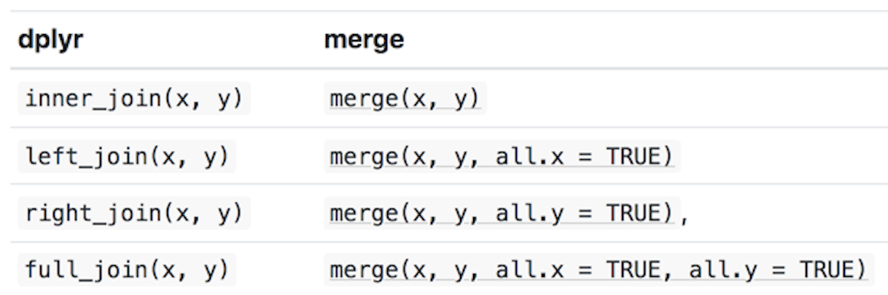
```

SQL is the inspiration for dplyr’s conventions
```{r sql,echo=FALSE, fig.align='center', fig.cap='Implementation', out.width='60%'} 
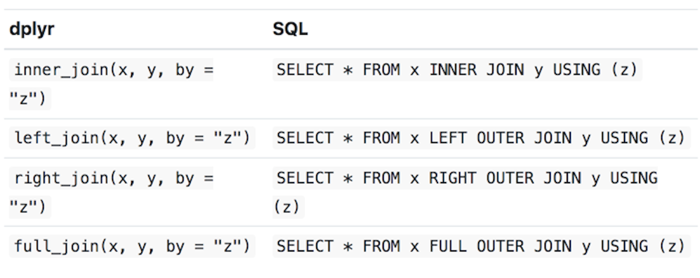
```

Example of dplyr’s joins and SQL syntax:

    inner_join(x, y, by = c("a" = "b")) 

It uses a slightly different syntax in SQL: 

    SELECT * FROM x INNER JOIN y ON x.a = y.b


## Filtering joins

- `semi_join(x, y)` **keeps** all observations in x that have a match in y.
- `anti_join(x, y)` **drops** all observations in x that have a match in y.

**Semi-join**:

    semi_join()


```{r semijoin, echo=FALSE, fig.align='center', fig.cap='Semi-join', out.width='60%'} 
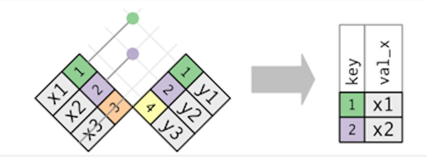
```

```{r message=FALSE, warning=FALSE, paged.print=FALSE}
top_dest <- flights %>%
  count(dest, sort = TRUE) %>%
  head(10)

flights %>% 
  semi_join(top_dest) #  keeps all observations in x that have a match in y
```


Filtering joins never duplicate rows like mutating joins do:

```{r semijoin2, echo=FALSE, fig.align='center', fig.cap='Semi-join', out.width='60%'} 
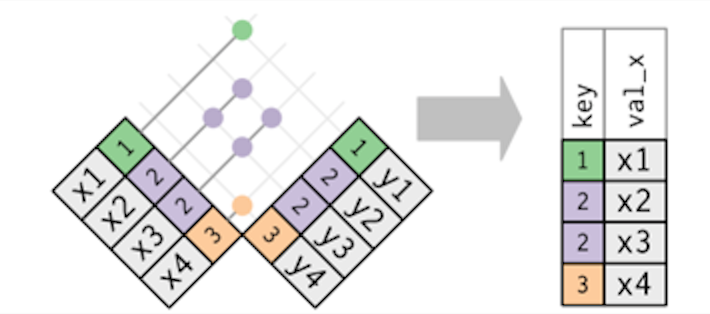
```

The inverse of a semi-join is an **anti-join**:

    anti_join()

```{r}
flights %>%
  anti_join(planes, by = "tailnum") %>%
  count(tailnum, sort = TRUE) # keeps the rows that don’t have a match
```

```{r antijoin, echo=FALSE, fig.align='center', fig.cap='Anti-join', out.width='60%'} 
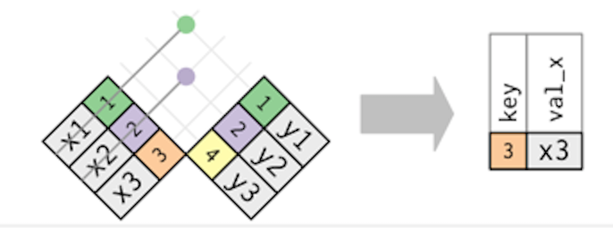
```

[Exercises](https://jrnold.github.io/r4ds-exercise-solutions/relational-data.html)


## Some more things to consider

### Join problems

>Be aware that simply checking the number of rows before and after the join is not sufficient to ensure that your join has gone smoothly. 

1. Identifying the variables that form the primary key in each table
2. Check for missing values
3. Check that your foreign keys match primary keys in another table (using anti_join()`)

### Set operations

These are type of **two-table verb** set operations:

- intersect(x, y): return only observations in both x and y
- union(x, y): return unique observations in x and y
- setdiff(x, y): return observations in x, but not in y

## Meeting Videos

### Cohort 5

`r knitr::include_url("https://www.youtube.com/embed/4Ju9nj82Ksk")`

<details>
  <summary> Meeting chat log </summary>
  
```
00:08:43	Ryan Metcalf:	So sorry for my delay. Aerating the lawn! Fun!
00:10:36	Becki R. (she/her):	Hello!
00:22:56	Becki R. (she/her):	That's a good idea! It would be a nice reference.
00:24:30	Jon Harmon (jonthegeek):	https://cran.r-project.org/web/packages/DiagrammeR/index.html
00:24:33	Sandra Muroy:	diagramR?
00:25:12	Jon Harmon (jonthegeek):	I guess the sharable link is supposed to be: https://cran.r-project.org/package=DiagrammeR
00:26:06	Becki R. (she/her):	That's a good reminder, thanks.
00:56:06	Ryan Metcalf:	Another way to notate Venn diagrams and/or discrete mathematics is to use LaTeX. This is not intended to deter you learning of R but may be useful when working with a larger team (especially DB admins!) https://www.purplemath.com/modules/venndiag2.htm
01:04:20	Jon Harmon (jonthegeek):	ggplot2::diamonds %>% dplyr::count(carat, cut, color, clarity, depth, table, price, x, y, z, sort = TRUE)
01:08:49	Ryan Metcalf:	Great Job Federica! Looking forward to next week!
```
</details>

`r knitr::include_url("https://www.youtube.com/embed/BDckA3OdsiU")`

<details>
  <summary> Meeting chat log </summary>
  
```
00:22:57	Jon Harmon (jonthegeek):	Try this to see a quick example. You're right that the order of the columns is left then right either way, but the rows to keep changes.
library(dplyr)
band_members %>% left_join(band_instruments)
band_members %>% right_join(band_instruments)
00:29:17	Jon Harmon (jonthegeek):	band_instruments %>% left_join(band_members)
00:39:07	lucus w:	Seems like setdiff() is similar to dplyr::anti_join()… they maybe differ by how they prints?
00:40:45	Jon Harmon (jonthegeek):	anti_join only needs to match on one key column to exclude; setdiff is looking for the entire observations to be repeated.
00:41:29	lucus w:	Interesting.. thanks!
00:52:28	Njoki Njuki Lucy:	I don't understand what's happening exactly, if age is greater than 25, have it as 25L(int) otherwise its age?
00:53:56	Njoki Njuki Lucy:	okay, thanks
00:54:28	Federica Gazzelloni:	sorry my connection
01:05:28	Njoki Njuki Lucy:	thank you :)
01:05:33	lucus w:	Thanks y'all
```
</details>

### Cohort 6

`r knitr::include_url("https://www.youtube.com/embed/P5FlxEhWE74")`

<details>
  <summary> Meeting chat log </summary>
  
```
LOG
```
</details>
