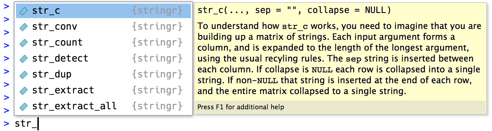

# Regular expressions

Note: Since these slides were made, this chapter has been split into "Strings" and "Regular expressions". After you edit these slides, remove this note.

**Learning objectives:**

- Manipulate **character vectors** using simple `{stringr}` functions.
- Use **regular expressions (regex)** to match **patterns** in strings.
  - Use **regex** to match **simple characters, `.`, and `\`.**
  - Use **regex** `^`, `$`, and `\b` to match **anchors and boundaries.**
  - Use **regex** `\d`, `\s`, `[]`, and `[^]` to match **character classes.**
  - Use **regex** `|` and `()` to match **alternatives.**
  - Use **regex** `?`, `+`, `*`, `{n}`, `{n,}`, `{,m}`, and `{n, m}` to match **repetitions in patterns.**
  - Use **regex grouping and backreferences** to refer to previous matches.
- Use `{stringr}` **functions** and **regex** to **manipulate strings.**
  - **Detect** pattern matches with `stringr::str_detect()`.
  - Select **subsets** of strings that match a pattern with `stringr::str_subset()`.
  - **Count** pattern matches with `stringr::str_count()`.
  - **Extract** pattern matches with `stringr::str_extract()` and `stringr::str_extract_all()`.
  - **Extract group matches** with `stringr::str_match()`, `stringr::str_match_all()`, and `tidyr::extract()`.
  - **Replace** pattern matches with `stringr::str_replace()` and `stringr::str_replace_all()`.
  - **Split** strings into pieces with `stringr::str_split()` and `stringr::boundary()`.
  - **Locate** matches within a string with `stringr::str_locate()` and `stringr::str_locate_all()`.
- Use **other {stringr} matching rules** to find specific patterns.
- Use **regex patterns** with base functions such as `apropos()` and `dir()` to find things.
- Describe the **relationship** between `{stringr}` and `{stringi}`.

## Introduction

> This chapter is going to be wicked fun!!!

- Regexs make up the backbone of textual searches. 
- "But can't I just `ctrl + f` and search my document? Well, yes...but no...
- Regular Expressions translate your search into computer code.

[stringr pkgdown site](https://stringr.tidyverse.org/)
[stringr cheatsheet](https://github.com/rstudio/cheatsheets/blob/main/strings.pdf)

### Pre-Requisites
We will be utilizing the `{stringr}` package which is part of the core tidyverse.

```{r 17-Load Library, include = TRUE}
library(tidyverse)
```

## String Basics

- You can create strings with either single quotes `'` or with double quotes `"`. The computer doesn't care.
  - However, which ever you choose, just stick with the format throughout your script.
  
```{r 17-String Quote Example, include = TRUE}
string1 <- 'This is also a string, but uses single quotes'
string2 <- "This is a string with double quotes"
```

During scripting, if you do not close a string but try to start a new line you will see the `+` line entry. But how do you quit so you can add the closing quote? Just hit the escape key.

```{r 17-Rookie Mistake, include = TRUE, eval = FALSE}
"This is a string, but I forgot to close the quote


Help, I'm stuck! (Hit the escape key)
```

One of the more tricky things to remember when using regular expressions is the `\` backslash when you literally want to use a special character in a search.

```{r 17-The magical escape backslash, include = TRUE}
doublequote <- "\"" # or '"'
singlequote <- '\'' # or "'"
print(doublequote)
print(singlequote)
```

Evaluating the above makes you question if my environment is correct. Yes it is. By printing to the screen, we are treating the output as a string...confused? To execute this as a regular expression however, we have to use `writeLines()`.

```{r 17-But Wait-Theres More, include = TRUE}
doublequote <- "\"" # or '"'
singlequote <- '\'' # or "'"
writeLines(doublequote)
writeLines(singlequote)
```

There are a handful of other special characters. The most common are `\n`, newline, and `\t`, tab, but you can see the complete list by requesting help on `: ?'"'`, or `?"'"`. You’ll also sometimes see strings like `\u00b5`, this is a way of writing non-English characters that works on all platforms:

```{r 17-Unicode example, include = TRUE}
x <- "\u00b5"
x
y <- "\U1F44D"
y
```

Another way to think "non-English" would be to say these are [Unicode](https://en.wikipedia.org/wiki/List_of_Unicode_characters) values.

>NOTE: The list is quite extensive (~144K). A better way to state the comment, unicode is inteded to represent the worlds diverse linguistic and lexiconal attributes!

Multiple strings are often stored in a character vector, which you can create with c():

```{r 17-Combining a string, include = TRUE}
c("one", "two", "three")
```

### String Length

Base R has many functions that can work with String Length. Unfortunetely, these can all be a bit different. Therefore, we are going to use the `{stringr}` package to maintain our semantics and work within one package...`{tidyverse}`!

- All string functions in `{stringr}` start with the root `str_` making use of the package quite intuitive.

```{r 17-String Length Example, include = TRUE}
str_length(c("a", "R for Data Science", NA))
```

Using the RStudio IDE makes using the autocomplete feature quiet simple

This is a excellent way to quickly call on a particular `{stringr}` function!

### Combining Strings

To combine two or more strings, use `str_c()`

```{r 17-Combine Strings, include = TRUE}
str_c("x", "y")
str_c("x", "y", "z")

```

You can also add the `sep` argument to control how the strings are seperated.

```{r 17-Combine Strings using sep, include = TRUE}
str_c("x", "y", sep = ", ")
```
Like many other functions in R, if you have missing data, you can add `NA`.

```{r 17-Strings and NA, include = TRUE}
x <- c("abc", NA)
str_c("|-", x, "-|")
str_c("|-", str_replace_na(x), "-|")
```

As shown above, `str_c()` is vectorised, and it automatically recycles shorter vectors to the same length as the longest:

```{r 17-recycle shorter vectors, include = TRUE}
str_c("prefix-", c("a", "b", "c"), "-suffix")
```

> I'm unsure if the use of *recycle* is accurate in the above statement. Another way to view this is a vector list inside a vector list. As the output is sent to the screen, the function acts like a for-loop inside a for-loop where each pass of the inside combination is iterated as combined with the outside combination iteration.

Objects of length 0 are silently dropped. This is particularly useful in conjunction with `if`:

```{r 17-using if, include = TRUE}
name <- "Ryan"
time_of_day <- "afternon"
birthday <- FALSE

str_c(
  "Good ", time_of_day, " ", name,
  if (birthday) " and HAPPY BIRTHDAY",
  "."
)
```

> The above example is written a bit confusing. The object `birthday` is passed as a boolean value of *FALSE* and therefore will never evaluate *TRUE*, making the `if` statement overhead. Maybe a better way to write the `if` statement would be to write an argument like `sys.date == birthday` in which case, if the system date of the computer matches the object `birthday`, you would get extra text.

Finally, if you would like to collapse a vector of strings into a single string, use the `collapse` argument.

```{r 17-Collapse String, include = TRUE}
str_c(c("x", "y", "z"))
str_c(c("x", "y", "z"), collapse = ", ")
```


### Subsetting Strings

You can extract parts of a string using `str_sub()`. As well as the string, `str_sub()` takes start and end arguments which give the (inclusive) position of the substring:

```{r 17-Subsetting, include = TRUE}
x <- c("Apple", "Banana", "Pear")
str_sub(x, 1, 3)

# negative numbers count backwards from end
str_sub(x, -3, -1)

```

Note that str_sub() won’t fail if the string is too short: it will just return as much as possible:

```{r 17-Short Subsetting, include = TRUE}
str_sub("a", 1, 5)
```

You can also use the assignment form of `str_sub()` to modify strings:

```{r 17-Modify Strings, include = TRUE}
str_sub(x, 1, 1) <- str_to_lower(str_sub(x, 1, 1))
x
```

### Locales

- Alternatives to `str_to_lower()` is `srr_to_upper()` and `str_to_title()`.
- Changing case is a bit more complicated then it first appears
- Different languages have different rules for changing case

```{r 17-Local in Capitalization, include = TRUE}
# Turkish has two i's: with and without a dot, and it
# has a different rule for capitalising them:
str_to_upper(c("i", "ı"))

str_to_upper(c("i", "ı"), locale = "tr")
```

- Locale is specified as a ISO 639 language code, see [Wikipedia](https://en.wikipedia.org/wiki/List_of_ISO_639-1_codes)

- Sorting and Order are also effected by Locale
  - Base R only applies the system Locale
  - Using `{stringr}` adds a `local=` argument
  
```{r 17-Locale Sorting, include = TRUE}
x <- c("apple", "eggplant", "banana")

str_sort(x, locale = "en")  # English

str_sort(x, locale = "haw") # Hawaiian

```


### Exercises

1. In code that doesn’t use stringr, you’ll often see paste() and paste0(). What’s the difference between the two functions? What stringr function are they equivalent to? How do the functions differ in their handling of NA?

>`paste()` converts arguments to character strings and concatenates them. `paste0()` is the same function but slightly more efficent. The `{stringr}` they are equivelent to are `str_c()`. The major difference is the use of `as.character()` at its base versus `{stingr}`. The `paste()` and `paste0()` changes NA values to "NA".

2. In your own words, describe the difference between the sep and collapse arguments to str_c().

>The `sep` argument treats each combined string as its own output. Whereas the `collapse` aregument creates one large string object.

3. Use str_length() and str_sub() to extract the middle character from a string. What will you do if the string has an even number of characters?

>`str_length()` provides the quantity of characters in a string. `str_sub()` picks out the beginning and end of out of a vector. If the string has an even number of characters, it will only provide the smaller of the string.

4. What does str_wrap() do? When might you want to use it?

>`str_wrap()` uses the Knuth-Plass paragraph wrapping algorithm. [Knuth-Plass algorithm](http://www.eprg.org/G53DOC/pdfs/knuth-plass-breaking.pdf). This is important when using typesetting services like LaTeX.

5. What does str_trim() do? What’s the opposite of str_trim()?

>`str_trim()` removes extra white space between vectorized strings. `str_pad()` is the opposite which puts characters back into the string.

6. Write a function that turns (e.g.) a vector c("a", "b", "c") into the string a, b, and c. Think carefully about what it should do if given a vector of length 0, 1, or 2.

```{r 17-Exercise 6, Include = TRUE}
z <- str_c("a", "b", "c", sep = ", ")
z

# Unsure on the second half of hte question.

```


## Matching Patterns with Regular Expressions

To learn regular expressions (regexs) we'll use `str_view()` and `str_view_all()`.

[RegExplain](https://www.garrickadenbuie.com/project/regexplain/)

### Basic Matches

The simplest expressions are pattern matching:

```{r 17-Pattern Matching, include=TRUE}
x <- c("apple", "banana", "pear")
str_view(x, "an")
```

>NOTE: If you run this locally, the window that opens looks empty. In truth, it is printed "white" on "white" and therefore hard to read.

The next step up in complexity is ., which matches any character (except a newline):
```{r 17-Match any Character, include = TRUE}
str_view(x, ".a.")
```

The trick here is if "`.`" matches any character...what if we want to search for "`.`"? We have to escape the term by using "`\`". Yet...this leads to another problem. Since "`\`" is part of a string, we have to escape it twice. Therefore, it looks like this: "`\\.`".

```{r 17-Matching ".", include = TRUE}
# To create the regular expression, we need \\
dot <- "\\."

# But the expression itself only contains one:
writeLines(dot)
#> \.

# And this tells R to look for an explicit .
str_view(c("abc", "a.c", "bef"), "a\\.c")

```

Good, we figured out how to search for periods (`.`) by using the escape character `\`. Ok, but what if we want to search for `\`? Hmmmm....we need to "escape the escape". HA! Therefore, we need four backslashes! "`\\\\`".

```{r 17-Escaping the Escape, include = TRUE}
x <- "a\\b"
writeLines(x)
#> a\b

str_view(x, "\\\\")

```

#### Exercises

1. Explain why each of these strings don’t match a `\`: `"\"`, `"\\"`, `"\\\"`.

>a. `\` doesn't escape anything
>b. `"\"` again, is a string and doesn't escape anything
>c. `"\\"` escapes the escape, but doesn't have any pattern to search for
>d. `"\\\"` escapes the escape, but doesn't finish the expression

2. How would you match the sequence `"'\`?

>Unanswered

3. What patterns will the regular expression `\..\..\..` match? How would you represent it as a string?

>Unanswered

### Anchors

By default, regular expressions will match anywhere in a string. However, if you want the beginning or end of a string, you can "anchor" the regular expression. Lets see how this works:

```{r 17-match Anything, include=TRUE}
# The following matches anywhere "a" shows up
x <- c("apple", "banana", "pear")
str_view(x, "a")
```

>Intesting, I thought when searching for "a", it would highlight every insteance of "a". So "banana" would hit three times. Nevermind...`str_view_all()` is required to list ALL instances of a search term.

```{r 17-match beginning, include=TRUE}
# The following matches only the beginning of the string where "a" shows up
x <- c("apple", "banana", "pear")
str_view(x, "^a")
```

```{r 17-match end, include=TRUE}
# The following matches only the end of the string where "a" shows up
x <- c("apple", "banana", "pear")
str_view(x, "a$")
```

- To remember which pattern to use, remember the mnemonic "if you begin with power (`^`), you end up with money (`$`). [Evan Misshula](https://twitter.com/emisshula/status/323863393167613953)

```{r 17-Anchor before, include = TRUE}
x <- c("apple pie", "apple", "apple cake")
str_view(x, "apple")
```

```{r 17-Anchor after, include = TRUE}
str_view(x, "^apple$")
```

#### Exercise (Unanswered)
1. How would you match the literal string "`$^$`"?

2. Given the corpus of common words in `stringr::words`, create regular expressions that find all words that:

  a. Start with “y”.
  b. End with “x”
  c. Are exactly three letters long. (Don’t cheat by using `str_length()`!)
  d. Have seven letters or more.
  
3. Since this list is long, you might want to use the match argument to `str_view()` to show only the matching or non-matching words.

### Character Classes and Alternatives

There are a number of special patterns that match more than one character.
- `\d`: matches any digit.
- `\s`: matches any whitespace (e.g. space, tab, newline).
- `[abc]`: matches a, b, or c.
- `[^abc]`: matches anything except a, b, or c.

Remember, to create a regular expression containing `\d` or `\s`, you’ll need to escape the `\` for the string, so you’ll type "`\\d`" or "`\\s`".

```{r 17-easier readable expressions (a), include = TRUE}
# Look for a literal character that normally has special meaning in a regex
str_view(c("abc", "a.c", "a*c", "a c"), "a[.]c")
```

```{r 17-easeir readable expressions (b), include = TRUE}
str_view(c("abc", "a.c", "a*c", "a c"), ".[*]c")
```

```{r 17-easeir readable expressions (c), include = TRUE}
str_view(c("abc", "a.c", "a*c", "a c"), "a[ ]")
```

This works for most (but not all) regex metacharacters: `$` `.` `|` `?` `*` `+` `(` `)` `[` `{`. Unfortunately, a few characters have special meaning even inside a character class and must be handled with backslash escapes: `]` `\` `^` and `-`.

You can also use *alternation* to pick between one or more alternative patterns. If precedence ever gets confusing, use parentheses to make it clear what you want:

```{r 17-Alternation, include = TRUE}
str_view(c("grey", "gray"), "gr(e|a)y")
```

#### Exercise (Unanswered)

1. Create regular expressions to find all words that:

  a. Start with a vowel.
  b. That only contain consonants. (Hint: thinking about matching “not”-vowels.)
  c. End with ed, but not with `eed`.
  d. End with `ing` or `ise`.

2. Empirically verify the rule “i before e except after c”.

3. Is “q” always followed by a “u”?

4. Write a regular expression that matches a word if it’s probably written in British English, not American English.

5. Create a regular expression that will match telephone numbers as commonly written in your country.

### Repetition

Controlling how many time a pattern iterates is the next sequence of control. This can be accomplished with the following operators:

- `?`: 0 or 1
- `+`: 1 or more
- `*`: 0 or more

```{r 17-Repetition - 0 or 1, include = TRUE}
x <- "1888 is the longest year in Roman numerals: MDCCCLXXXVIII"
str_view(x, "CC?")
```

```{r 17-Repetition - 1 or more, include = TRUE}
str_view(x, "CC+")
```

```{r 17-Repetition - 0 or more with term, include = TRUE}
str_view(x, 'C[LX]+')
```

> The precedence of these operators is high which means most uses will need parentheses, like `bana(na)+`.

You can also specify the number of matches precisely:

- `{n}`: exactly n
- `{n,}`: n or more
- `{,m}`: at most m
- `{n,m}`: between n and m

```{r 17-Repetition - exactly n, include = TRUE}
str_view(x, "C{2}")
```

```{r 17-Repetition - n or more, include = TRUE}
str_view(x, "C{2,}")
```

```{r 17-Repetition - between n and m, include = TRUE}
str_view(x, "C{2,3}")
```

By default, these form of searches are greedy, which matches the longest string possible. To make them lazy (searching for the shortest string), you can add `?` at the end.

```{r 17-Repetition - between n and m - lazy, include = TRUE}
str_view(x, 'C{2,3}?')
```

```{r 17-Repetition - 0 or more with term - lazy, include = TRUE}
str_view(x, 'C[LX]+?')
```

#### Exercises (Unanswered)

1. Describe the equivalents of ?, +, * in {m,n} form.

2. Describe in words what these regular expressions match: (read carefully to see if I’m using a regular expression or a string that defines a regular expression.)

  a. `^.*$`
  b. `"\\{.+\\}"`
  c. `\d{4}-\d{2}-\d{2}`
  d. `"\\\\{4}"`
  
3. Create regular expressions to find all words that:

  a. Start with three consonants.
  b. Have three or more vowels in a row.
  c.. Have two or more vowel-consonant pairs in a row.

4. Solve the beginner regexp crosswords at https://regexcrossword.com/challenges/beginner.

### Grouping and Backreferences

- Parentheses also create a *numbered* capturing group.
- A capturing group stores *the part of the string* matched by the part of the regular expression inside the parentheses
-You can refer to the same text as previously matched by a capturing group with backreferences

For example, the following regular expression finds all fruits that have a repeated pair of letters.

```{r 17-Grouping and Backreferences}
str_view(fruit, "(..)\\1", match = TRUE)
```

> Dumb question...how does the R Environment know the object `fruit`? Use the command `data()` in Console to see all listed datasets in BaseR as well as those included in your loaded packages. For example, *fruit* is a dataset included with `{stringr}`.

#### Exercises (Unanswered)

1. Describe, in words, what these expressions will match:

  a. `(.)\1\1`
  b. `"(.)(.)\\2\\1"`
  c. `(..)\1`
  d. `"(.).\\1.\\1"`
  e. `"(.)(.)(.).*\\3\\2\\1"`

2. Construct regular expressions to match words that:

  a. Start and end with the same character.

  b. Contain a repeated pair of letters (e.g. “church” contains “ch” repeated twice.)

  c. Contain one letter repeated in at least three places (e.g. “eleven” contains three “e”s.)
  
## Tools

In this section you’ll learn a wide array of stringr functions that let you:

 - Determine which strings match a pattern
 - Find the positions of matches
 - Extract the content of matches
 - Replace matches with new values
 - Split a string based on a match
 
A word of caution before we continue: because regular expressions are so powerful, it’s easy to try and solve every problem with a single regular expression. In the words of Jamie Zawinski:

> Some people, when confronted with a problem, think “I know, I’ll use regular expressions.” Now they have two problems. 

***Exluded unbelievable long expression from presentation!***

- Instead of creating one complex regular expression, it’s often easier to write a series of simpler regexs

**Quick story: I use regex at work to grep HTML for particular tags. Although I can do `ctrl+f`...I'd have to do it 1000s of times. Instead, I pass a recursive tag and iterate through the entire project. The process saves me HOURS!**

 - Break the problem down to smaller manageable chunks. Use a visual drawing if it helps to write out your expression. The point...don't start from difficulty first!

### Detect Matches
To determine if a character vector matches a pattern, use str_detect(). It returns a logical vector the same length as the input:

```{r 17-String Detect, include = TRUE}
x <- c("apple", "banana", "pear")
str_detect(x, "e")
```

- The use of a boolean output (True/False) means, we can count them!
  - TRUE = 1
  - FALSE = 0
- Makind functions like `sum()` and `mean()` useful.

```{r 17-SUM-MEAN, include = TRUE}
# How many common words start with t?
sum(str_detect(words, "^t"))

# What proportion of common words end with a vowel?
mean(str_detect(words, "[aeiou]$"))

```

When you create large logical conditions, you may be able to break them down to simpler search terms and then combine them together. Always try to start simple.

```{r 17-Think Simple, include = TRUE}
# Find all words containing at least one vowel, and negate
no_vowels_1 <- !str_detect(words, "[aeiou]")
# Find all words consisting only of consonants (non-vowels)
no_vowels_2 <- str_detect(words, "^[^aeiou]+$")
identical(no_vowels_1, no_vowels_2)
```

A common use of `str_detect()` is to match a pattern. You can do this with logical sub-setting or the convenient `str_subset()` wrapper:

```{r 17-Pattern Match, include = TRUE}
words[str_detect(words, "x$")]

str_subset(words, "x$")

```

> NOTE, the first example's syntax is foreign to me. Would any member like to express what is happening?

Filter is another tool that can make string detection easier.

```{r 17-Using Filter, include = TRUE}
df <- tibble(
  word = words, 
  i = seq_along(word)
)
df %>% 
  filter(str_detect(word, "x$"))
```

A variation on `str_detect()` is `str_count()`: rather than a simple yes or no, it tells you how many matches there are in a string:

```{r 17-String Count, include = TRUE}
x <- c("apple", "banana", "pear")
str_count(x, "a")

# On average, how many vowels per word?
mean(str_count(words, "[aeiou]"))
```

It’s natural to use `str_count()` with `mutate()`:

```{r 17-String Count with Mutate, include = TRUE}
df %>% 
  mutate(
    vowels = str_count(word, "[aeiou]"),
    consonants = str_count(word, "[^aeiou]")
  )
```

Note that matches never overlap. For example, in "abababa", how many times will the pattern "aba" match? Regular expressions say two, not three:

```{r 17-abababa, include = TRUE}
str_count("abababa", "aba")

str_view_all("abababa", "aba")
```

>Note the use of `str_view_all()`. As you’ll shortly learn, many stringr functions come in pairs: one function works with a single match, and the other works with all matches. The second function will have the suffix `_all`.

#### Exercises (Unanswered)

1. For each of the following challenges, try solving it by using both a single regular expression, and a combination of multiple `str_detect()` calls.

  a. Find all words that start or end with `x`.

  b. Find all words that start with a vowel and end with a consonant.

  c. Are there any words that contain at least one of each different vowel?

2. What word has the highest number of vowels? What word has the highest proportion of vowels? (Hint: what is the denominator?)

### Extract Matches

- Use `str_extract()` to extract the actual text of a match
- [Harvard Sentences](https://en.wikipedia.org/wiki/Harvard_sentences)

```{r 17-Harvard Sentences, include = TRUE}

length(sentences)

head(sentences)

```

Imagine we want to find all sentences that contain a color.

>Note...I'm changing this section from the British English form *colour* to the American English form.

1. Create a vector of color names
2. Then turn it into a single regular expression

```{r 17-Color Names, include = TRUE}
colors <- c("red", "orange", "yellow", "green", "blue", "purple")
color_match <- str_c(colors, collapse = "|")
color_match
```

3. Select the sentences that contain a color
4. Extract the color to figure out which one it is

```{r 17-Select and Extract, Include = TRUE}
has_color <- str_subset(sentences, color_match)
matches <- str_extract(has_color, color_match)
head(matches)
```

>Note that `str_extract()` only extracts the first match.

```{r 17-Sting Extract, include = TRUE}
more <- sentences[str_count(sentences, color_match) > 1]
str_view_all(more, color_match)
```

```{r 17-Extract More, include = TRUE}
str_extract(more, color_match)
```

To get all matches, use `str_extract_all()`.

```{r 17-String Extact All, include = TRUE}
str_extract_all(more, color_match)
```

If you pass the argument `simplify = TRUE`, `str_extract_all()` will return a matrix with short matches expanded to the same length as the longest.

```{r 17-Simplify String Extract All, include = TRUE}
str_extract_all(more, color_match, simplify = TRUE)

x <- c("a", "a b", "a b c")
str_extract_all(x, "[a-z]", simplify = TRUE)
```

#### Exercises (Unanswered)

1. In the previous example, you might have noticed that the regular expression matched “flickered”, which is not a colour. Modify the regex to fix the problem.

2. From the Harvard sentences data, extract:

  a. The first word from each sentence.
  b. All words ending in ing.
  c. All plurals.

### Grouped Matches

Earlier we discussed using parentheses for clarifying precedence and for backreferences. ou can also use parentheses to extract parts of a complex match.

```{r 17-Noun, include = TRUE}
noun <- "(a|the) ([^ ]+)"

has_noun <- sentences %>%
  str_subset(noun) %>%
  head(10)
has_noun %>% 
  str_extract(noun)

```

- `str_extract()` gives us the complete match
- `str_match()` gives each individual component

```{r 17-String Match, include = TRUE}
has_noun %>% 
  str_match(noun)
```

>(Unsurprisingly, our heuristic for detecting nouns is poor, and also picks up adjectives like smooth and parked.)

If your data is in a tibble, it’s often easier to use `tidyr::extract()`. It works like `str_match()` but requires you to name the matches, which are then placed in new columns.

```{r 17-TidyR, include = TRUE}
tibble(sentence = sentences) %>% 
  tidyr::extract(
    sentence, c("article", "noun"), "(a|the) ([^ ]+)", 
    remove = FALSE
  )
```

**If you want all matches for each string, you’ll need `str_match_all()`**

#### Exercises (Unanswered)

1. Find all words that come after a “number” like “one”, “two”, “three” etc. Pull out both the number and the word.

2. Find all contractions. Separate out the pieces before and after the apostrophe.

### Replacing Matches

`str_replace()` and `str_replace_all()` allow you to replace matches with new strings.

```{r 17-String Replace, include = TRUE}
x <- c("apple", "pear", "banana")
str_replace(x, "[aeiou]", "-")
str_replace_all(x, "[aeiou]", "-")
```

With `str_replace_all()` you can perform multiple replacements by supplying a named vector

```{r 17-String Replace All}
x <- c("1 house", "2 cars", "3 people")
str_replace_all(x, c("1" = "one", "2" = "two", "3" = "three"))
```

Instead of replacing with a fixed string you can use backreferences to insert components of the match.

```{r 17-Sting Replace Backreference}
sentences %>% 
  str_replace("([^ ]+) ([^ ]+) ([^ ]+)", "\\1 \\3 \\2") %>% 
  head(5)
```

#### Exercises (Unanswered)

1. Replace all forward slashes in a string with backslashes.

2. Implement a simple version of `str_to_lower()` using `replace_all()`.

Switch the first and last letters in `words`. Which of those strings are still words?


### Splitting

Use str_split() to split a string up into pieces.

```{r 17-Splitting, include = TRUE}
sentences %>%
  head(5) %>% 
  str_split(" ")
```

If you’re working with a length-1 vector, the easiest thing is to just extract the first element of the list.

```{r 17-Lenght-1 Vector, include = TRUE}
"a|b|c|d" %>% 
  str_split("\\|") %>% 
  .[[1]]
```

You can use `simplify = TRUE` to return a matrix:

```{r 17-Splitting, Simplify, include = TRUE}
sentences %>%
  head(5) %>% 
  str_split(" ", simplify = TRUE)
```

You can also request a maximum number of pieces

```{r 17-Splitting - Maximum, include = TRUE}
fields <- c("Name: Hadley", "Country: NZ", "Age: 35")
fields %>% str_split(": ", n = 2, simplify = TRUE)
```

Instead of splitting up strings by patterns, you can also split up by character, line, sentence and word `boundary()`s.

```{r 17-Splitting - Boundary}
x <- "This is a sentence.  This is another sentence."
str_view_all(x, boundary("word"))
```

```{r 17-Another Boundary split, include = TRUE}
str_split(x, " ")[[1]]

str_split(x, boundary("word"))[[1]]

```

#### Exercises (Unanswered)

1. Split up a string like `"apples, pears, and bananas"` into individual components.

2. Why is it better to split up by `boundary("word")` than `" "`?

3. What does splitting with an empty string (`""`) do? Experiment, and then read the documentation.

### Find Matches

- `str_locate()` and `str_locate_all()` give you the starting and ending positions of each match.
- You can use `str_locate()` to find the matching pattern, `str_sub()` to extract and/or modify them.

## Other types of Pattern
When you use a pattern that’s a string, it’s automatically wrapped into a call to `regex()`.

```{r 17-RegEx, include = TRUE}
# The regular call:
str_view(fruit, "nana")
# Is shorthand for
str_view(fruit, regex("nana"))
```

You can use the other arguments of `regex()` to control details of the match:

- `ignore_case = TRUE` allows characters to match either their uppercase or lowercase forms. This always uses the current locale.

```{r 17-Ignore Case Example 1, include = TRUE}
bananas <- c("banana", "Banana", "BANANA")
str_view(bananas, "banana")
```

```{r 17-Ignore Case Example 2, include = TRUE}
str_view(bananas, regex("banana", ignore_case = TRUE))
```

- `multiline = TRUE` allows `^` and `$` to match the start and end of each line rather than the start and end of the complete string.

```{r 17-Mulitline, include = TRUE}
x <- "Line 1\nLine 2\nLine 3"
str_extract_all(x, "^Line")[[1]]

str_extract_all(x, regex("^Line", multiline = TRUE))[[1]]

```

- `comments = TRUE` allows you to use comments and white space to make complex regular expressions more understandable. Spaces are ignored, as is everything after `#`. To match a literal space, you’ll need to escape it: `"\\ "`.

```{r 17-Comments, include = TRUE}
phone <- regex("
  \\(?     # optional opening parens
  (\\d{3}) # area code
  [) -]?   # optional closing parens, space, or dash
  (\\d{3}) # another three numbers
  [ -]?    # optional space or dash
  (\\d{3}) # three more numbers
  ", comments = TRUE)

str_match("514-791-8141", phone)

```

- `dotall = TRUE` allows `.` to match everything, including `\n`.

There are three other functions you can use instead of `regex()`:

- `fixed()`: matches exactly the specified sequence of bytes. It ignores all special regular expressions and operates at a very low level. This allows you to avoid complex escaping and can be much faster than regular expressions.

>Note, I had to install the microbenchmark package before running the next code snippet.

```{r 17-Fixed, include = TRUE}
#install.packages("microbenchmark")
library(microbenchmark)
microbenchmark::microbenchmark(
  fixed = str_detect(sentences, fixed("the")),
  regex = str_detect(sentences, "the"),
  times = 20
)
```

Beware using `fixed()` with non-English data. It is problematic because there are often multiple ways of representing the same character. For example, there are two ways to define “á”: either as a single character or as an “a” plus an accent:

```{r 17-Accents, include = TRUE}
a1 <- "\u00e1"
a2 <- "a\u0301"
c(a1, a2)

a1 == a2

```

They render identically, but because they’re defined differently, `fixed()` doesn’t find a match. Instead, you can use `coll()`, defined next, to respect human character comparison rules:

```{r 17-COLL, include = TRUE}
str_detect(a1, fixed(a2))

str_detect(a1, coll(a2))

```

- `coll()`: compare strings using standard collation rules. This is useful for doing case insensitive matching. Note that coll() takes a locale parameter that controls which rules are used for comparing characters. Unfortunately different parts of the world use different rules!

```{r 17-COLL agian, include = TRUE}
# That means you also need to be aware of the difference
# when doing case insensitive matches:
i <- c("I", "İ", "i", "ı")
i
str_subset(i, coll("i", ignore_case = TRUE))
str_subset(i, coll("i", ignore_case = TRUE, locale = "tr"))
```

Both `fixed()` and `regex()` have ignore_case arguments, but they do not allow you to pick the locale: they always use the default locale.

```{r 17-stringi example, include = TRUE}
stringi::stri_locale_info()
```

The downside of `coll()` is speed; because the rules for recognising which characters are the same are complicated, `coll()` is relatively slow compared to `regex()` and `fixed()`.

- As you saw with `str_split()` you can use boundary() to match boundaries. You can also use it with the other functions:

```{r 17-String View All, include = TRUE}
x <- "This is a sentence."
str_view_all(x, boundary("word"))
```

```{r 17-String View All with Boundary, include = TRUE}
str_extract_all(x, boundary("word"))
```

### Exercises (Unanswered)

1. How would you find all strings containing `\` with `regex()` vs. with `fixed()`?

2. What are the five most common words in sentences?

## Other uses of regular expressions

There are two useful function in base R that also use regular expressions:

- `apropos()` searches all objects available from the global environment. This is useful if you can’t quite remember the name of the function.

```{r 17-Apropos, include = TRUE}
apropos("replace")
```

- `dir()` lists all the files in a directory. The `pattern` argument takes a regular expression and only returns file names that match the pattern.

```{r 17-Dir call, include = TRUE}
head(dir(pattern = "\\.Rmd$"))
```

> If you’re more comfortable with “globs” like `*.Rmd`, you can convert them to regular expressions with `glob2rx()`

## stringi

`stringr` is built on top of the `stringi` package. `stringr` is useful when you’re learning because it exposes a minimal set of functions, which have been carefully picked to handle the most common string manipulation functions. `stringi`, on the other hand, is designed to be comprehensive. It contains almost every function you might ever need: `stringi` has 250 functions to `stringr’s` 49.

If you find yourself struggling to do something in `stringr`, it’s worth taking a look at `stringi`. The packages work very similarly, so you should be able to translate your `stringr` knowledge in a natural way. The main difference is the prefix: `str_` vs. `stri_`.

### Exercises

1. Find the stringi functions that:
  1. Count the number of words.
  2. Find duplicated strings.
  3.Generate random text.
2. How do you control the language that `stri_sort()` uses for sorting?

## Meeting Videos

### Cohort 5

`r knitr::include_url("https://www.youtube.com/embed/RpZoQR2xwME")`

<details>
  <summary> Meeting chat log </summary>
  
```
00:10:10	Njoki Njuki Lucy:	Hi everyone!
00:10:24	Federica Gazzelloni:	Hello!
00:10:31	Sandra Muroy:	hi!
00:11:09	Federica Gazzelloni:	Hi Sandra!
00:11:27	Sandra Muroy:	Hi Federica :D
00:11:43	Sandra Muroy:	Hi Lucy!
00:19:20	Jon Harmon (jonthegeek):	https://xkcd.com/208/
00:20:10	Jon Harmon (jonthegeek):	https://smltar.com/ is the new book by Julia Silge and Emil Hvitfeldt.
00:20:42	Jon Harmon (jonthegeek):	https://www.tidytextmining.com/ is the older Tidytext book by Julia Silge and David Robinson.
00:28:15	Njoki Njuki Lucy:	do you also load the packages or that's sufficient for a readable code?
00:28:59	Jon Harmon (jonthegeek):	Within an Rmd I tend to put a library() call per package at the top so it's easy to find, but in my exploration work I rarely library anything other than magrittr.
00:30:11	Njoki Njuki Lucy:	okay, thank you
00:39:53	Jon Harmon (jonthegeek):	> x <- r"(this treats all characters as ecaped. For example: \ " ')"
> writeLines(x)
this treats all characters as ecaped. For example: \ " '
00:45:30	Jon Harmon (jonthegeek):	\"
00:45:31	Federica Gazzelloni:	textutils: https://github.com/enricoschumann/textutils
00:45:42	Jon Harmon (jonthegeek):	"\""
00:46:00	Jon Harmon (jonthegeek):	"""
00:46:19	Jon Harmon (jonthegeek):	"\\"
00:49:07	Jon Harmon (jonthegeek):	> "\"
+
00:50:06	Jon Harmon (jonthegeek):	> cat("this\ttab")
this	tab
00:50:21	Jon Harmon (jonthegeek):	> cat("this\nnewline")
this
newline
00:50:40	Jon Harmon (jonthegeek):	> cat("this\something"
Error: '\s' is an unrecognized escape in character string starting ""this\s"
00:51:20	Njoki Njuki Lucy:	did I get it right that the character after \ is escaped not printed?
00:51:30	Jon Harmon (jonthegeek):	correct
00:51:41	Jon Harmon (jonthegeek):	https://regexr.com/
00:59:49	Jon Harmon (jonthegeek):	> str_c(rep("prefix", 3), c("a", "b", "c"), rep("suffix", 3), sep = "-")
[1] "prefix-a-suffix" "prefix-b-suffix" "prefix-c-suffix"
01:00:25	Jon Harmon (jonthegeek):	> str_c("prefix", c("a", "b", "c"), "suffix", sep = "-")
[1] "prefix-a-suffix" "prefix-b-suffix" "prefix-c-suffix"
01:01:26	Jon Harmon (jonthegeek):	> str_c(c("prefix", "other", "another"), c("a", "b", "c"), "suffix", sep = "-")
[1] "prefix-a-suffix"  "other-b-suffix"   "another-c-suffix"
01:02:02	Jon Harmon (jonthegeek):	> str_c(c("prefix", "other"), c("a", "b", "c"), "suffix", sep = "-")
[1] "prefix-a-suffix" "other-b-suffix"  "prefix-c-suffix"
Warning message:
In stri_c(..., sep = sep, collapse = collapse, ignore_null = TRUE) :
  longer object length is not a multiple of shorter object length
01:04:54	Jon Harmon (jonthegeek):	> str_c("prefix", c("a", "b", "c"), "suffix", sep = "-", collapse = "|")
[1] "prefix-a-suffix|prefix-b-suffix|prefix-c-suffix"
01:09:51	Njoki Njuki Lucy:	thank you so much Ryan and Jon, strings are starting to make sense now!
01:09:53	Sandra Muroy:	thanks so much Ryna!
01:09:56	Sandra Muroy:	Ryan!
```
</details>

`r knitr::include_url("https://www.youtube.com/embed/A-_URHkvxNA")`

<details>
  <summary> Meeting chat log </summary>
  
```
00:07:40	Jon Harmon (jonthegeek):	statlearning.com
00:23:39	Jon Harmon (jonthegeek):	^ = start of text
$ = end of text
00:31:17	Jon Harmon (jonthegeek):	Notes are finally updated on our site if you want to follow along or review: https://r4ds.github.io/bookclub-r4ds/strings.html
00:31:37	Sandra Muroy:	thanks Jon!
00:37:56	Jon Harmon (jonthegeek):	https://en.wikipedia.org/wiki/Harvard_sentences
00:42:35	Jon Harmon (jonthegeek):	sum(stringr::str_detect(sentences, str_c(words, collapse = "|"), negate = TRUE))
00:45:50	Jon Harmon (jonthegeek):	1 %in% 1:10
00:46:02	Jon Harmon (jonthegeek):	"a" %in% "ab"
00:46:08	Jon Harmon (jonthegeek):	"a"
00:46:10	Jon Harmon (jonthegeek):	"ab"
00:46:18	Jon Harmon (jonthegeek):	"a" %in% c("a", "b")
01:02:39	Jon Harmon (jonthegeek):	regexr.com
```
</details>

### Cohort 6

`r knitr::include_url("https://www.youtube.com/embed/l07Vo1wMW5s")`

<details>
  <summary> Meeting chat log </summary>
  
```
00:09:53	Daniel Adereti:	We will kick off in 1 min
00:14:55	Shannon:	https://r4ds.github.io/bookclub-r4ds/string-basics.html
00:18:48	Shannon:	https://stringr.tidyverse.org/
00:19:06	Shannon:	https://github.com/rstudio/cheatsheets/blob/main/strings.pdf
00:21:02	Daniel Adereti:	For new members, we have this sheet where we volunteer to take classes each week, you are welcome to fill in your names. Thanks! https://docs.google.com/spreadsheets/d/1zy2nXNkvcdqWuF8rQ5ApWRkVQG_UJt0azu3h_mEnY2E/edit?usp=drive_web&ouid=115626840160043101981
00:26:49	Shannon:	https://en.wikipedia.org/wiki/List_of_Unicode_characters
01:05:02	Daniel Adereti:	That's fine!
01:05:13	Daniel Adereti:	We can pick up next week
01:05:37	Adeyemi Olusola:	Thank you!
01:05:45	Folashade Bayode:	Thank you 😊
```
</details>

`r knitr::include_url("https://www.youtube.com/embed/k7poFr556To")`

<details>
  <summary> Meeting chat log </summary>
  
```
00:15:15	Daniel Adereti:	We have this nice book that solves the exercises, if you are interested: https://jrnold.github.io/r4ds-exercise-solutions/strings.html
00:15:35	Marielena Soilemezidi:	awesome, thanks Daniel! :)
00:22:13	Marielena Soilemezidi:	the book has the same solution for this, so you did great actually! :)
00:36:42	Shannon:	https://regexcrossword.com/challenges/beginner
00:37:04	Marielena Soilemezidi:	ooh cool!
00:37:10	Marielena Soilemezidi:	thanks Shannon!
00:43:17	Marielena Soilemezidi:	0.0
00:43:26	Marielena Soilemezidi:	who thought of this example?!
00:52:47	Daniel Adereti:	Hey Marielena, if you want to volunteer for a class, you can fill in your name here: https://docs.google.com/spreadsheets/d/1zy2nXNkvcdqWuF8rQ5ApWRkVQG_UJt0azu3h_mEnY2E/edit#gid=0
00:55:10	Marielena Soilemezidi:	Thanks, Daniel! I'll check the next available chapters :)
```
</details>

`r knitr::include_url("https://www.youtube.com/embed/9UuMNJB3KFA")`

<details>
  <summary> Meeting chat log </summary>
  
```
00:03:15	Adeyemi Olusola:	Good day!
00:04:23	Adeyemi Olusola:	That sounds perfect
00:48:27	Adeyemi Olusola:	I have to drop off now.
Thanks Shannon for the wonderful presentation!
00:49:28	Marielena Soilemezidi:	oh, cool! :)
00:50:24	Marielena Soilemezidi:	haha yaay!
00:51:47	Marielena Soilemezidi:	weird!
```
</details>


### Cohort 7

`r knitr::include_url("https://www.youtube.com/embed/RFSURwQ0-eg")`

<details>
<summary> Meeting chat log </summary>

```
00:05:33	Oluwafemi Oyedele:	Good Evening All, we will start in two minute time!!!
00:06:21	Olukunle Tunde:	Okay
00:37:40	Oluwafemi Oyedele:	https://stringr.tidyverse.org/articles/regular-expressions.html
00:47:09	Oluwafemi Oyedele:	https://github.com/gadenbuie/regexplain
00:47:17	Oluwafemi Oyedele:	https://www.garrickadenbuie.com/project/regexplain/
```
</details>

`r knitr::include_url("https://www.youtube.com/embed/5uuYHs3b_U8")`

<details>
<summary> Meeting chat log </summary>

```
00:29:46	Oluwafemi Oyedele: https://stringr.tidyverse.org/articles/regular-expressions.html
```
</details>


### Cohort 8

`r knitr::include_url("https://www.youtube.com/embed/wDVJ1zWGTzA")`
