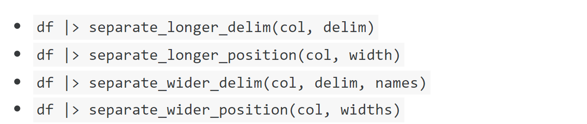
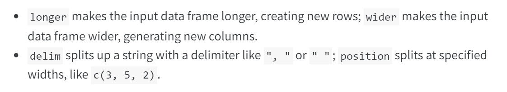
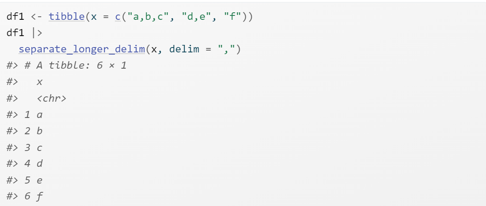
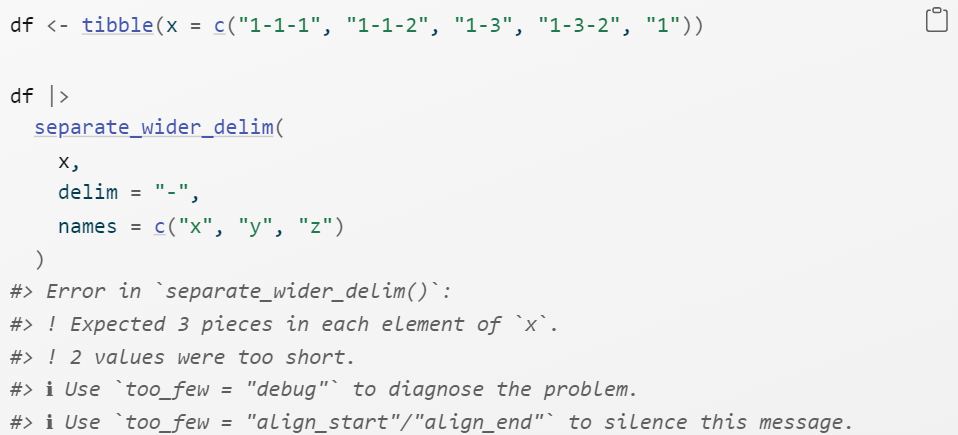
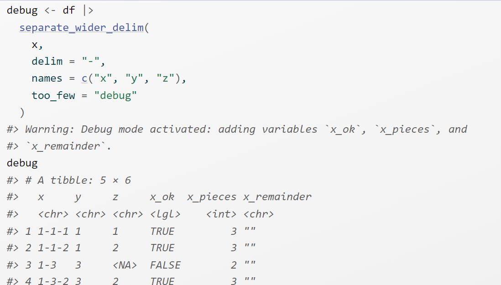
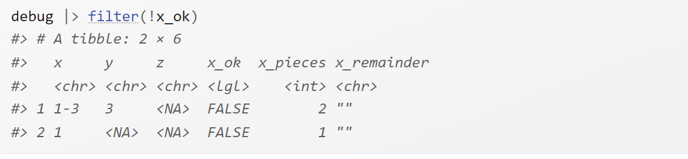
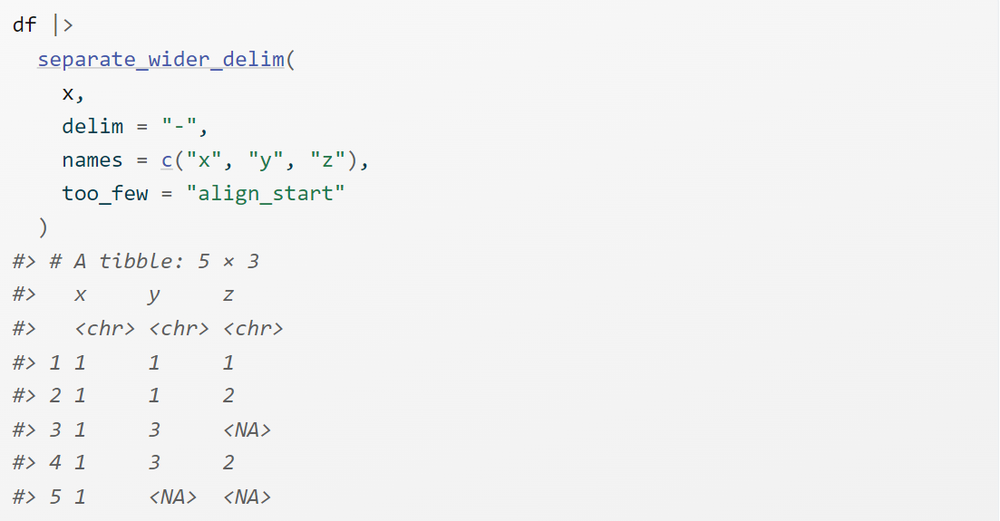

# Strings

**Learning objectives:**

- This chapter we will learn about how to work with strings in R.


## Introduction

- Strings are not glamorous, high-profile components of R, but they do play a big role in many data cleaning and preparation tasks. The stringr package provides a cohesive set of functions designed to make working with strings as easy as possible.

- We’ll keep working with strings in the next chapter, where you’ll learn more about the power of regular expressions.


[stringr pkgdown site](https://stringr.tidyverse.org/)

[stringr cheatsheet](https://github.com/rstudio/cheatsheets/blob/main/strings.pdf)


## Prerequisites

```{r}
library(tidyverse)
library(babynames)
```

- You can quickly tell when you’re using a stringr function because all stringr functions start with str_. This is particularly useful if you use RStudio because typing str_ will trigger autocomplete, allowing you to jog your memory of the available functions.


## Creating a string

Firstly, we can create a string using either single quotes (') or double quotes ("). There’s no difference in behavior between the two, so in the interests of consistency, [the tidyverse style guide](https://style.tidyverse.org/syntax.html#character-vectors) recommends using ", unless the string contains multiple ".

```{r}
string1 <- "This is a string"

string2 <- 'If I want to include a "quote" inside a string, I use single quotes'
```

- If you forget to close a quote, you’ll see +, the continuation character:


## Escapes

- To include a literal single or double quote in a string, we can use `\` to “escape” it:

```{r}
double_quote <- "\"" # or '"'

single_quote <- '\'' # or "'"
```

- So if you want to include a literal backslash in our string, we’ll need to escape it: `\\`:

```{r}
backslash <- "\\"
```

- To see the raw contents of the string, we can use **str_view()**

```{r}
x <- c(single_quote, double_quote, backslash)

x

str_view(x)
```

## Raw strings

- Creating a string with multiple quotes or backslashes gets confusing quickly. 

- To illustrate the problem, let’s create a string that contains the contents of the code block where we define the double_quote and single_quote variables:

```{r}
tricky <- "double_quote <- \"\\\"\" # or '\"'
single_quote <- '\\'' # or \"'\""

str_view(tricky)
```

That’s a lot of backslashes! (This is sometimes called .[leaning toothpick syndrome](https://en.wikipedia.org/wiki/Leaning_toothpick_syndrome) To eliminate the escaping, you can instead use a **raw string**

```{r}
tricky <- r"(double_quote <- "\"" # or '"'
single_quote <- '\'' # or "'")"

str_view(tricky)
```

- A raw string usually starts with r"( and finishes with )". But if your string contains )" you can instead use r"[]" or r"{}", and if that’s still not enough, you can insert any number of dashes to make the opening and closing pairs unique, e.g. `r"--()--", `r"---()---", etc. Raw strings are flexible enough to handle any text.

## Other special characters

- As well as `\"`, `\'`, and `\\`, there are a handful of other special characters that may come in handy. The most common are `\n`, newline, and `\t`, tab. You’ll also sometimes see strings containing Unicode escapes that start with `\u` or `\U`. This is a way of writing non-English characters that work on all systems. You can see the complete list of other special characters in ?'"'.

```{r}
x <- c("one\ntwo", "one\ttwo", "\u00b5", "\U0001f604")

x

str_view(x)
```

##  Creating many strings from data

- Now that you’ve learned the basics of creating a string or two by “hand”, we’ll go into the details of creating strings from other strings.

- This will help you solve the common problem where you have some text you wrote that you want to combine with strings from a data frame. 

- For example, you might combine “Hello” with a name variable to create a greeting. 

## str_c()

- str_c() takes any number of vectors as arguments and returns a character vector:

```{r}
str_c("x", "y")

str_c("x", "y", "z")

str_c("Hello ", c("John", "Susan"))
```

- str_c() is very similar to the base paste0(), but is designed to be used with mutate() by obeying the usual tidyverse rules for recycling and propagating missing values:

```{r}
df <- tibble(name = c("Flora", "David", "Terra"))

df |> mutate(greeting = str_c("Hi ", name, "!"))
```

- If you want missing values to display in another way, use coalesce() to replace them. Depending on what you want, you might use it either inside or outside of str_c():

```{r}
df |> 
  mutate(
    greeting1 = str_c("Hi ", coalesce(name, "you"), "!"),
    greeting2 = coalesce(str_c("Hi ", name, "!"), "Hi!")
  )
```

## str_glue() 

- If you are mixing many fixed and variable strings with str_c(), you’ll notice that you type a lot of "s, making it hard to see the overall goal of the code. An alternative approach is provided by the [glue package](https://glue.tidyverse.org/) via str_glue()3. You give it a single string that has a special feature: anything inside {} will be evaluated like it’s outside of the quotes:

```{r}
df |> mutate(greeting = str_glue("Hi {name}!"))
```

- As we can see, str_glue() currently converts missing values to the string "NA" unfortunately making it inconsistent with str_c().


- You also might wonder what happens if you need to include a regular { or } in your string. You’re on the right track if you guess you’ll need to escape it somehow. 

- The trick is that glue uses a slightly different escaping technique; instead of prefixing with special character like \, you double up the special characters:

```{r}
df |> mutate(greeting = str_glue("{{Hi {name}!}}"))
```

## str_flatten() 

- **str_c()** and **glue()** work well with mutate() because their output is the same length as their inputs. What if you want a function that works well with summarize(), i.e. something that always returns a single string? That’s the job of **str_flatten()**: it takes a character vector and combines each element of the vector into a single string:

```{r}
str_flatten(c("x", "y", "z"))

str_flatten(c("x", "y", "z"), ", ")

str_flatten(c("x", "y", "z"), ", ", last = ", and ")

```

This makes it work well with summarize():

```{r}
df <- tribble(
  ~ name, ~ fruit,
  "Carmen", "banana",
  "Carmen", "apple",
  "Marvin", "nectarine",
  "Terence", "cantaloupe",
  "Terence", "papaya",
  "Terence", "madarine"
)


df |>
  group_by(name) |> 
  summarize(fruits = str_flatten(fruit, ", "))
```

## Extracting data from strings

- It’s very common for multiple variables to be crammed together into a single string. In this section, you’ll learn how to use four tidyr functions to extract them:



- If you look closely, you can see there’s a common pattern here: separate_, then longer or wider, then _, then by delim or position. That’s because these four functions are composed of two simpler primitives:



- We’ll return to the last member of this family, separate_regex_wider(), in **Chapter 17**. It’s the most flexible of the wider functions, but you need to know something about regular expressions before you can use it.

## Separating into rows

- Separating a string into rows tends to be most useful when the number of components varies from row to row. The most common case is requiring [separate_longer_delim()](https://tidyr.tidyverse.org/reference/separate_longer_delim.html) to split based on a delimiter:




- It’s rarer to see [separate_longer_position()](https://tidyr.tidyverse.org/reference/separate_longer_delim.html) in the wild, but some older datasets do use a very compact format where each character is used to record a value:


```{r}
df2 <- tibble(x = c("1211", "131", "21"))
df2 |> 
  separate_longer_position(x, width = 1)
```

## Separating into columns

Separating a string into columns tends to be most useful when there are a fixed number of components in each string, and you want to spread them into columns. They are slightly more complicated than their longer equivalents because you need to name the columns.

```{r}
df3 <- tibble(x = c("a10.1.2022", "b10.2.2011", "e15.1.2015"))

df3 |> 
  separate_wider_delim(
    x,
    delim = ".",
    names = c("code", "edition", "year")
  )
```


- If a specific piece is not useful you can use an NA name to omit it from the results:

```{r}
df3 |> 
  separate_wider_delim(
    x,
    delim = ".",
    names = c("code", NA, "year")
  )
```

- [separate_wider_position()](https://tidyr.tidyverse.org/reference/separate_wider_delim.html) works a little differently because you typically want to specify the width of each column. So you give it a named integer vector, where the name gives the name of the new column, and the value is the number of characters it occupies. You can omit values from the output by not naming them:

```{r}
df4 <- tibble(x = c("202215TX", "202122LA", "202325CA")) 

df4 |> 
  separate_wider_position(
    x,
    widths = c(year = 4, age = 2, state = 2)
  )
```

## Diagnosing widening problems

separate_wider_delim() requires a fixed and known set of columns. What happens if some of the rows don’t have the expected number of pieces? There are two possible problems, too few or too many pieces, so separate_wider_delim() provides two arguments to help: too_few and too_many. Let’s first look at the too_few case with the following sample dataset:



- You’ll notice that we get an error, but the error gives us some suggestions on how you might proceed. Let’s start by debugging the problem:




- When you use the debug mode, you get three extra columns added to the output: x_ok, x_pieces, and x_remainder (if you separate a variable with a different name, you’ll get a different prefix). Here, x_ok lets you quickly find the inputs that failed:




- x_pieces tells us how many pieces were found, compared to the expected 3 (the length of names). x_remainder isn’t useful when there are too few pieces, but we’ll see it again shortly.

- In other cases, you may want to fill in the missing pieces with NAs and move on. That’s the job of too_few = "align_start" and too_few = "align_end" which allow you to control where the NAs should go:



## Letters

In this section, we’ll introduce you to functions that allow you to work with the individual letters within a string. You’ll learn how to find the length of a string, extract substrings, and handle long strings in plots and tables.


## Length

- [str_length()](https://stringr.tidyverse.org/reference/str_length.html) tells you the number of letters in the string:

```{r}
str_length(c("a", "R for data science", NA))
```

- We could also use this with [count()](https://dplyr.tidyverse.org/reference/count.html) to find the distribution of lengths of US babynames and then with [filter()](https://dplyr.tidyverse.org/reference/filter.html) to look at the longest names:

```{r}
babynames |>
  count(length = str_length(name), wt = n)
```

```{r}
babynames |> 
  filter(str_length(name) == 15) |> 
  count(name, wt = n, sort = TRUE)
```

## Subsetting

We can extract parts of a string using str_sub(string, start, end), where start and end are the positions where the substring should start and end. The start and end arguments are inclusive, so the length of the returned string will be end - start + 1:

```{r}
x <- c("Apple", "Banana", "Pear")

str_sub(x, 1, 3)
```

- We can use negative values to count back from the end of the string: -1 is the last character, -2 is the second to last character, etc.

```{r}
str_sub(x, -3, -1)
```

Note that [str_sub()](https://stringr.tidyverse.org/reference/str_sub.html) won’t fail if the string is too short: it will just return as much as possible:

```{r}
str_sub("a", 1, 5)

```


- We could use str_sub() with mutate() to find the first and last letter of each name:

```{r}
babynames |> 
  mutate(
    first = str_sub(name, 1, 1),
    last = str_sub(name, -1, -1)
  )

```

## Long strings

Sometimes you care about the length of a string because you’re trying to fit it into a label on a plot or table. stringr provides two useful tools for cases where your string is too long:

- str_trunc(x, 30) ensures that no string is longer than 30 characters, replacing any letters after 30 with ….

- str_wrap(x, 30) wraps a string introducing new lines so that each line is at most 30 characters (it doesn’t hyphenate, however, so any word longer than 30 characters will make a longer line)

The following code shows these functions in action with a made-up string:


```{r}
x <- paste0(
  "Lorem ipsum dolor sit amet, consectetur adipiscing elit, sed do eiusmod ",
  "tempor incididunt ut labore et dolore magna aliqua. Ut enim ad minim ",
  "veniam, quis nostrud exercitation ullamco laboris nisi ut aliquip ex ea",
  "commodo consequat."
)
```

```{r}
str_view(str_trunc(x, 30))

```

```{r}
str_view(str_wrap(x, 30))

```

## Non-English text

So far, we’ve focused on English language text which is particularly easy to work with for two reasons. Firstly, the English alphabet is relatively simple: there are just 26 letters. Secondly (and maybe more importantly), the computing infrastructure we use today was predominantly designed by English speakers. Unfortunately, we don’t have room for a full treatment of non-English languages. Still, we wanted to draw your attention to some of the biggest challenges you might encounter: encoding, letter variations, and locale-dependent functions.


##  Encoding

- When working with non-English text, the first challenge is often the encoding. To understand what’s going on, we need to dive into how computers represent strings. In R, we can get at the underlying representation of a string using [charToRaw()](https://rdrr.io/r/base/rawConversion.html)

```{r}
charToRaw("Hadley")
```

Each of these six hexadecimal numbers represents one letter: 48 is H, 61 is a, and so on. The mapping from hexadecimal number to character is called the encoding, and in this case, the encoding is called ASCII. ASCII does a great job of representing English characters because it’s the American Standard Code for Information Interchange.


- There were two different encodings for Europe: Latin1 (aka ISO-8859-1) was used for Western European languages, and Latin2 (aka ISO-8859-2) was used for Central European languages. 

- In Latin1, the byte b1 is “±”, but in Latin2, it’s “ą”! Fortunately, today there is one standard that is supported almost everywhere: UTF-8. UTF-8 can encode just about every character used by humans today and many extra symbols like emojis.


- readr uses UTF-8 everywhere. This is a good default but will fail for data produced by older systems that don’t use UTF-8. If this happens, your strings will look weird when you print them. Sometimes just one or two characters might be messed up; other times, you’ll get complete gibberish. For example here are two inline CSVs with unusual encodings:

```{r,eval=FALSE}
x1 <- "text\nEl Ni\xf1o was particularly bad this year"

read_csv(x1)


x2 <- "text\n\x82\xb1\x82\xf1\x82\xc9\x82\xbf\x82\xcd"

read_csv(x2)
```

To read these correctly, you specify the encoding via the locale argument:

```{r,eval=FALSE}
read_csv(x1, locale = locale(encoding = "Latin1"))


read_csv(x2, locale = locale(encoding = "Shift-JIS"))

```

```{r,eval=FALSE}
guess_encoding(x1)


guess_encoding(x2)
```

Encodings are a rich and complex topic; we’ve only scratched the surface here. If you’d like to learn more, we recommend reading the detailed explanation at [Encoding Explanation](http://kunststube.net/encoding/.)


## Letter variations

Working in languages with accents poses a significant challenge when determining the position of letters (e.g. with str_length() and str_sub()) as accented letters might be encoded as a single individual character (e.g. ü) or as two characters by combining an unaccented letter (e.g. u) with a diacritic mark (e.g. ¨). For example, this code shows two ways of representing ü that look identical:

```{r}
u <- c("\u00fc", "u\u0308")

str_view(u)

```
But both strings differ in length, and their first characters are different:

```{r}
str_length(u)

str_sub(u, 1, 1)
```
Finally, note that a comparison of these strings with == interprets these strings as different, while the handy str_equal() function in stringr recognizes that both have the same appearance:

```{r}
u[[1]] == u[[2]]


str_equal(u[[1]], u[[2]])

```
## Locale-dependent functions

- Finally, there are a handful of stringr functions whose behavior depends on your locale. A locale is similar to a language but includes an optional region specifier to handle regional variations within a language. 

- A locale is specified by a lower-case language abbreviation, optionally followed by a _ and an upper-case region identifier. For example, “en” is English, “en_GB” is British English, and “en_US” is American English. If you don’t already know the code for your language, Wikipedia has a good list, and you can see which are supported in stringr by looking at stringi::stri_locale_list().

- Base R string functions automatically use the locale set by your operating system. This means that base R string functions do what you expect for your language, but your code might work differently if you share it with someone who lives in a different country. To avoid this problem, stringr defaults to English rules by using the “en” locale and requires you to specify the locale argument to override it. Fortunately, there are two sets of functions where the locale really matters: changing case and sorting.

- The rules for changing cases differ among languages. For example, Turkish has two i’s: with and without a dot. Since they’re two distinct letters, they’re capitalized differently:

```{r}
str_to_upper(c("i", "ı"))

str_to_upper(c("i", "ı"), locale = "tr")
```

Sorting strings depends on the order of the alphabet, and the order of the alphabet is not the same in every language8! Here’s an example: in Czech, “ch” is a compound letter that appears after h in the alphabet.

```{r}
str_sort(c("a", "c", "ch", "h", "z"))

str_sort(c("a", "c", "ch", "h", "z"), locale = "cs")
```

This also comes up when sorting strings with dplyr::arrange(), which is why it also has a locale argument.

## Summary

In this chapter, we’ve learned about some of the power of the stringr package: how to create, combine, and extract strings, and about some of the challenges you might face with non-English strings. Now it’s time to learn one of the most important and powerful tools for working with strings: regular expressions. Regular expressions are a very concise but very expressive language for describing patterns within strings and are the topic of the next chapter.


## Meeting Videos

### Cohort 5

`r knitr::include_url("https://www.youtube.com/embed/RpZoQR2xwME")`

<details>
  <summary> Meeting chat log </summary>
  
```
00:10:10	Njoki Njuki Lucy:	Hi everyone!
00:10:24	Federica Gazzelloni:	Hello!
00:10:31	Sandra Muroy:	hi!
00:11:09	Federica Gazzelloni:	Hi Sandra!
00:11:27	Sandra Muroy:	Hi Federica :D
00:11:43	Sandra Muroy:	Hi Lucy!
00:19:20	Jon Harmon (jonthegeek):	https://xkcd.com/208/
00:20:10	Jon Harmon (jonthegeek):	https://smltar.com/ is the new book by Julia Silge and Emil Hvitfeldt.
00:20:42	Jon Harmon (jonthegeek):	https://www.tidytextmining.com/ is the older Tidytext book by Julia Silge and David Robinson.
00:28:15	Njoki Njuki Lucy:	do you also load the packages or that's sufficient for a readable code?
00:28:59	Jon Harmon (jonthegeek):	Within an Rmd I tend to put a library() call per package at the top so it's easy to find, but in my exploration work I rarely library anything other than magrittr.
00:30:11	Njoki Njuki Lucy:	okay, thank you
00:39:53	Jon Harmon (jonthegeek):	> x <- r"(this treats all characters as ecaped. For example: \ " ')"
> writeLines(x)
this treats all characters as ecaped. For example: \ " '
00:45:30	Jon Harmon (jonthegeek):	\"
00:45:31	Federica Gazzelloni:	textutils: https://github.com/enricoschumann/textutils
00:45:42	Jon Harmon (jonthegeek):	"\""
00:46:00	Jon Harmon (jonthegeek):	"""
00:46:19	Jon Harmon (jonthegeek):	"\\"
00:49:07	Jon Harmon (jonthegeek):	> "\"
+
00:50:06	Jon Harmon (jonthegeek):	> cat("this\ttab")
this	tab
00:50:21	Jon Harmon (jonthegeek):	> cat("this\nnewline")
this
newline
00:50:40	Jon Harmon (jonthegeek):	> cat("this\something"
Error: '\s' is an unrecognized escape in character string starting ""this\s"
00:51:20	Njoki Njuki Lucy:	did I get it right that the character after \ is escaped not printed?
00:51:30	Jon Harmon (jonthegeek):	correct
00:51:41	Jon Harmon (jonthegeek):	https://regexr.com/
00:59:49	Jon Harmon (jonthegeek):	> str_c(rep("prefix", 3), c("a", "b", "c"), rep("suffix", 3), sep = "-")
[1] "prefix-a-suffix" "prefix-b-suffix" "prefix-c-suffix"
01:00:25	Jon Harmon (jonthegeek):	> str_c("prefix", c("a", "b", "c"), "suffix", sep = "-")
[1] "prefix-a-suffix" "prefix-b-suffix" "prefix-c-suffix"
01:01:26	Jon Harmon (jonthegeek):	> str_c(c("prefix", "other", "another"), c("a", "b", "c"), "suffix", sep = "-")
[1] "prefix-a-suffix"  "other-b-suffix"   "another-c-suffix"
01:02:02	Jon Harmon (jonthegeek):	> str_c(c("prefix", "other"), c("a", "b", "c"), "suffix", sep = "-")
[1] "prefix-a-suffix" "other-b-suffix"  "prefix-c-suffix"
Warning message:
In stri_c(..., sep = sep, collapse = collapse, ignore_null = TRUE) :
  longer object length is not a multiple of shorter object length
01:04:54	Jon Harmon (jonthegeek):	> str_c("prefix", c("a", "b", "c"), "suffix", sep = "-", collapse = "|")
[1] "prefix-a-suffix|prefix-b-suffix|prefix-c-suffix"
01:09:51	Njoki Njuki Lucy:	thank you so much Ryan and Jon, strings are starting to make sense now!
01:09:53	Sandra Muroy:	thanks so much Ryna!
01:09:56	Sandra Muroy:	Ryan!
```
</details>

`r knitr::include_url("https://www.youtube.com/embed/A-_URHkvxNA")`

<details>
  <summary> Meeting chat log </summary>
  
```
00:07:40	Jon Harmon (jonthegeek):	statlearning.com
00:23:39	Jon Harmon (jonthegeek):	^ = start of text
$ = end of text
00:31:17	Jon Harmon (jonthegeek):	Notes are finally updated on our site if you want to follow along or review: https://r4ds.github.io/bookclub-r4ds/strings.html
00:31:37	Sandra Muroy:	thanks Jon!
00:37:56	Jon Harmon (jonthegeek):	https://en.wikipedia.org/wiki/Harvard_sentences
00:42:35	Jon Harmon (jonthegeek):	sum(stringr::str_detect(sentences, str_c(words, collapse = "|"), negate = TRUE))
00:45:50	Jon Harmon (jonthegeek):	1 %in% 1:10
00:46:02	Jon Harmon (jonthegeek):	"a" %in% "ab"
00:46:08	Jon Harmon (jonthegeek):	"a"
00:46:10	Jon Harmon (jonthegeek):	"ab"
00:46:18	Jon Harmon (jonthegeek):	"a" %in% c("a", "b")
01:02:39	Jon Harmon (jonthegeek):	regexr.com
```
</details>

### Cohort 6

`r knitr::include_url("https://www.youtube.com/embed/l07Vo1wMW5s")`

<details>
  <summary> Meeting chat log </summary>
  
```
00:09:53	Daniel Adereti:	We will kick off in 1 min
00:14:55	Shannon:	https://r4ds.github.io/bookclub-r4ds/string-basics.html
00:18:48	Shannon:	https://stringr.tidyverse.org/
00:19:06	Shannon:	https://github.com/rstudio/cheatsheets/blob/main/strings.pdf
00:21:02	Daniel Adereti:	For new members, we have this sheet where we volunteer to take classes each week, you are welcome to fill in your names. Thanks! https://docs.google.com/spreadsheets/d/1zy2nXNkvcdqWuF8rQ5ApWRkVQG_UJt0azu3h_mEnY2E/edit?usp=drive_web&ouid=115626840160043101981
00:26:49	Shannon:	https://en.wikipedia.org/wiki/List_of_Unicode_characters
01:05:02	Daniel Adereti:	That's fine!
01:05:13	Daniel Adereti:	We can pick up next week
01:05:37	Adeyemi Olusola:	Thank you!
01:05:45	Folashade Bayode:	Thank you 😊
```
</details>

`r knitr::include_url("https://www.youtube.com/embed/k7poFr556To")`

<details>
  <summary> Meeting chat log </summary>
  
```
00:15:15	Daniel Adereti:	We have this nice book that solves the exercises, if you are interested: https://jrnold.github.io/r4ds-exercise-solutions/strings.html
00:15:35	Marielena Soilemezidi:	awesome, thanks Daniel! :)
00:22:13	Marielena Soilemezidi:	the book has the same solution for this, so you did great actually! :)
00:36:42	Shannon:	https://regexcrossword.com/challenges/beginner
00:37:04	Marielena Soilemezidi:	ooh cool!
00:37:10	Marielena Soilemezidi:	thanks Shannon!
00:43:17	Marielena Soilemezidi:	0.0
00:43:26	Marielena Soilemezidi:	who thought of this example?!
00:52:47	Daniel Adereti:	Hey Marielena, if you want to volunteer for a class, you can fill in your name here: https://docs.google.com/spreadsheets/d/1zy2nXNkvcdqWuF8rQ5ApWRkVQG_UJt0azu3h_mEnY2E/edit#gid=0
00:55:10	Marielena Soilemezidi:	Thanks, Daniel! I'll check the next available chapters :)
```
</details>

`r knitr::include_url("https://www.youtube.com/embed/9UuMNJB3KFA")`

<details>
  <summary> Meeting chat log </summary>
  
```
00:03:15	Adeyemi Olusola:	Good day!
00:04:23	Adeyemi Olusola:	That sounds perfect
00:48:27	Adeyemi Olusola:	I have to drop off now.
Thanks Shannon for the wonderful presentation!
00:49:28	Marielena Soilemezidi:	oh, cool! :)
00:50:24	Marielena Soilemezidi:	haha yaay!
00:51:47	Marielena Soilemezidi:	weird!
```
</details>


### Cohort 7

`r knitr::include_url("https://www.youtube.com/embed/NQq6EoCCsR0")`

<details>
<summary> Meeting chat log </summary>

```
00:16:35	Oluwafemi Oyedele:	https://github.com/rstudio/cheatsheets/blob/main/strings.pdf
00:16:54	Oluwafemi Oyedele:	https://stringr.tidyverse.org/
00:19:37	Olukunle Tunde:	no sir
00:20:33	Oluwafemi Oyedele:	https://style.tidyverse.org/syntax.html#character-vectors
00:33:16	Oluwafemi Oyedele:	https://glue.tidyverse.org/
00:40:47	Oluwafemi Oyedele:	https://tidyr.tidyverse.org/reference/separate_longer_delim.html
00:42:51	Oluwafemi Oyedele:	https://tidyr.tidyverse.org/reference/separate_longer_delim.html
00:51:51	Oluwafemi Oyedele:	https://stringr.tidyverse.org/reference/str_length.html
00:59:39	Oluwafemi Oyedele:	https://rdrr.io/r/base/rawConversion.html
01:02:17	Oluwafemi Oyedele:	http://kunststube.net/encoding/
01:06:49	Olukunle Bashir:	thank you very much oluwafemi. it's well understood
```
</details>


### Cohort 8

`r knitr::include_url("https://www.youtube.com/embed/URL")`

<details>
<summary> Meeting chat log </summary>

```
LOG
```
</details>
