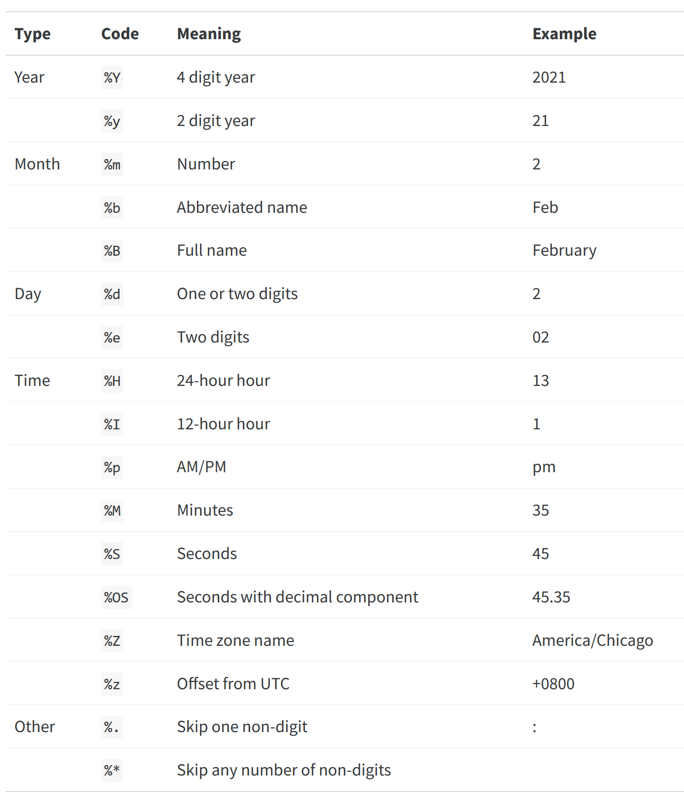

# Dates and times

**Learning objectives:**

-   **Create date** and **datetime** objects.

    -   Create dates and datetimes from **strings.**
    -   Create dates and datetimes from **individual components.**
    -   Create dates and datetimes from **each other.**

-   Work with **datetime components.**

    -   **Extract** components from datetimes.
    -   **Round** datetime components.
    -   **Set** individual datetime components.

-   Perform **arithmetic** on **timespans.**

    -   Use **durations** to measure exact seconds.
    -   Use **periods** to measure human units like weeks and months.
    -   Use **intervals** to represent timespans with exact start and end datetimes.

-   Recognize ways to deal with **timezones** in R.

## Create date and date-time objects
Loading relevant libraries
```{r, warning=F}
library(tidyverse)
library(nycflights13)
```

- As examples, we have the function `now()` and `today()` to get the current date and the current date + timestamp respectively.
```{r}
now() # just the date
```

```{r}
today() # date with timestamp
```

## Create date and date-time objects from strings

-   Date: use 'y' 'm' 'd' in whatever order eg. ymd()
-   Date-time: add 'h' 'm' 's' after an underscore eg. ymd_hms()
-   Ex: making date time object for `ymd()` since the date `2007-01-12` is in the format with the year coming first, month coming second, and day of the month coming third
```{r}
ymd("2007-01-12")
```

- Functions such as `ymd` will return `NA` if the inputted string isn't in the specified date format.
- Ex: Here, `ymd()` gives `NA` since `ymd()` needs the date in year-month-day format (hence the name `ymd` with y = year, m = month, d = day), which the date `Dec 12, 2007` isn't in.
```{r}
ymd("Dec 12, 2007") # year, month, day
```

- Ex: Using `ymd_hms` making a date-time object from `now()` (which gives the date and timestamp)
```{r}
ymd_hms(now())
```


## Create date and date-time objects from individual components

-   make_date()
-   Ex:
```{r}
make_date(year = 1955, month = 12, day = 20)
```

-   make_datetime()
-   Ex:
```{r}
make_datetime(year = 1955, month = 12, day = 20,
              hour = 15, min = 55, sec = 43)
```

## Using data columns to create date and date-time objects
-   You can make date or datetime objects out from different columns
-   Here, we make datetime objects out of the columsn for the minute, year, day, and timestamp for each flight in the `flights` data set from the `nycflights13` package

```{r}
flights |> head()
```

```{r}
make_datetime_100 <- function(year, month, day, time) {
  make_datetime(year, month, day, time %/% 100, time %% 100)
  
  # got %/% be integer division
  # got %% mean mod 
  # show some math
}

flights %>%
  mutate(dep_timestamp = make_datetime(year, month, day, dep_time))
```

## Create date and date-time objects from an existing object
Here are other functions to make date or datetime objects out of dates.
-   as_datetime()
-   Ex: 
```{r}
as_datetime(now())
```

-   as_date()
-   Ex: 
```{r}
as_date(now())
```

## Parse custom date formats into date and date-time objects
- You can also parse strings into dates if they're in formats not recognized by premade functions for date parsing (i.e., `ymd_hms()`, `mdy()`. etc).
- See the table of codes below to figure out how to type out datetime formats


## Example: parsing custom date format
- Ex: Here, we parse a date not in a format `lubridate` recognizes and use the argument `format` to specify the format of the date so R knows where to find different components in the given date (i.e., month, day, year, etc).
```{r}
as_datetime(x = "1975/01/02", 
            
            tz = "America/Detroit",
            
            # default format is %Y-%m-%d (i.e., 1970-01-05)
            format = "%Y/%m/%d")
```

- You can get a variety of time zone names by running the function `OlsonNames()` (which contains more than 600 time zone names)
- Here, we use `head()` to get the first ten time zone names to not overload this page
```{r}
OlsonNames() |> head()
```

## Extract components from datetimes
Note that using any of the below methods on a date or datetime object missing the component you're trying to get data for will give an error.

Example: using `year()` on a date-time object without a year component will return the value `0`.
```{r}
# registers as 0 due to no component
year("1975/01/02")
```

## Extracting the year from datetimes
-   year()
```{r}
# get year component of date
year(mdy("December 12, 2014"))
```

## Extracting the month from datetimes
-   month()
```{r}
month(mdy("December 12, 2014"))
```

  -   You can set arguments to modify how you obtain the month component, such as having `month()` return the name of the month (abbreviated or not abbreviated) instead of a number representing it (i.e., `12 = December`)
  -   Here's one where we abbreviate the month  
```{r}
month(x = mdy("December 12, 2014"),
      label = T, # default FALSE (show month as name or ordered factor with Dec the largest?),
      abbr = T, # use with label arg, show month as abbreviation? (ignore if label=F, default is T),
      )
```

  -   Here's one where we don't abbreviate the month
```{r}
month(x = mdy("December 12, 2014"),
      
      # default FALSE (show month as name or ordered factor with Dec the largest?),
      label = T,
      
      # use with label arg, show month as abbreviation? (ignore if label=F, default is T)
      abbr = F
      )
```

## Extracting the day of the year from datetimes
-   yday()
```{r}
# returns how many days transpired since
# beginning of year date is in (i.e., 2014)
yday(mdy("December 12, 2014")) 
```

## Extracting the day of the month from datetimes
-   mday()
```{r}
# returns day of month in date
mday(mdy("December 12, 2014"))
```

## Extracting the weekday from datetimes
-   wday()
```{r}
# get day of the week
wday(mdy("December 12, 2014")) # Friday
```

  -   You can alter arguments for `wday()` 
```{r}
wday(x = mdy("December 12, 2014"),
     
     # default is F, show name of weekday
     label = T, 
     
     # default True, abbreviate weekday name?,
     abbr = F, 
     
     # set which day week starts, 1 = Mon, 7 = Sun (default) or the first level of factor
     week_start = 7,
     
     #default is current locale, will get names correspond to locale or time zone (where you are)
     locale = Sys.getlocale("LC_TIME") # 
)
```

## Extracting time components from datetimes
-   hour()
```{r}
# return hour component of date
hour(mdy_hms("December 12, 2014 19:20:00"))
```

-   minute()
```{r}
# get minute component of date
minute(mdy_hms("December 12, 2014 19:20:00"))
```

-   second()
```{r}
# get second component of date
second(mdy_hms("December 12, 2014 19:20:00"))
```

## Round datetime components
You can round up dates using the functions below

Arguments shown below in `round_date()` apply to `round_date`, `floor_date`, `ceiling_date`

-   round_date() rounds to
```{r}
round_date(now(), 
           
           # which unit to do rounding on (default is "seconds")
           unit = "seconds", 
           
           # default is 7 which is Sunday as 1 is Monday, change start of week
           week_start = 7 
           )

# why seconds barely change is due to how seconds stored
second(now()) 
```

## Get the floor of datetime components
-   `floor_date()` rounds down
```{r}
# current date
now()

# date we get floor for
floor_date(now(), unit = "seconds")
```

## Get the ceiling of datetime components
-   ceiling_date() rounds up
```{r}
# current date
now()

# date we get ceiling for
ceiling_date(now(), unit = "seconds")
second(now())
```

## Set individual datetime components

Use create functions (ymd_hms) or update()
- Ex: `ymd_hms()` where we can change time zone
```{r}
ymd_hms("2023, December 23 10:19:23", 
        tz = "America/Detroit")
```


- can update datetime with `update()` where you can modify different components of a date
```{r}
update(object = ymd_hms("2023, December 23 10:19:23", 
        tz = "America/Detroit"), 
       year = 2010, 
       month = 1, 
       mday = 1,
       hour = 12,
       minute = 13,
       second = 13,
       week_start =  7 # default is 7
)
```

## Avoid negative numbers when setting individual datetime components
- DO NOT insert negative numbers or numbers out of range (say, having `month=35` when they're only 12 months in a year)
- It'll cause `update()` to not function as intended as shown here where `month=-1` gives us a date at November 23, 2021 since `1=Janaury`
- Thus, numbers less than `1` (aka `January`) will cause it to count backwards in the month cycle (as `0` gets us the previous month before in the previous year so `0=December` of the previous year of the date)
```{r}
update(object = 
         ymd_hms("2023, November 23 10:19:23", 
        tz = "America/Detroit"), 
       month = -1, # negative,
       year = 2022,
       week_start =  7 # default is 7
)
```

## Avoid exceeding numeric limits of individual time components
- Here's an example with the number of days exceeding what's the max number of days in a month (i.e., 28, 29, 30, or 31)
- With `day=35` in the `update()` function below, it'll increment in next cycle so typing 35 means it'll iterate to next month
- Ex: For December, `day=35` will go to next year in January on the 4th as December has 31 days and January too so 35 - 31 = 4
- Thus, we land on the 4th day of January of 2024
```{r}
update(object = 
         ymd_hms("2023, December 23 10:19:23", 
        tz = "America/Detroit"), 
       day = 35, 
       week_start =  7 # default is 7
)
```

- Therefore, it's best to NOT attempt doing such arithmetic in the `update()` function and instead just update to a specific date you want the date to be

## Perform arithmetic on timespans
You can subtract dates to get the difference in time in terms of days
```{r}
today() - ymd("1973-01-12")
```

The above can be difficult to work with but `lubridate` package has other ways to get time duration in seconds
```{r}
as.duration(today() - ymd("1973-01-12"))
```

## Use durations to measure timespans

Durations measure seconds, be aware conversions happen at a standard rate

Here, the below functions get a certain duration of time in either minutes, weeks, etc and get the result of that duration in seconds.

-   dseconds()
```{r}
# 15 seconds
dseconds(15) 
```

-   dminutes()
```{r}
# number of seconds in 10 min
dminutes(10) 
```

-   dhours()
```{r}
# can pass in vector to get number of seconds
# in 12 hours and 24 hours respectively
dhours(c(12, 24))
```

-   ddays()
```{r}
# can pass in sequence to get number of seconds
# in 0 days, 1 day, 2 days, ..., 5 days respectively
ddays(0:5)
```

-   dweeks()
```{r}
# how many seconds in 3 weeks
dweeks(3) 
```

-   dyears()
```{r}
# how many seconds in years
dyears(1) 
```

These can be added, subtracted and divided in some cases, also multiplied by numbers.  See examples below
```{r}
# 600 s (or 10 min) divided by 60
dminutes(10) / 60 
```

```{r}
# adding 12 to 600 s (or 10 min)
dminutes(10) + 12 
```

## Use periods to measure human units like weeks or months

These work like durations, but take into account things like DST

-   seconds()
```{r}
# getting 10 seconds
seconds(10)
```

-   minutes()
```{r}
# getting two minutes
minutes(2)
```

-   hours()
```{r}
# getting two hours
hours(2)
```

-   days()
```{r}
# getting three days
days(3)
```

-   weeks()
```{r}
# getting four weeks
weeks(4)
```

-   months()
```{r}
# getting one month
months(1)
```

-   years()
```{r}
# getting 4 years
years(4)
```

These can be added, subtracted and divided in some cases, also multiplied by numbers.


## Use intervals to represent timespans with exact start and end datetimes

Intervals are way to do arithmetic with durations and periods? syntax???

## Getting time zone names

-   R uses IANA (Internet Assigned Numbers Authority) for time zone names.
-   Get a complete list of time zone names with OlsonNames(), which has about 600 time zone names
```{r, eval=F}
OlsonNames()
```

Snapshot of first 10 time zone names
```{r}
OlsonNames() |>  head()
```

## Change the displayed time zone

-   The time zone attribute of a datetime is only displayed.
-   UTC is the default (and doesn't have DST, which makes computing easier)
-   with_tz()
```{r}
with_tz(
  # time to convert into different tz
  time = as_datetime(x = "December 7, 2014 12:04:13", tz = "America/Detroit",
            # format of time being scanned
            format = "%B %d, %Y %H:%M:%S"),
  
        # time zone to switch to
        tz = "Africa/Abidjan"
        )
```


## Change the underlying time zone

-   force_tz()
-   i.e., if you want to only change the name of the time zone in a date and not convert the time to fit the new time zone
```{r}
x <- as_datetime(x = "1975/01/02 12:04:13", tz = "America/Detroit",
            # format of time with %H:%M:%S indicate position of hour, minute, seconds
            format = "%Y/%m/%d %H:%M:%S")

force_tz(x, 
          # time zone to force it too
          tzone_out = c("America/Los_Angeles")
          )
```

## Meeting Videos

### Cohort 5

`r knitr::include_url("https://www.youtube.com/embed/J8QU4RBdi5c")`

<details>
  <summary> Meeting chat log </summary>
  
```
00:17:21	Sandra Muroy:	Hi Lucus!
00:17:52	lucus w:	Hi Sandra
00:27:34	Ryan Metcalf:	The “Visual Markdown Editor” icon Becki mentioned is intended to provide a similar experience to Jupyter Notebooks.
00:41:39	Federica Gazzelloni:	round_date:: https://lubridate.tidyverse.org/reference/round_date.html
00:51:22	lucus w:	Dates and time are HARD
00:51:40	Sandra Muroy:	agree!
00:52:21	Ryan Metcalf:	For a list of timezone abbreviations in R, run `OlsonNames(tzdir = NULL)`
00:53:16	Sandra Muroy:	thanks Ryan!
00:58:51	Ryan Metcalf:	I learned a trick from Federica….for syntax questions, use “?`<the character in question>`” Note the back ticks to highlight the sequence of character.
01:06:13	lucus w:	“?” -- aka “what the”
01:07:42	Federica Gazzelloni:	?`%--%`
01:08:42	Federica Gazzelloni:	start %--% end
01:10:08	Becki R. (she/her):	Thanks, Federica! The easiest answer is the best.
01:10:54	lucus w:	In healthcare there’s a tendency to deidentify date time objects as it’s considered patient identified information. Masking those date time randomly is a huge challenge
01:11:19	Sandra Muroy:	interesting
01:13:57	Sandra Muroy:	happy holidays everyone!
```
</details>

### Cohort 6

`r knitr::include_url("https://www.youtube.com/embed/URL")`

<details>
  <summary> Meeting chat log </summary>
  
```
LOG
```
</details>


### Cohort 7

`r knitr::include_url("https://www.youtube.com/embed/pGbCWFB4Rz4")`


### Cohort 8

`r knitr::include_url("https://www.youtube.com/embed/QXFhZjc9S0o")`
