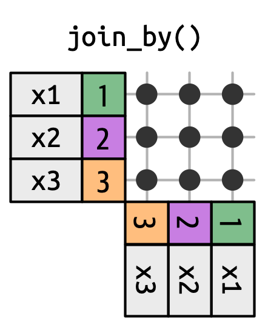
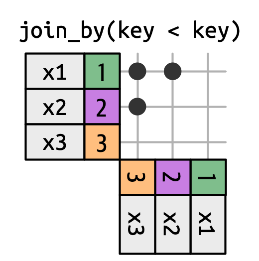
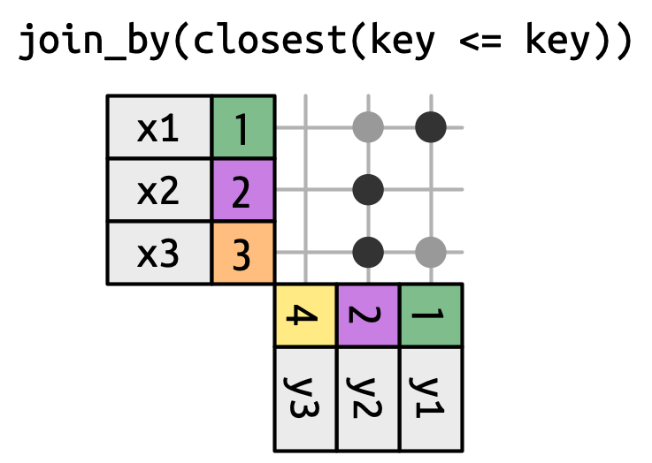

# Joins


```{r 21-01, message=FALSE, warning=FALSE, include=FALSE, paged.print=FALSE}
library(nycflights13)
library(tidyverse)
```

**Learning objectives:**

- Use mutating and filtering joins to combine data. 
- Identify **keys**, or varisbles, to connect a pair of data frames.
- Understand how joins work and understand the output
- Discuss a family of joins that provides more flexibiility in matching keys

-----------

## Introduction

- It's rare for data analysis to use only a single data frame so we often use multiple, called **relational data**.

- The idea behind joins is these data relationships are defined between a pair of tables through keys.

- Every join involves a pair of keys: a primary key and a foreign key. 

- To explore these keys, we'll look at the data frames in the nycflight13 package.


## nycflights13

- The nycflights13 package contains airline on-time data for all flights departing NYC in 2013, as well as useful 'metadata' on airlines, airports, weather, and
planes in various other data frames.
  
  - `airlines` contains data about each flight
  
  - `airlines` contains data about each airline

  - `airports` records data about each airport

  - `weather` records data about the weather at the origin airports.

  - `planes` records data about each plane. 

- The relationship between these data frames can be seen below. 


```{r 21-03, echo=FALSE, fig.align='center', fig.cap='nycfilghts13 package', out.width='100%'} 
knitr::include_graphics('images/nycfilghts13.png')
```
  
## Keys

- A **primary key** uniquely identifies an observation in its own table.

- A **foreign key** uniquely identifies an observation in another table.

- When more than one variable is needed, the key is called a **compound key**. 

- `flights$tailnum` is a foreign key that corresponds to the primary key `planes$tailnum`.

- `flights$carrier` is a foreign key that corresponds to the primary key `airlines$carrier`.

- `flights$origin` is a foreign key that corresponds to the primary key `airports$faa`.

- `flights$dest` is a foreign key that corresponds to the primary key `airports$faa`.

- `flights$origin-flights$time_hour` is a compound foreign key that corresponds to the compound primary key `weather$origin-weather$time_hour`.

- The primary and foreign keys in the nycflights13 package almost always have the same names and almost every variable name used in multiple tables has the same meaning in each place, which makes joining them much easier, with the exception of `year`, year means year of departure in `flights` and year of manufacturer in `planes`. 

## Validating keys

- It’s good practice to verify that they do indeed uniquely identify each observation. One way to do that is to `count()` the primary keys and look for entries where `n` is greater than one. 

```{r}
planes |> 
  count(tailnum) |> 
  filter(n > 1)


weather |> 
  count(time_hour, origin) |> 
  filter(n > 1)

```

- You should also check for missing values in your primary keys — if a value is missing then it can’t identify an observation!

```{r}
planes |> 
  filter(is.na(tailnum))

weather |> 
  filter(is.na(time_hour) | is.na(origin))
```


## Surrogate keys

- A **surrogate key** is a custom made key where it is possible to identify unique information, such as the number of rows in a table, and it is made if a table lacks a primary key.

- For flights, the combination of time_hour, carrier, and flight seems reasonable simple numeric surrogate key using the row number.

- For example, `flights2$flights_id` is a surrogate key because it is custom made and uniquely identifies each observation in the flights table.

```{r}
flights2 <- flights |> 
  mutate(id = row_number(), .before = 1)
flights2
```


## Basic joins

- Once you understand how data frames are connected via keys, we can start using joins to better understand the flights dataset. 

- dplyr provides six join functions: `left_join()`, `inner_join()`, `right_join()`, `full_join()`, `semi_join()`, and `anti_join()`. 

- They all have the same interface: they take a pair of data frames (`x` and `y`) and return a data frame. The order of the rows and columns in the output is primarily determined by `x`.


```{r 21-twotables, echo=FALSE, fig.align='center', fig.cap='Two tables', out.width='30%'} 
knitr::include_graphics("images/twotables.png")
```


## Mutating joins 

- A mutating join allows you to combine variables from two data frames: it first matches observations by their keys, then copies across variables from one data frame to the other. 

- Like `mutate()`, the join functions add variables to the right, so if your dataset has many variables, you won’t see the new ones.

- There are four types of mutating joins, but there’s one that you’ll use almost all of the time: `left_join()`. 

```{r}
flights2 <- flights |> 
  select(year, time_hour, origin, dest, tailnum, carrier)
flights2

```

```{r}
flights2 |>
  left_join(airlines)
```

## Left Joins

- The left join is special because the output will always have the same rows as `x`, the data frame you’re joining to. 

- The primary use of `left_join()` is to add in additional metadata. For example, we can use `left_join()` to add the full airline name to the `flights2` data:

```{r}
flights2 |>
  left_join(airlines)
```

## Specifying join keys

-By default, `left_join()` will use all variables that appear in both data frames as the join key, the so called natural join. 

- This is a useful heuristic, but it doesn’t always work, like when joining `flights` and `planes` which each have a year column but they mean different things.

```{r}
flights2 |> 
  left_join(planes)
```

-  We get a lot of missing matches because our join is trying to use `tailnum` and `year` as a compound key. In this case, we only want to join on tailnum so we need to provide an explicit specification with `join_by()`, where `join_by(tailnum)` is short for `join_by(tailnum == tailnum)`.


```{r}
flights2 |> 
  left_join(planes, join_by(tailnum))
```


- You can also specify different join keys in each table. For example, there are two ways to join the `flight2` and `airports` table: either by `dest` or `origin`:


```{r}
flights2 |> 
  left_join(airports, join_by(dest == faa))


flights2 |> 
  left_join(airports, join_by(origin == faa))

```

## Equi Joins

-  A left join is often called an equi join because it describes the relationship between the two tables where the keys are equal.

- `inner_join()`, `right_join()`, `full_join()` are similar to `left_join()` in that respect, but the difference is which rows they keep: 

  - left join keeps all the rows in `x`, 
  
  - the right join keeps all rows in `y`, 
  
  - the full join keeps all rows in either `x` or `y`, and 
  
  - the inner join only keeps rows that occur in both `x` and `y`
  
- Equi joins are the most common type of join, so we’ll typically omit the equi prefix, and just say “inner join” rather than “equi inner join”.
  

```{r 21-outerjoins, echo=FALSE, fig.align='center', fig.cap='Outer joins', out.width='60%'} 
knitr::include_graphics("images/outerjoins.png")
```


```{r 21-innerjoin, echo=FALSE, fig.align='center', fig.cap='inner join', out.width='100%'} 
knitr::include_graphics("images/innerjoin.png")
```

## Filtering joins

- The primary action of a filtering join is to filter the rows, and unlike mutating joins, never duplicate rows. 

- There are two types: semi-joins and anti-joins. 

  - Semi-joins keep all rows in `x` that have a match in `y`
  - anti-joins, it's inverse, return all rows in `x` that don’t have a match in `y`. 

```{r 21-semijoin, echo=FALSE, fig.align='center', fig.cap='Semi-join', out.width='60%'} 
knitr::include_graphics("images/semijoin.png")
```


```{r 21-antijoin, echo=FALSE, fig.align='center', fig.cap='Anti-join', out.width='60%'} 
knitr::include_graphics("images/antijoin.png")
```

## Non-equi joins

- In equi joins the x keys and y are always equal, so we only need to show one in the output, but that isn't always the case.

- dplyr helps by identifying four particularly useful types of non-equi join:

  - Cross joins match every pair of rows.
  - Inequality joins use <, <=, >, and >= instead of ==.
  - Rolling joins are similar to inequality joins but only find the closest match.
  - Overlap joins are a special type of inequality join designed to work with ranges.


```{r 19-cross, echo=FALSE, fig.align='center', fig.cap='Anti-join', out.width='60%'} 

```

```{r 19-inequality, echo=FALSE, fig.align='center', fig.cap='Anti-join', out.width='60%'} 

```

```{r 19-rolling, echo=FALSE, fig.align='center', fig.cap='Anti-join', out.width='60%'} 

```

## Meeting Videos

### Cohort 5

`r knitr::include_url("https://www.youtube.com/embed/4Ju9nj82Ksk")`

<details>
  <summary> Meeting chat log </summary>
  
```
00:08:43	Ryan Metcalf:	So sorry for my delay. Aerating the lawn! Fun!
00:10:36	Becki R. (she/her):	Hello!
00:22:56	Becki R. (she/her):	That's a good idea! It would be a nice reference.
00:24:30	Jon Harmon (jonthegeek):	https://cran.r-project.org/web/packages/DiagrammeR/index.html
00:24:33	Sandra Muroy:	diagramR?
00:25:12	Jon Harmon (jonthegeek):	I guess the sharable link is supposed to be: https://cran.r-project.org/package=DiagrammeR
00:26:06	Becki R. (she/her):	That's a good reminder, thanks.
00:56:06	Ryan Metcalf:	Another way to notate Venn diagrams and/or discrete mathematics is to use LaTeX. This is not intended to deter you learning of R but may be useful when working with a larger team (especially DB admins!) https://www.purplemath.com/modules/venndiag2.htm
01:04:20	Jon Harmon (jonthegeek):	ggplot2::diamonds %>% dplyr::count(carat, cut, color, clarity, depth, table, price, x, y, z, sort = TRUE)
01:08:49	Ryan Metcalf:	Great Job Federica! Looking forward to next week!
```
</details>

`r knitr::include_url("https://www.youtube.com/embed/BDckA3OdsiU")`

<details>
  <summary> Meeting chat log </summary>
  
```
00:22:57	Jon Harmon (jonthegeek):	Try this to see a quick example. You're right that the order of the columns is left then right either way, but the rows to keep changes.
library(dplyr)
band_members %>% left_join(band_instruments)
band_members %>% right_join(band_instruments)
00:29:17	Jon Harmon (jonthegeek):	band_instruments %>% left_join(band_members)
00:39:07	lucus w:	Seems like setdiff() is similar to dplyr::anti_join()… they maybe differ by how they prints?
00:40:45	Jon Harmon (jonthegeek):	anti_join only needs to match on one key column to exclude; setdiff is looking for the entire observations to be repeated.
00:41:29	lucus w:	Interesting.. thanks!
00:52:28	Njoki Njuki Lucy:	I don't understand what's happening exactly, if age is greater than 25, have it as 25L(int) otherwise its age?
00:53:56	Njoki Njuki Lucy:	okay, thanks
00:54:28	Federica Gazzelloni:	sorry my connection
01:05:28	Njoki Njuki Lucy:	thank you :)
01:05:33	lucus w:	Thanks y'all
```
</details>

### Cohort 6

`r knitr::include_url("https://www.youtube.com/embed/P5FlxEhWE74")`

<details>
  <summary> Meeting chat log </summary>
  
```
LOG
```
</details>


### Cohort 7

`r knitr::include_url("https://www.youtube.com/embed/BWk9H1yrB7o")`


### Cohort 8

`r knitr::include_url("https://www.youtube.com/embed/O57XwU3Erus")`

<details>
<summary> Meeting chat log </summary>

```
00:09:40	shamsuddeen:	start
01:04:02	shamsuddeen:	https://dplyr.tidyverse.org/reference/setops.html
01:05:16	Abdou:	Reacted to "https://dplyr.tidyve..." with 👍
01:06:07	shamsuddeen:	end
```
</details>
