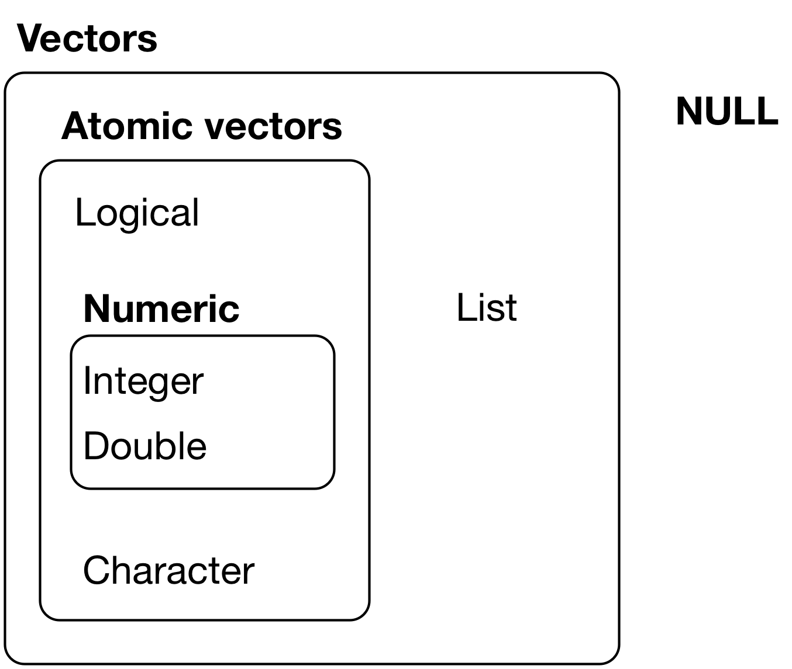
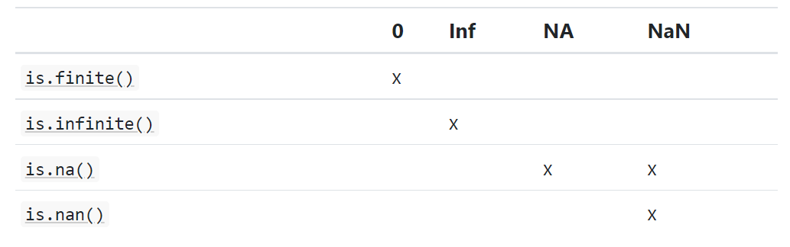
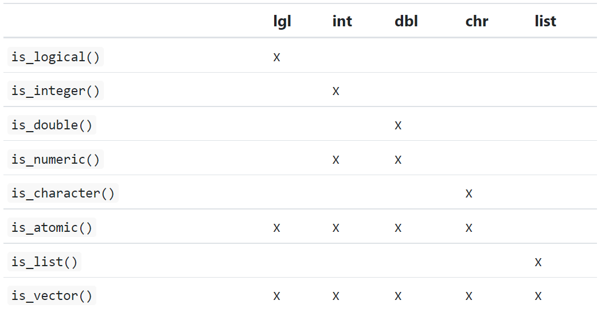

# Vectors

**Learning objectives:**

- Compare and contrast **atomic vectors** and **lists**.
  - Recognize the **six types of atomic vectors**.
  - Determine the key properties (`typeof` and `length`) of vectors.
  - Recognize the three important types of **augmented vectors**.
- Construct **logical** vectors.
- Construct **numeric** vectors.
  - Differentiate between the two types of numeric vectors, **double** and **integer**.
- Construct **character** vectors.
- Recognize the different types of missing values.
- **Coerce vectors** between different types.
- **Test** whether a vector has a given type.
- Recognize when a vector will be **recycled** to match the length of another vector, and when it will not.
- **Name** the elements of vectors.
- **Subset** vectors.
- Construct **lists**.
- Differentiate between `[`, `[[`, and `$` for **subsetting lists**.
- Use **attributes** to provide additional information about vectors.
- Recognize the **S3 object-oriented system**.
- Construct **factors**.
- Construct **dates** and **date-times**.
- Recognize that **tibbles are augmented lists.**

## Introduction

- Since we have already learnt about tibbles, in this chapter we will study vectors that underlie them.

### Prerequisites

- Here we focus on base R data structures, hence no need to load any packages.
- But we will a couple of functions from `purrr` package to avoid some inconsistencies in base R.

```{r load_tidyverse, message=FALSE, eval=FALSE} 
library(tidyverse)
```

## Vector basics

- There are two types of vectors:
  - Atomic vectors, of which there are six types: 
    - <span style="color: blue;">logical</span>
    - <span style="color: blue;">integer</span>
    - <span style="color: blue;">double</span>
    - <span style="color: blue;">character</span>
    - <span style="color: blue;">complex</span>
    - <span style="color: blue;">raw</span>
  - Integer and double vectors are collectively called **numeric** vectors.
  - Lists, at times they are called recursive vectors because lists can contain other lists.
- The main difference between vectors and lists:
  - Atomic vectors are homogeneous i.e. contain only one type (in my understanding).
  - Lists are heterogeneous i.e.,can have different different types.
- Another related object: `NULL`. It is often used to represent the absence of a vector (unlike `NA` which is used to represent the absence of a value). `NULL` typically acts like a vector of length 0.

Figure 20.1: The hierarchy of R’s vector types:



- Two key properties for each vector:
  - Its **type**, which can be determined with `typeof()`.
  
```{r type_of, eval=FALSE}
typeof(letters)

typeof(1:10)
```

  - Its **length**, which can be determined with `length()`.
  
```{r length_vector, eval=FALSE}
x1 <- list("a", "b", 1:10); length(x1)

x2 <- c("a", "b"); length(x2)
```

> Qn: does this imply that the length of a list is the # of elements in a list for example (x1)?

- Vectors can also contain arbitrary additional metadata in the form of attributes.
  - Which are then used to create **augmented vectors** which build on additional behaviour. There are three important types of augmented vector:
    - Factors are built on top of integer vectors.
    - Dates and date-times are built on top of numeric vectors.
    - Data frames and tibbles are built on top of lists.

## Important types of atomic vector

- The four most important types of atomic vectors: logical, integer, double, and character.

> Note: Raw and complex are rarely used during a data analysis, hence not part of this of discussion.

### Logical

- Simplest type of atomic vector --> can take only three possible values: `FALSE`, `TRUE`, and `NA`.
- They are constructed with comparison operators.
- OR, can create them by hand with `c()`:

```{r logical_vector, eval=FALSE}
1:10 %% 3 == 0

c(TRUE, TRUE, FALSE, NA)
```

> Qn: what exactly is %% doing here? I understand is x modulus y...

### Numeric

- As learnt, integer and double are known collectively as numeric vectors.
- In R, numbers are doubles by default.
- To create an integer, place `L` after the number.

```{r numeric_vector, eval=FALSE}
typeof(1)

typeof(1L)

1.5L
```

> Note: the warning after running 1.5L is because that integers only take whole numbers. I think.

- Two important differences between doubles and integers:
  1. Doubles are approximations. They represent floating point numbers that can't be precisely represented with a fixed amount of memory. Therefore, we should consider all doubles as approximations. E.g., the square root of two:
  
```{r doubles_vector, eval=FALSE}
(x3 <- sqrt(2) ^ 2)

options(scipen = 999)
x3 - 2
```

> Side note: `options(scipen = 999)` to remove the scientific numbers as I often confuse reading e- or e+.

- When working with floating point numbers, it is common that the calculations include some approximation.
  - Hence, when we compare floating point numbers we should use `dplyr::near()` instead of `==` as it allows for some numerical tolerance. (*what does this mean?*)
  
```{r dplyr_near, eval=FALSE}
dplyr::near(1.745, 2)
# compares if 1.745 is the same as 2
# FALSE
```

2. Integers have one special value: `NA` while doubles have four: `NA`, `NaN`, `Inf` and `-Inf`. 
    - `NaN`, `Inf` and `-Inf` can arise during division:
    
```{r special_missing_val_numeric, eval=FALSE}
c(-1, 0, 1) / 0
```

  - To check for these special values, let's use the helper functions `is.finite()`, `is.infinite()`, and `is.nan()` instead of using `==`.
  
```{r checking_special_missing_val_numeric, eval=FALSE}
is.finite(c(-1, 0, 1) / 0)
is.infinite(c(-1, 0, 1) / 0)
is.na(c(-1, 0, 1) / 0)
is.nan(c(-1, 0, 1) / 0)
```



### Character

- Most complex atomic vector because each element of a character vector is a string, and a string contains an arbitrary amount of data.
- R uses a global string pool.
  - Implying that each unique string is only story in memory once.
  - And every use of the string points to that representation.
    - This reduces the amount of memory needed by duplicated strings. To see this, let's use `pryr::object_size()`:
    
```{r checking_memory_character, eval=FALSE}
x <- "This is a reasonably long string."
pryr::object_size(x)

y <- rep(x, 1000)
pryr::object_size(y)
```

`y` doesn’t take up 1,000x as much memory as `x`, because each element of `y` is just a pointer to that same string. 

A pointer is 8 bytes, so 1000 pointers to a 152 B string is 8 * 1000 + 152 = 8.14 kB. *I am lost :(*

### Missing values

- Each atomic vector has its own missing value:

```{r atomic_vec_missing_value, eval=FALSE}
NA            # logical

NA_integer_   # integer

NA_real_      # double

NA_character_ # character
```

- But we don't need to know about these different types since we can always use `NA` and it'll be converted to the correct type using the implicit coercion rules.

- **However, there are some functions that are strict about their inputs, so it’s useful to have this knowledge sitting in your back pocket so you can be specific when needed.**

### Exercises

1. Describe the difference between is.finite(x) and !is.infinite(x).

```{r diff_finite_inifinite, eval=FALSE}
(x <- c(-1/0, 0/0, 1/0, 5, 5L, NA))
is.finite(x)
is.infinite(x)
!is.infinite(x)
```

`is.finite()` function does consider non-missing numeric values to be finite, and `-Inf`, `NaN`,  `Inf` are considered not to be finite.

`is.infinite()` considers only `-Inf` and `Inf` as infinite. Hence, `!is.infinite()` considers `-Inf` and `Inf` to be finite while non-missing numeric values, `NaN`, and `NA` not to be infinite.

2. Read the source code for dplyr::near() (Hint: to see the source code, drop the ()). How does it work?

```{r info_dplyr_near, eval=FALSE}
dplyr::near()
```

It doesn't check equality as I first thought, but it checks if two numbers are within a certain tolerance (`tol`), usually given as `.Machine$double.eps^0.5`, which is the smallest floating point number that the computer can represent. (Good to know!!)

3. A logical vector can take 3 possible values. How many possible values can an integer vector take? How many possible values can a double take? Use google to do some research.

```{r possible_values_numeric, eval=FALSE}
help(integer)
help(double)
```

For integers vectors, R uses a 32-bit representation. I.e., it can represent $2^{32}$ different values with the integers. But one of these values is set aside for `NA_integer_`.

```{r max_integer_value, eval=FALSE}
.Machine$integer.max
.Machine$integer.max + 1L
```

The range of integers values represented in R is $+- 2^{31}-1$. Hence, the maximum integer is $2^{31}-1$ instead of $2^{32}$ because 1 bit is used to represent the sign $(+ -)$ and one value is to represent $NA_integer_$.

An integer greater than that value, R will return `NA` values.

For double vectors, R uses a 64-bit representation, i.e., they can hold up to $2^{64}$ values. But, some of those values are assigned to special values: `-Inf`, `Inf`, `NA_real_`, and `NaN`.

```{r max_idouble_value, eval=FALSE}
.Machine$double.xmax
```

4. Brainstorm at least four functions that allow you to convert a double to an integer. How do they differ? Be precise.

The difference between conversion of a double to an integer differs in how they deal with the fractional part of the double.

- Round down, towards $-\infty$ i.e., taking the `floor` of a number --> `floor()`.
- Round up, towards $\infty$ i.e., taking the `ceiling` of a number --> `ceiling()`.
- Round towards zero --> `trunc()` and `as.integer()`.
- Round away from zero.
- Round to the nearest integer. If ties exists, then numbers are defined with a fractional part of 0.5?
  - Round half down, towards $-\infty$.
  - Round half up, towards $\infty$
  - Round half towards zero
  - Round half away from zero
  - Round half towards the even integer --> `round()`.
  - Round half towards the odd integer.
  
```{r rounding_double, eval=FALSE}
tibble(
  x = c(1.8, 1.5, 1.2, 0.8, 0.5, 0.2, 
        -0.2, -0.5, -0.8, -1.2, -1.5, -1.8),
  `Round down` = floor(x),
  `Round up` = ceiling(x),
  `Round towards zero` = trunc(x),
  `Nearest, round half to even` = round(x) # 0.5 is rounded to 0
) 
```

5. What functions from the readr package allow you to turn a string into logical, integer, and double vector?

`parse_logical()` parses logical values, which can appear as variations of TRUE/FALSE or 1/0.

```{r parse_logical, eval=FALSE}
parse_logical(c("TRUE", "FALSE", "1", "0", "true", "t", "NA"))
```

`parse_integer()` parses integer values.

```{r parse_integer, eval=FALSE}
parse_integer(c("1235", "0134", "NA"))
```

In case of any non-numeric characters in the string such as commas, decimals, `parse_integer()` will throw an error unlike `parse_numeric()` which ignores all the non-numeric characters before or after the first number.

```{r parse_integer_nonNumeric, eval=FALSE}
parse_integer(c("1000", "$1,000", "10.00"))
```

```{r parse_numeric_nonNumeric, eval=FALSE}
parse_number(c("1.0", "3.5", "$1,000.00", "NA", "ABCD12234.90", "1234ABC", "A123B", "A1B2C"))
```

## Using atomic vectors

- Let's review some of the important tools for working with the different types of atomic vector:
  - How to convert from one type to another, and when that happens automatically.
  - How to tell if an object is a specific type of vector.
  - What happens when you work with vectors of different lengths.
  - How to name the elements of a vector.
  - How to pull out elements of interest.
  
### Coercion

- We can coerce or convert one one type of vector to another in two ways:

1. Explicit coercion -> call a function like `as.logical()`, `as.integer()`, `as.double()`, or `as.character()`.  Before doing this, check the type of the vector. For example,  you may need to tweak your readr `col_types` specification.

2. Implicit coercion -> use a vector in a specific context that expects a certain type of vector. For example, using a logical vector with a numeric summary function or using a double vector where an integer vector is expected.

- Our focus here will be implicit coercion as explicit coercion is relatively rarely used in data analysis plus easy to understand.
- An important type of implicit coercion: using a logical vector in a numeric context. 
  - `TRUE` is converted to `1` and `FALSE` is converted to `0`. Hence, summing the logical vector is the # of trues and mean of a logical vector is the proportion of trues.
  
```{r implicit_coerce_logical_to_numeric, eval=FALSE}
x <- sample(20, 100, replace = TRUE)
y <- x > 10
sum(y)  # how many are greater than 10?

mean(y) # what proportion are greater than 10?
```

Or, some code that relies  on implicit coercion in the opposite direction, from integer to logical:

```{r implicit_coerce_numeric_to_logical, eval=FALSE}
if (length(x)) {
  # do something
}
```

Here, 0 is converted to `FALSE` and everything else is converted to `TRUE`. For easier understanding of the code, let's be explicit: `length(x) > 0`.

> NOTE1: When we create a vector containing multiple types with `c()`: the most complex type always wins. --> *Aha moment!*

```{r coerce_vector_with_multiple_types, eval=FALSE}
typeof(c(TRUE, 1L)) #integer wins

typeof(c(1L, 1.5)) #double wins 
#why? Thinking here, because integer is created from a double?

typeof(c(1.5, "a")) #character wins
```

> NOTE2: An atomic vector **can not** only have a mix of different types since the type is a property of the complete vector, not the individual elements. For a mix of multiple types in the same vector, use a list.

### Test functions

- Suppose we want to have different things based on the type of vector:
  - One option is to use `typeof()`.
  - Or, use a test function which returns a `TRUE` or `FALSE`.
    - Not recommended: base R functions -> `is.vector()` and `is.atomic()`.
    - Instead let's use the `is_*` functions provided by purrr , summarised below.
    


### Scalars and recycling rules

- Not only does R implicitly coerce the types of vectors to be compatible, but it also implicitly coerce the length of vectors. 
  - This is called vector **recycling** because the shorter vector is repeated (or recycled) to the same length as the longer vector.
- Mostly useful when we are mixing vectors and "scalars". Note, R doesn't have scalars instead, a single number is a vector of length 1.
  - Since, there are no scalars, most built-in functions are **vectorised** meaning that they will operate on  vector of numbers. Hence, such a code will work:
  
```{r scalars, eval=FALSE}
sample(10) + 100

runif(10) > 0.5
```

- What happens if we add two vectors of different lengths?

```{r adding_vectors_with_lengths_differ, eval=FALSE}
1:10 + 1:2
```

R expands the shortest vector to the same length as the longest --> recycling. 

But what if the length of the longer is not an integer multiple of the length of the shorter:

```{r adding_vec_with_lengths_differ_not_multiple, eval=FALSE}
1:10 + 1:3
```

Vector recycling can silently conceal problem, hence, the vectorised functions in tidyverse will throw errors when recycling anything other than a scalar. We can use `rep()` to do recycling ourselves.

```{r adding_cols_with_lengths_differ, eval=FALSE}
tibble(x = 1:4, y = 1:2)

tibble(x = 1:4, y = rep(1:2, 2))


tibble(x = 1:4, y = rep(1:2, each = 2))
```

### Naming vectors  

- We can name all types of vectors during creation with `c()`:

```{r naming_vec_at_creation, eval=FALSE}
c(x = 1, y = 2, z = 4)
```

- Or, with `purrr::set_names()`:

```{r naming_vec_using_purrr, eval=FALSE}
set_names(1:3, c("a", "b", "c"))
```

> Why name vectors? Because are useful in subsetting. 

### Subsetting

- To filter vectors, we use the subsetting function -> `[` and is called like `x[a]`.There are four types of things that you can subset a vector with:

1. A numeric vector containing only integers, and these must either be all positive, all negative, or zero.

Subsetting with positive integers keeps the elements at those positions:

```{r subset_vec_positive_integers, eval=FALSE}
x <- c("one", "two", "three", "four", "five")
x[c(3, 2, 5)]
```

If we repeat a position, we can actually make a longer output than input:

```{r subset_vec_positive_integers1, eval=FALSE}
x[c(1, 1, 5, 5, 5, 2)]
```

Negative values drop the elements at the specified positions:

```{r subset_vec_negative_integers, eval=FALSE}
x[c(-1, -3, -5)]
```

It’s an error to mix positive and negative values:

```{r subset_vec_positive_and negative_integers, eval=FALSE}
x[c(1, -1)]
```

The error message mentions subsetting with zero, which returns no values:

```{r subset_vec_zero, eval=FALSE}
x[0]
```

This is useful if we want to create unusual data structures to functions with. (Jon, please expound!)

2. Subsetting with a logical vector keeps all values corresponding to a `TRUE` value; often useful in conjunction with the comparison functions.

```{r subset_vec_logical, eval=FALSE}
x <- c(10, 3, NA, 5, 8, 1, NA)

# All non-missing values of x
x[!is.na(x)]

# All even (or missing!) values of x
x[x %% 2 == 0]
```

3. If you have a named vector, you can subset it with a character vector:

```{r subset_named_vec_with_character_vec, eval=FALSE}
x <- c(abc = 1, def = 2, xyz = 5)
x[c("xyz", "def")]
```

We can also use a character vector to duplicate individual entries.

```{r subset_named_vec_with_character_vec1, eval=FALSE}
x[c("xyz", "xyz", "def", "def")]
```

4. The simplest type of subsetting is nothing, `x[]`, which returns the complete `x`. This is mostly useful when subsetting matrices (and other high dimensional structures) because we can select all the rows or all the columns, by leaving that index blank. E.g., if `x` is 2d, `x[1, ]` selects the first row and all the columns.

Learn more about the applications of subsetting: “Subsetting” chapter of Advanced R: http://adv-r.had.co.nz/Subsetting.html#applications.

An important difference between `[` and `[[` -> `[[` extracts only a single element, and always drops names. Use it whenever we want to make it clear that we're extracting a single item, as in a for loop.

### Exercises

1. What does `mean(is.na(x))` tell you about a vector `x`? What about `sum(!is.finite(x))`?

2. Carefully read the documentation of `is.vector()`. What does it actually test for? Why does `is.atomic()` not agree with the definition of atomic vectors above?

3. Compare and contrast `setNames()` with `purrr::set_names()`.

4. Create functions that take a vector as input and returns:

  1. The last value. Should you use `[` or `[[`?

  2. The elements at even numbered positions.

  3. Every element except the last value.

  4. Only even numbers (and no missing values).

5. Why is `x[-which(x > 0)]` not the same as `x[x <= 0]`?

6. What happens when you subset with a positive integer that’s bigger than the length of the vector? What happens when you subset with a name that doesn’t exist?

## Recursive vectors (lists)

## Attributes

## Augmented vectors

## Meeting Videos

### Cohort 5

`r knitr::include_url("https://www.youtube.com/embed/URL")`

<details>
  <summary> Meeting chat log </summary>
  
```
LOG
```
</details>

### Cohort 6

`r knitr::include_url("https://www.youtube.com/embed/URL")`

<details>
  <summary> Meeting chat log </summary>
  
```
LOG
```
</details>
