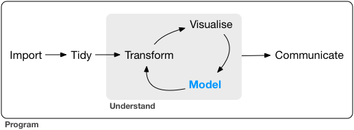
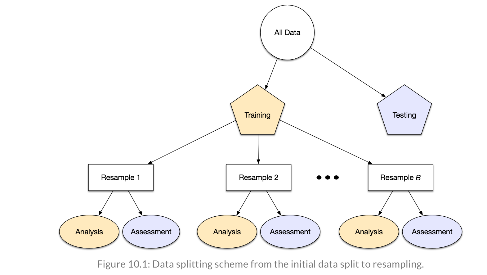

# (PART) Model {-}

# Introduction

**Learning objectives:**

- What are the step of modeling
- How to treat your data when analysing a phenomenon

## Introduction to modeling

These are the steps taken when making a model:

## Making hypothesis

It is a good practice to split your data into sub-groups to evaluate them step by step before deciding for the final model.

In general the split proportions are as follow:

- 60% training
- 20% validation
- 30% testing

The training set is for making the first level of hypothesis, exploring your data with visualizations and trying different types of models.
The validation set is used to compare models, as a second level model selection.
Then, finally the testing set works as you are testing your model on new data, when you are confident you have the right model.

This picture is from [TidyModels book](https://www.tmwr.org/resampling.html)

