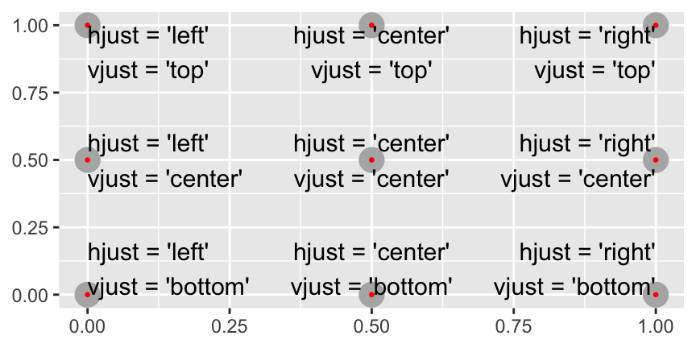
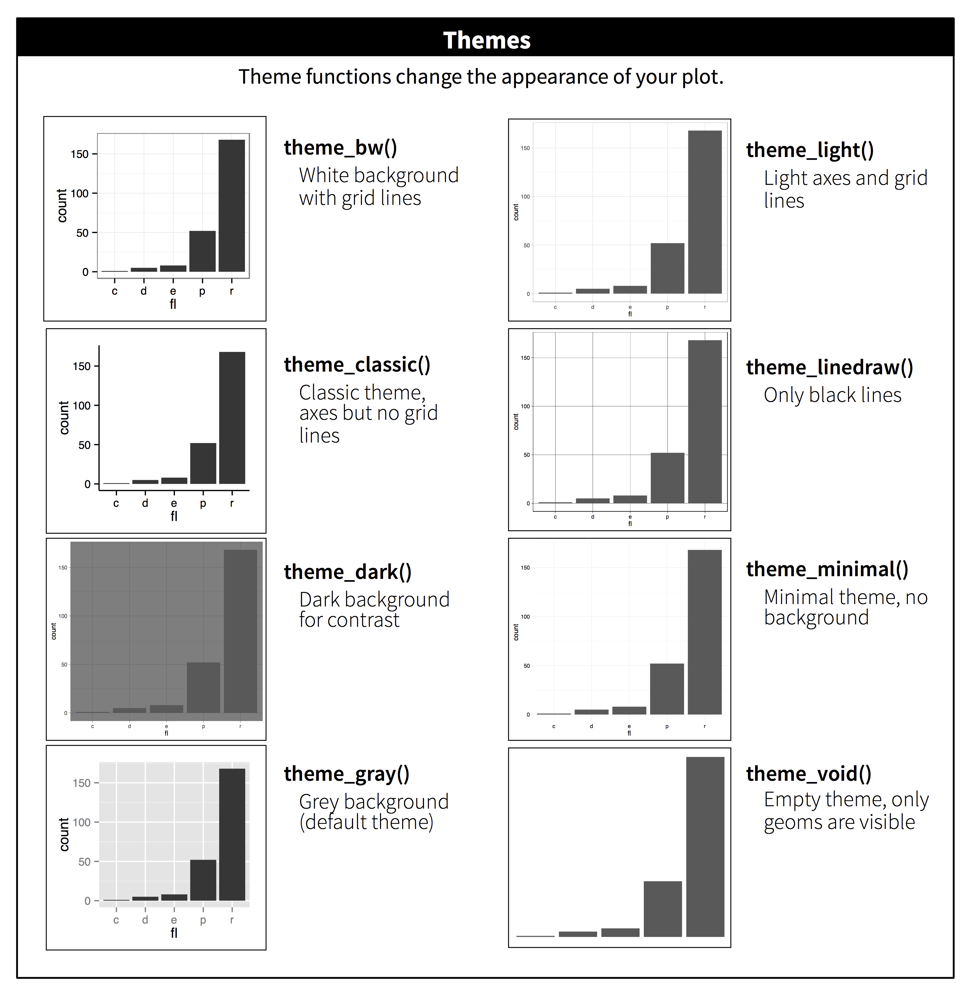

# Graphics for communication

**Learning objectives:**

- **Describe the contents** of a plot with **labels.**
- Call out **specific features** of your data with **annotations.**
- Control **how data maps** to things you can see with **`scale_` functions.**
- Control **which data displays** in a plot.
- **Customize** the non-data elements of your plot with **themes.**
- **Save** your plots.

-------------

## Tools you need to create good graphics

>  The Truthful Art, by Albert Cairo

The book focuses on what you need to think about in order to create effective graphics.

```{r 28-01,fig.cap="Credit:The Truthful Art, by Albert Cairo",fig.align='center', include=FALSE}

```

**Resources:**

- http://www.thefunctionalart.com/p/instructors-guide.html
- https://www.dropbox.com/s/gyqyz3hei7lhhmt/R_RESOURCES.txt?dl=0
- https://exts.ggplot2.tidyverse.org/gallery/

```{r 28-02,message=FALSE, warning=FALSE, include=FALSE, paged.print=FALSE}
library(tidyverse)
```


## Use labels and annotations

1.  First data set is about the Biochemical Oxygen Demand, found in {datasets} package, it is made of two variables:
-Time
-Demand

```{r 28-03}
BOD 
```


```{r 28-04,message=FALSE, warning=FALSE, paged.print=FALSE}
ggplot(BOD, aes(Time, demand)) +
  geom_point(size=2) +
  geom_smooth() +
  labs(
    title = "Biochemical Oxygen Demand",
    subtitle = "versus Time in an evaluation of water quality",
    caption = "Originally from Marske (1967), \nBiochemical Oxygen Demand Data Interpretation Using Sum of Squares Surface M.Sc. Thesis, \nUniversity of Wisconsin – Madison.",
    y ="Demand") +
  tvthemes::theme_avatar()
```

2.  Second dataset is found in the book and made of some random uniform distributions.
Here we see how we can coustomise axis title with maths formula.

```{r 28-05}
df <- tibble(
  x = runif(10),
  y = runif(10)
)
ggplot(df, aes(x, y)) +
  geom_point(shape=21, stroke=2,size=5,fill="grey67",alpha=0.7) +
  labs(
    x = quote(sum(x[i] ^ 2, i == 1, n)),
    y = quote(alpha + beta + frac(delta, theta))
  ) +
  tvthemes::theme_brooklyn99()
```

3. Third dataset is the Annual Precipitation in US Cities, the set is made of one observation each column, about the average amount of precipitation (rainfall) in inches for each of 70 United States (and Puerto Rico) cities.
Here we see how to add text to a plot with `geom_text()`

```{r 28-06}
precip[1:10]
length(precip)
```

```{r 28-07}
cities <- precip%>%names

df <- data.frame(cities,precip)
df %>%
  arrange(precip) %>%
  ggplot(aes(x=1:70,y=precip)) +
  geom_point(shape=21,color="white") +
  geom_line(size=0.5,linetype="dashed")+
  geom_text(aes(label=cities,size=precip),
            hjust = "right",nudge_x = -2,
            check_overlap = T) +
  labs(title="Trend of Annual Precipitation in US Cities",
       x="70 United States Cities",
       y="AVG precipitation (rainfall) in inches")+
  tvthemes::theme_spongeBob()+
  theme(legend.position = "none")
```

4. This is the Edgar Anderson's Iris Data. It gives the measurements in centimeters of the variables sepal length and width and petal length and width, respectively, for 50 flowers from each of 3 species of iris. The species are Iris setosa, versicolor, and virginica.

```{r 28-08}
ggplot(iris,aes(Sepal.Length,Sepal.Width,group=Species))+
  geom_point(aes(color=Species)) +
  geom_text(data=iris%>%
              group_by(Species)%>%
              filter(Sepal.Length==max(Sepal.Length))%>%
              ungroup(),
    aes(label=Species),
    size=8, hjust="right",
    check_overlap = T) +
  hrbrthemes::theme_modern_rc()
```

5. This is Fuel economy data from 1999 to 2008 for 38 popular models of cars. This dataset contains a subset of the fuel economy data that the EPA makes available on https://fueleconomy.gov/. It contains only models which had a new release every year between 1999 and 2008 - this was used as a proxy for the popularity of the car.

Here we learn how to set the lable in specific place inside the plot.
```{r 28-09}
label <- mpg %>%
  summarise(
    displ = max(displ),
    hwy = max(hwy),
    label = "Increasing engine size is \nrelated to decreasing fuel economy."
  )

ggplot(mpg, aes(displ, hwy)) +
  geom_point(aes(color=factor(hwy)),size=2) +
  geom_text(aes(label = label), data = label, 
            color="grey40",size=6,
            vjust = "top", hjust = "right")+
ggthemes::theme_fivethirtyeight() +
  theme(legend.position = "none")
```

In particular for all the possibility we can refer to this plot for principal adjustments of the text inside the plot.



Other geoms for annotation:

- `geom_hline()` and `geom_vline()` to add reference lines. I often make them thick (size = 2) and white (colour = white), and draw them underneath the primary data layer. That makes them easy to see, without drawing attention away from the data.

- `geom_rect()` to draw a rectangle around points of interest. The boundaries of the rectangle are defined by aesthetics xmin, xmax, ymin, ymax.

- `geom_segment()` with the arrow argument to draw attention to a point with an arrow. Use aesthetics x and y to define the starting location, and xend and yend to define the end location.


## Scales

The `scale_<functions>` are very useful in many ways, among which is to set a color/fill scale for a particular plot, or to make modification of the x/y text axis.

Here the dataset is made of random normal of 10 000 values.

```{r 28-10, fig.asp = 0.618}
df <- tibble(
  x = rnorm(10000),
  y = rnorm(10000)
)

p1 <- ggplot(df, aes(x, y)) +
  geom_hex() +
  coord_fixed() 

p2 <- ggplot(df, aes(x, y)) +
  geom_hex() +
  viridis::scale_fill_viridis() +
  coord_fixed()

library(patchwork)
p1+p2 &
  theme_linedraw() &
  theme(legend.position = "top")
```

## Themes

There are interesting packages available for adjusting the them of your plot in addition to the themes that are provided with {ggplot2} package: **ggplot2 extensions - gallery**

- {viridis}
- {hrbrthemes}
- {ggthemes}
- {tvthemes}
- ...

source: [https://exts.ggplot2.tidyverse.org/gallery/](https://exts.ggplot2.tidyverse.org/gallery/)




## Save the plot

`ggsave("my-plot.pdf")`


## Meeting Videos

### Cohort 5

`r knitr::include_url("https://www.youtube.com/embed/URL")`

<details>
  <summary> Meeting chat log </summary>
  
```
LOG
```
</details>

### Cohort 6

`r knitr::include_url("https://www.youtube.com/embed/URL")`

<details>
  <summary> Meeting chat log </summary>
  
```
LOG
```
</details>
